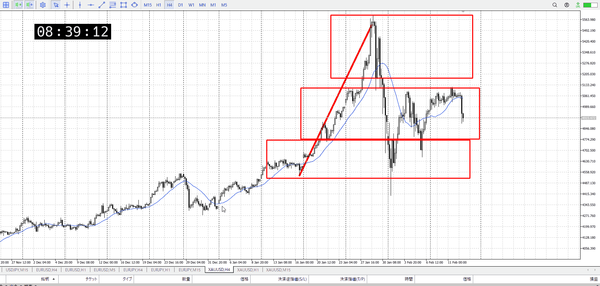
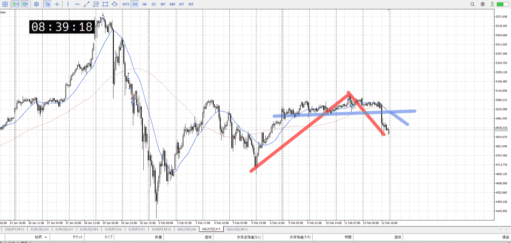
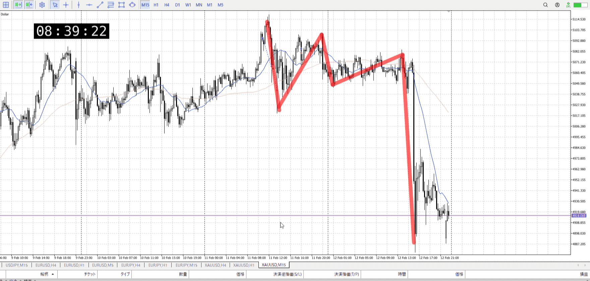
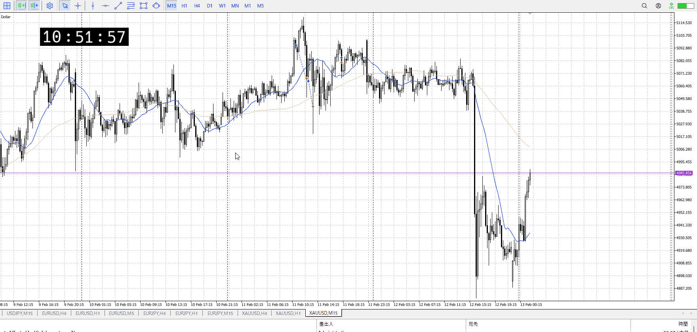
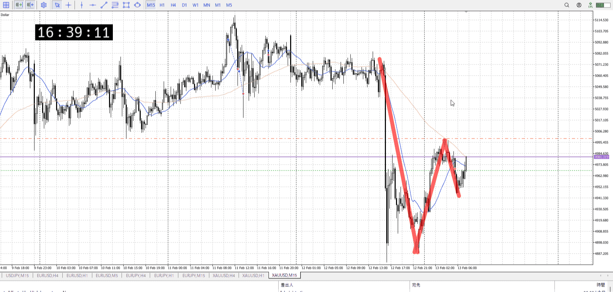
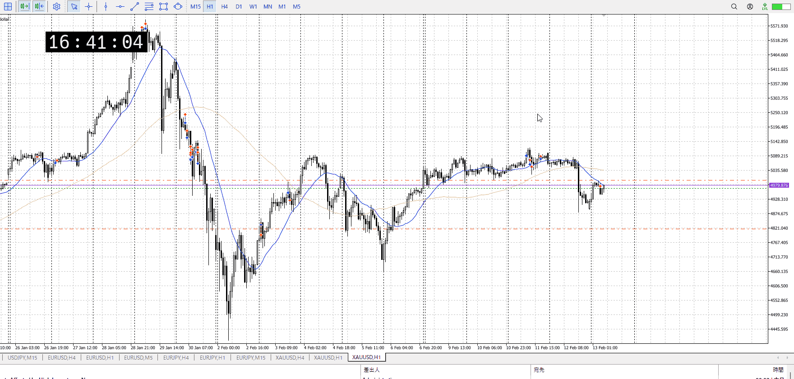
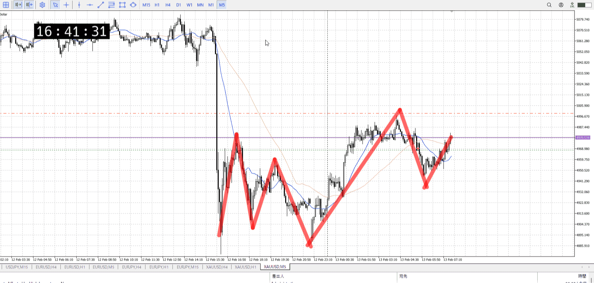

> [!note]
>- +1万 事前認識 **開始5分**

- [ ] [my](../my.md)(見ないと増える)
- [ ] 指標
    - 差し込まれる可能性有り、毎日

## 4h

＜ここに目線画像＞

- [x] トレーディングレンジ
    - m

方向：u

## 1h

＜ここに目線画像＞ ^4bb92f

方向：d

## 15m

＜ここに目線画像＞

方向：d

全方向：udd
^1d4903

- [x] 使用足全ての目線確認

## シナリオ

b:1h半値？
s:1h高値
- [x] 時間足ぶつかり

戻り売り。
勢いが強いのでその前に落ちるかも。
- [x] 1hシナリオ
    - [x] 明確か ? 続行 : 確定後考え直し

下降
- [x] 日出日入、週出週入

一気に下優勢、どこまで行くか
- [x] 傾き比率

190k
- [x] 前移動値

420k
- [x] 前回上昇・下降値

## 位置

- [x] 推進
- [ ] 調整

## 方針
目線・シナリオ・強弱・調整
横幅・PA後・平均線方向・波
**ひきつけ**・軸時間・傾き比率

1hdでこの下降の強さ、推進に入ったか
その分半値っぽいところでの抵抗は大きい、ここを抜けるかを見る
正直それにCPI使いそうだけど、それはあくまで予感なので

- [x] 買いたいなら
    - ここで上髭など揃えつつ、売りを否定して上抜け
    - 1h半値を勝たせる
- [x] 売りたいなら
    - 下抜け戻り、もしくは戻りでレンジ下から

OK!
Exchage Start.

---

## メモ

窓締まり分を使って買い
出来なくはないが短期

この後にあるはずの戻り売りの方が大事
1hAも追いついてきてる

1hの戻り売りをしたわけだが。
傾き比率はまだ全然問題なさそうだが、切り上げっぽくなったのが効いてくる

1hとして売ってるからまだ全然問題ないと言えばそう

5mは目線上にしてから変わってない
その分の半値からの買いだと思えば、まあ
比率は傾きは良いが、横が上昇の1/3くらいしかなくなってしまった

この上昇で一旦の安値を作り、割れば5mを一時的に黙らせられる
目線は上のまま変わらないが、ありえなくはない線

![[../Entry/en20260214T100643]]

---

再検証