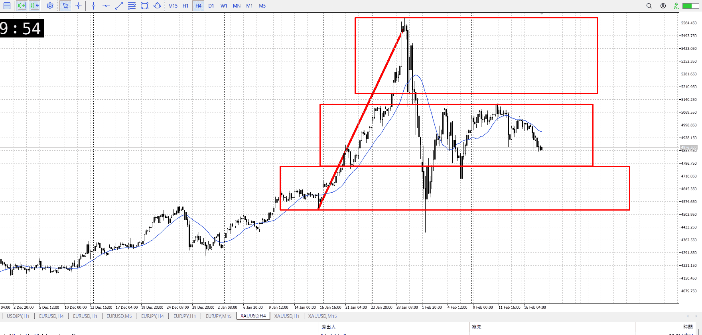
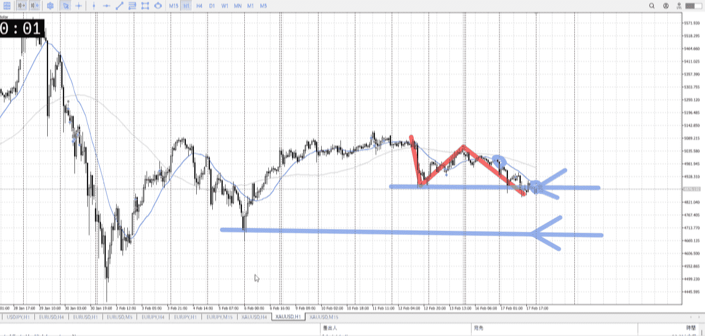
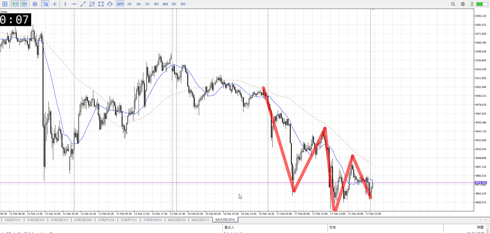
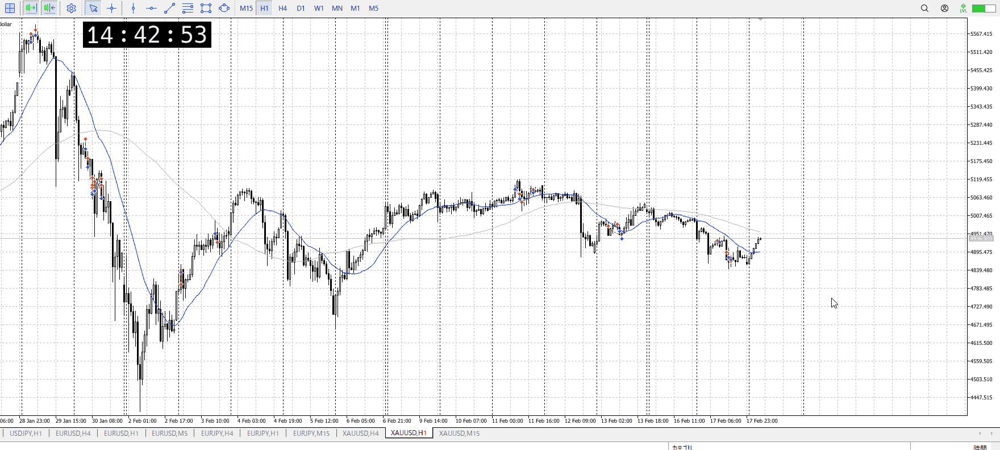
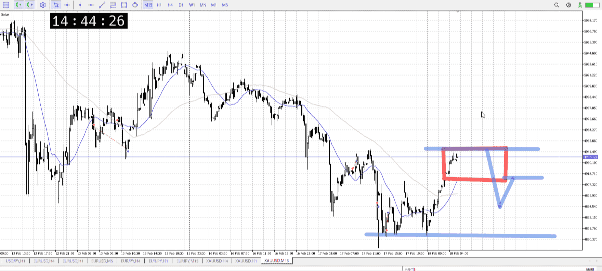
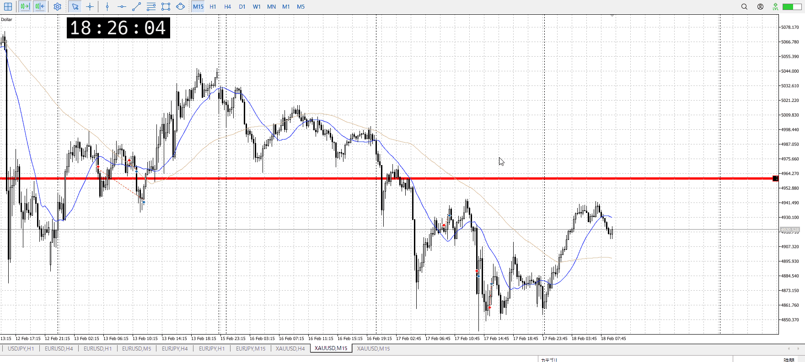
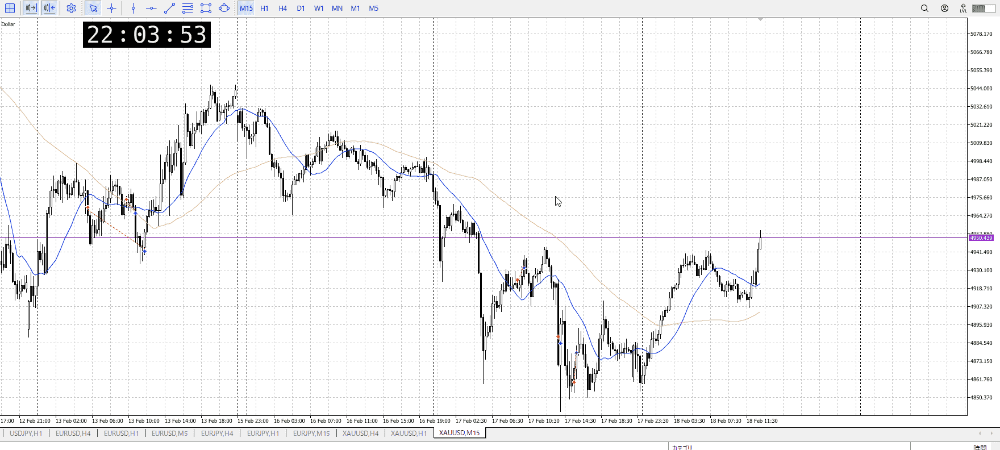
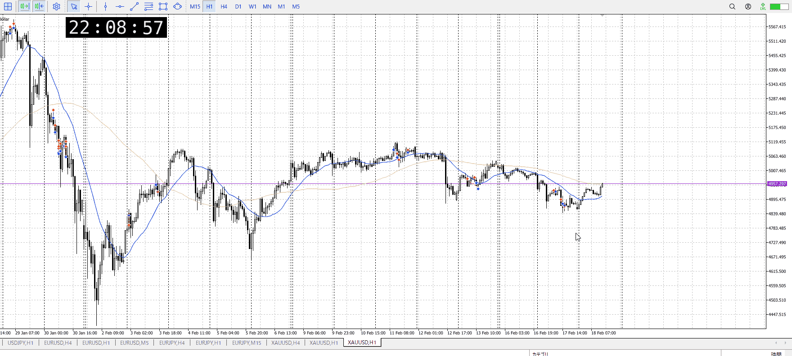
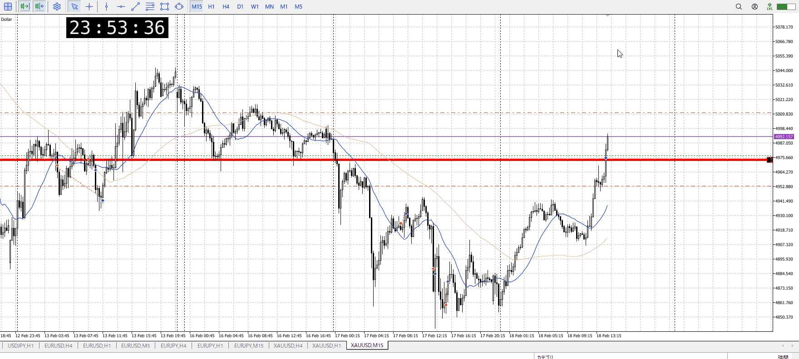

> [!note]
>- +1万 事前認識 **開始5分**

- [x] [my](../my.md)(見ないと増える)
- [x] 指標
    - 差し込まれる可能性有り、毎日

28:00fomc
## 4h

＜ここに目線画像＞

- [x] トレーディングレンジ
    - m

方向：u

## 1h

＜ここに目線画像＞ ^4bb92f

方向：d

## 15m

＜ここに目線画像＞

方向：d

全方向：udd
^1d4903

- [x] 使用足全ての目線確認

## シナリオ

b:1h前回安値
s:1hレンジ下
- [x] 時間足ぶつかり

上からは売られたはずなので、今いるとこに戻ってきた場合どうするか
きっちり抜けた場合、一旦は第二シナリオで止まるはずなのでそれも見る
昨日の分が押し留まったので買いの可能性も見てる、その分抜けの速さに注意
FOMCも忘れず
- [x] 1hシナリオ
    - [x] 明確か ? 続行 : 確定後考え直し

下降
- [x] 日出日入、週出週入

緩やかな下降
- [x] 傾き比率

140k
- [x] 前移動値

230k
- [x] 前回上昇・下降値

## 位置

- [x] 推進
- [ ] 調整

## 方針
目線・シナリオ・強弱・調整
横幅・PA後・平均線方向・波
**ひきつけ**・軸時間・傾き比率

推進中。調整とその終わりまで待ちたい。つまり抜けて戻りが一つ。頭と尻尾は取れない
抜け後すぐは1h4hと合わさるため5m15mでも取れる。

ここでもし上がった場合、1hはdなので自信をもって買うのはせめて高値抜いてから

あとは抜き後オーバーシュートでも買えるが、それは勢いがある時。今は緩やかな下降なので可能性は薄いと見る。

- [x] 買いたいなら
    - 1h高値抜いてから押し
- [x] 売りたいなら
    - 1h安値抜き戻り
    - レンジから上抜けダマシ落ち

その間の値が取れないのかという話
間取るなら短期で、1h4hに合わせ売りだがいまその売りの底にいるので取るのは難しいだろう。

しっかり1hレンジからの上抜けしたら
そりゃしっかりやったら考えるが、そしたら一つ高値がずれるので1h高値抜き押しに当たるはず

底が揃い始め、天井はまだ微妙

OK!
Exchage Start.

---

## メモ
調整終わり入り場所に備え波
調整終わりの方向性に備え明確な環境足抜け
方向性に対する疑いに備えローソクに対する上位足根拠、これはエントリー前後で両方該当
早めの押し戻りに備え入りたい場所と髭
ついでに新情報に備え落ち着いて考え直し

[my2026-02-18](../My_Test/my2026-02-18.md)

これが上昇成功したら
まず15m高値だけを抜いていく、買って15mのみ
1h高値で手放す

4h1hはまだ売り
なので売りたい、これを調整として売りを取りたい
15mでこんな感じで受け止め、売りで取りたい
波をしっかり待つ

1hの売りが続く想定

![[../Last_Entry/len20260218T024734]]

t

この高さぐらいを超えたら買いを考え始めたい
下降が決定的になった抜け付近？　とか、半値とか
1hの最終戻り売りの失敗になるのが一番大きそう

今15mで落ちはじめっぽく見えるが、そもそもそこはレンジじゃないので注意

1hが上向き始め
今いるところが大体最終売り
ここ割ったら買い

ここに辿り着くまでの5m買いが出来るかも
15mでレンジ割り、押しを買い
まあ非推奨、その後見たほうがいい

これをフリにして下に行くこともできる
ここの処理がどうなるかで決まる

処理を見るまで、ここでは何もできない
ここでは1h売りがいるのでその処理を見たい
15mは上、udu
1h売りと15m高値

15m、1h上髭に下振りを無視して上がったところを抜け買いしたが
横幅があまりに小さくないか？

前からの買いがあったのは事実で、1h売りとを見たいのも事実
1h上髭に対して15m下髭一つでは上がらないのは分かる、複数出す暇もなく上がっていった

全然勢い的には上まで狙ってもあるだろうけど、指標前
といっても指標4時間前

![[../Entry/en20260219T120714]]

FOMCが見えてきて、上昇で利確後
この後は1hの天井とぶつかる分を見る必要があるため、一旦終了

---

再検証