> [!note]
>- +1万 事前認識 **開始5分**

- [ ] [my](../my.md)(見ないと増える)
- [ ] 指標
    - 差し込まれる可能性有り、毎日

## 4h
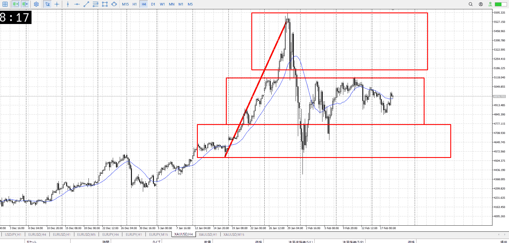
＜ここに目線画像＞

- [x] トレーディングレンジ
    - m

方向：u

## 1h
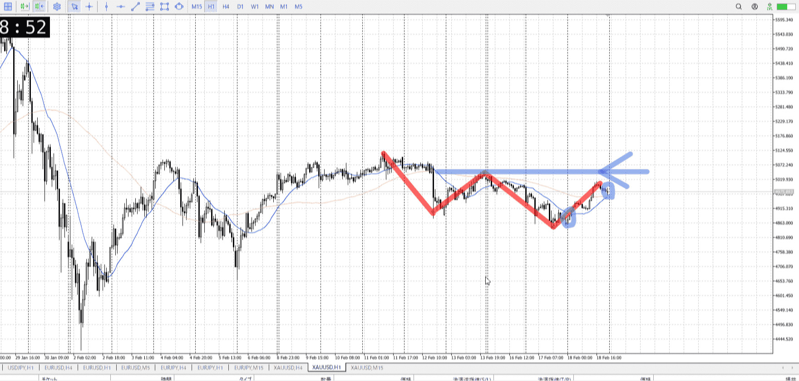
＜ここに目線画像＞ ^4bb92f

方向：d

## 15m
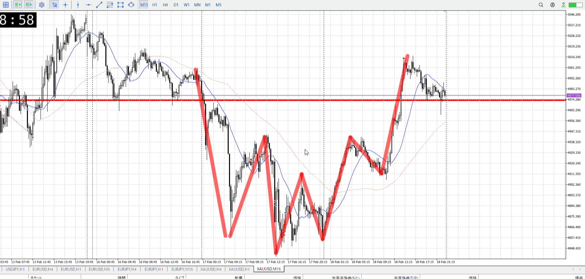
＜ここに目線画像＞

方向：u

全方向：udu
^1d4903

- [x] 使用足全ての目線確認

## シナリオ

b:15m押し目買い
s:1h天井
- [x] 時間足ぶつかり

高値とぶつかってどうなるか
高値は天井圏の一部にもなりそう、対する15m押し目買いはもともと指標でも抜けなかった底からという意味はある
- [x] 1hシナリオ
    - [x] 明確か ? 続行 : 確定後考え直し

上昇
- [x] 日出日入、週出週入

半分の長さで7割戻している、買い優勢
- [x] 傾き比率

152k
月曜の二倍以上
- [x] 前移動値

u165k
売られるならそろそろ
- [x] 前回上昇・下降値

## 位置

- [ ] 推進
- [x] 調整

## 方針
目線・シナリオ・強弱・調整
横幅・PA後・平均線方向・波
**ひきつけ**・軸時間・傾き比率

1h高値で最後の売り
傾き的には買いに勢いがある、移動値的にはここで売っておきたい
15mは押し目から買いたい、1hは高値で売りたい
迷うようならレンジを待て

- [x] 買いたいなら
    - レンジ上抜け押し
    - レンジ内での5m急上昇、5m買い
- [x] 売りたいなら
    - レンジ下抜け戻り
    - レンジ内での15m急落、15m売り
    - 上抜けダマシ

OK!
Exchage Start.

---

## メモ
まず押し目買いを試すので、レンジの横幅取りつつ下髭連で止まるとこを探す
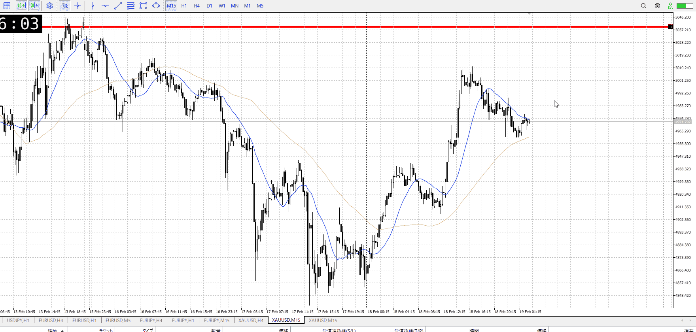
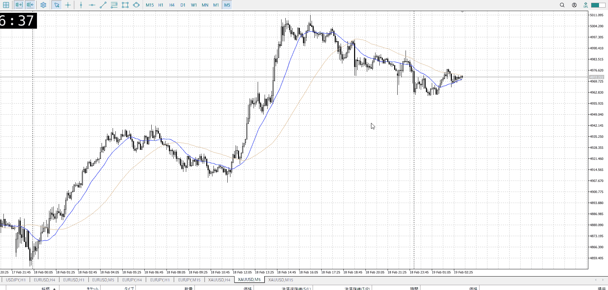
形状はそれらしいが、時間帯がよくない。伸びにくい昼。
このままぐだっての見てから。

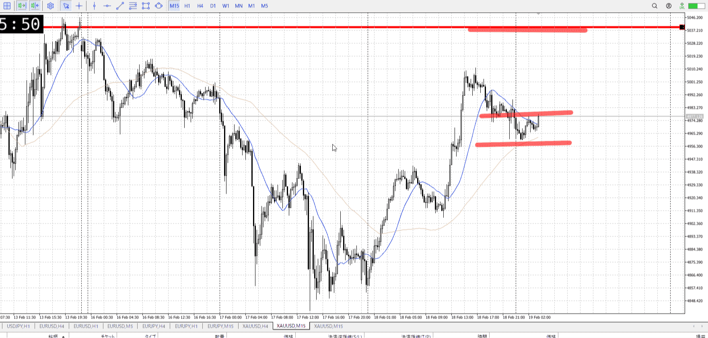
昼にやらないのは伸びないからで、このように伸びるのならやっておきたいとこ
ここでいきなりではなく、しっかり買える押しを探す

![[../Last_Entry/len20260219T123634]]

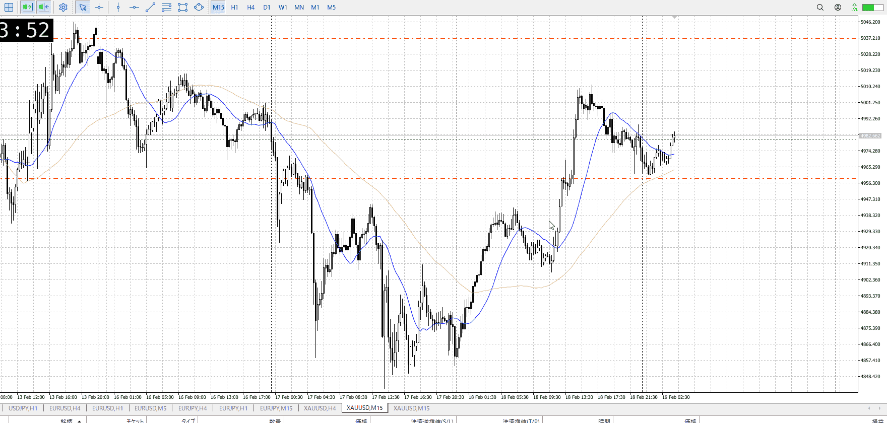
5mで探したから、見た目あんま変わらない。
15m取引なのでこんなもんか。1h天井との打ち合いまで持ちたいが。
一気に抜ける必要はないはず。昼だから鈍いだろうが待ち。

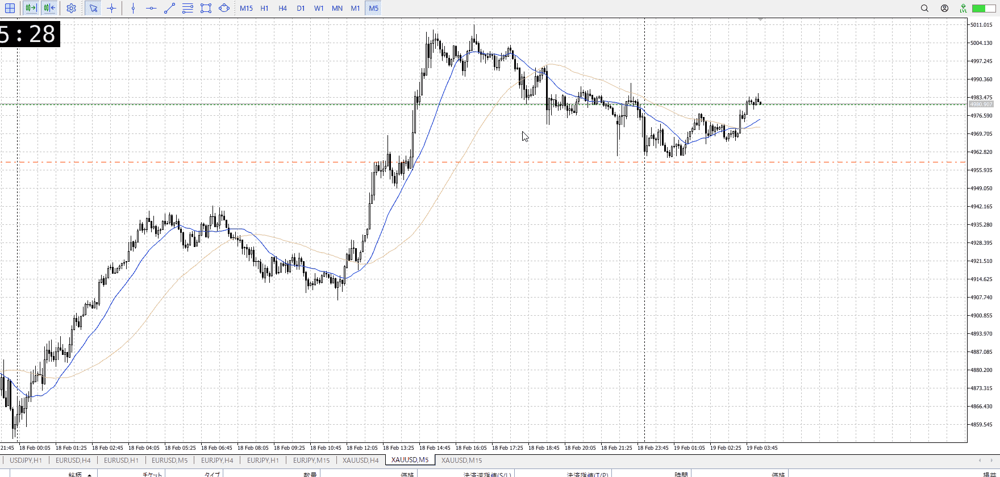

本来なら下から入って、損切6240points程度でゆったり待てたが。
動くのが意外と早かった。

t
なら落ちるの待って、そこで買えばいい

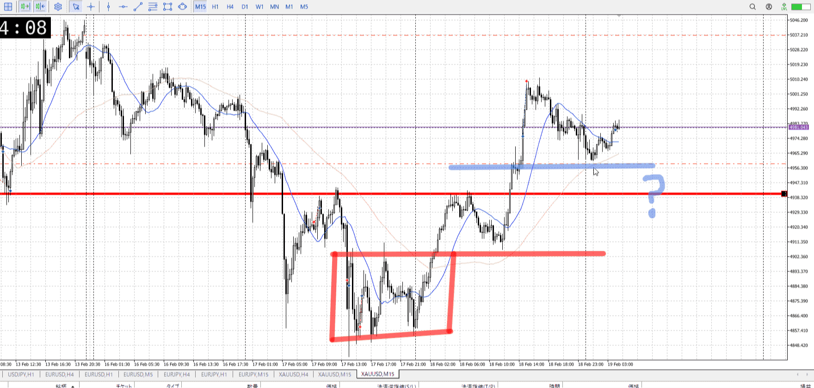

前回のはレンジの上に押したのを買ったが、今回はそういう押しより少し上にいる
その意味で上昇が前回より弱い可能性があり、前回のように買うのは難しい
比較検討するなら、前回のも再度検証して何が同じなのかを明確に

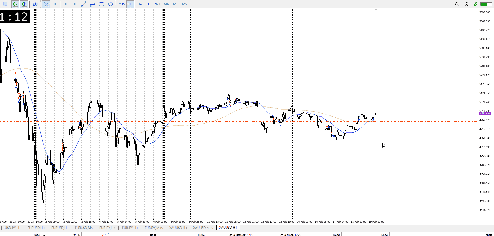

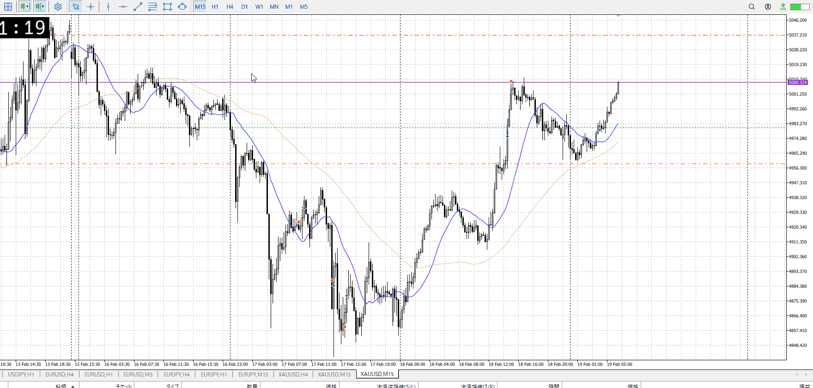

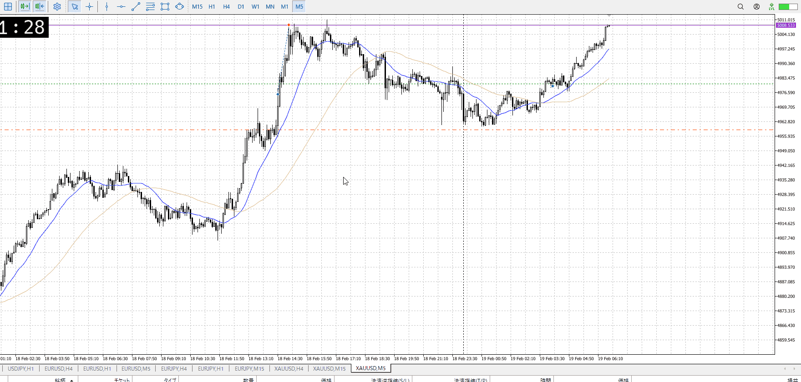

じわじわと最低要求にやってきた
今のところ怪しい動きはない
15mが上髭を見せ始めたら警戒

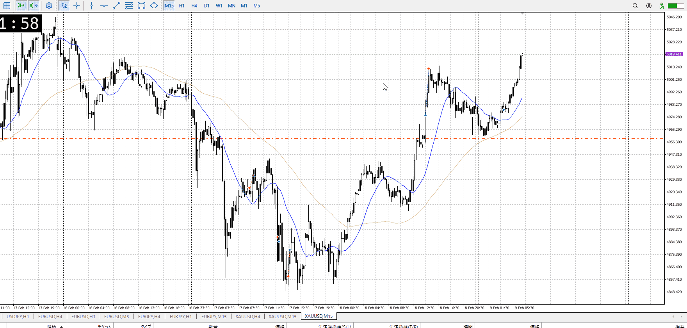

良い感じに伸びてる
今日は指標もない
ただし1hとのぶつかりは絶対あるので、それを見る

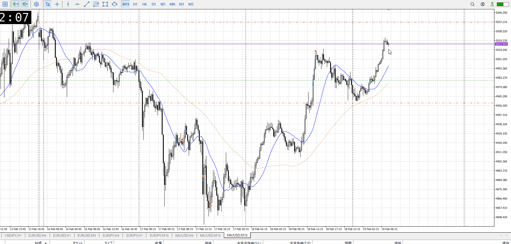
あまりにも下がらない
このまま持ち続けたほうがいい

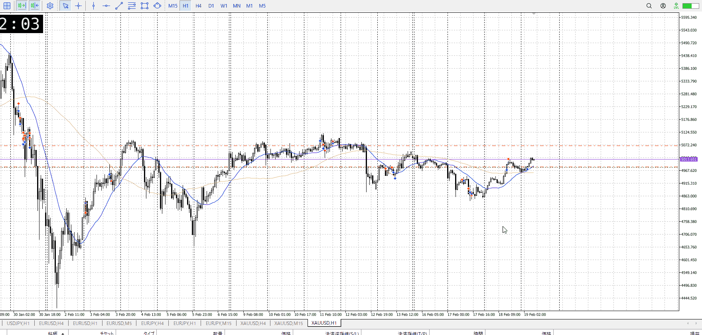
15mで買って上げてなかったが、1h的にはここまで
15m最低値は超えたし、元々1hで

t
ここは4hも気にしてる

1h目線はまだ下だけど、流れが変わって15mで1h安値割りより強い上トレンド出た

これが1hですぐ止まると見て利確置くより、ぶつかり後の上抜きまで考えておいた方が取れるよね
でも4hには勝てないからここまでだね、的な？

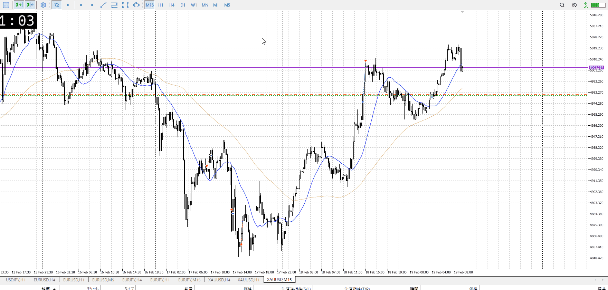

ちょっと強くね
15mでレンジでもないところを抜いているので大勢に影響はなさそうだが、この強さが出てきて15m確定したのはちょっと怖い
15m抜いた時点で1h待ちだろうし1hで何かやるまで気にしないと言えばそう

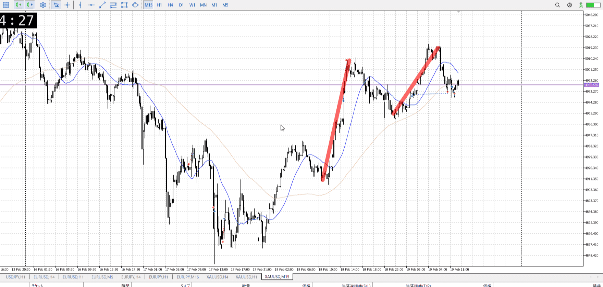
結果的には切りだった
15m一本単体ではなく、前回の上昇に対して遅く短い上昇でこれが出たのがまずかった

![[../Entry/en20260219T093538]]

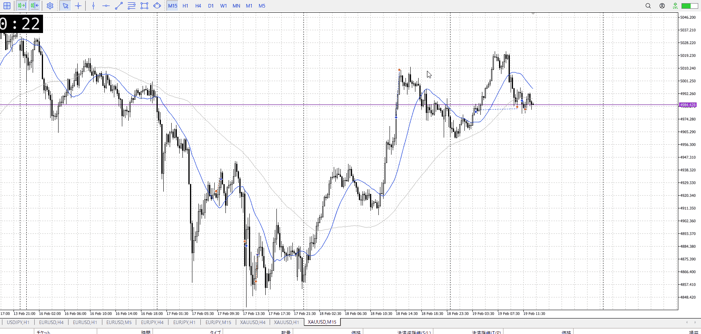

![[../Last_Entry/len20260219T100016]]

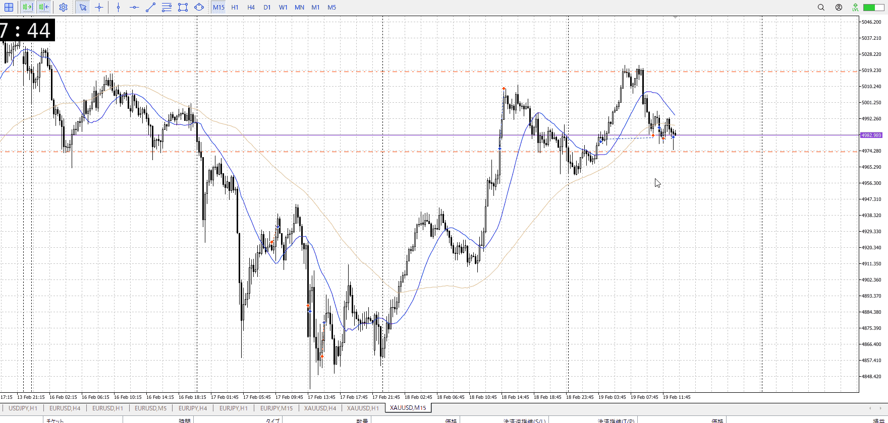

平均下にいるが、押し目買いの普通はこう
![[../Entry/en20260219T103455]]

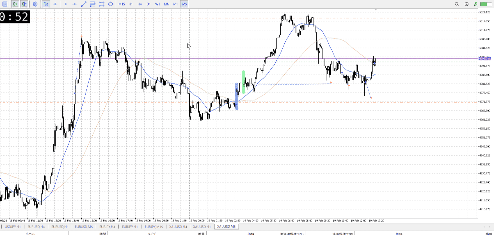
損切値が出てないのでは？

![[../Entry/en20260219T112030]]

---

再検証