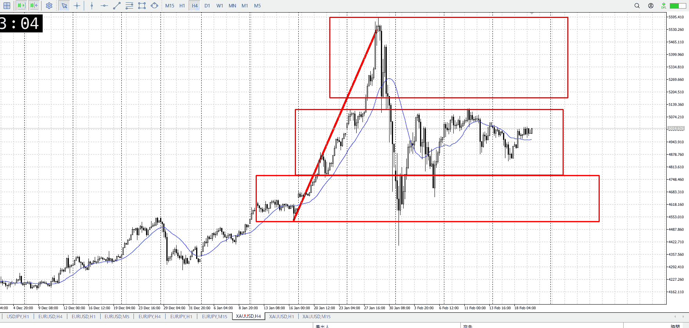
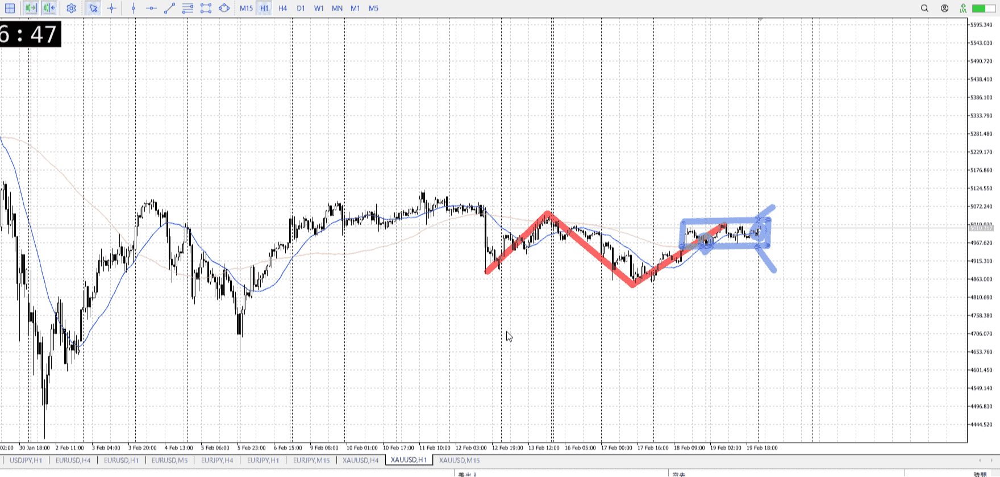
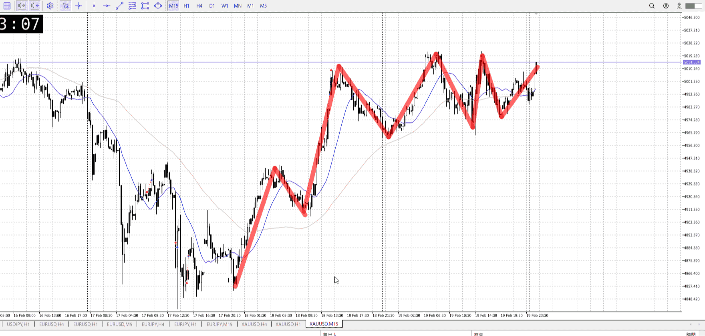
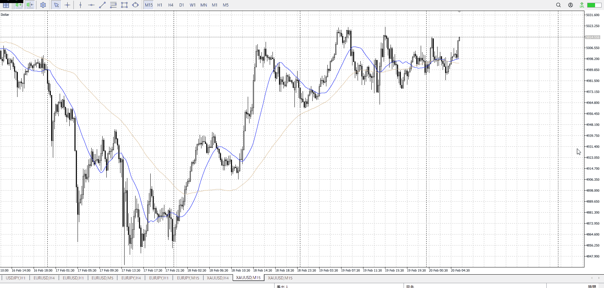
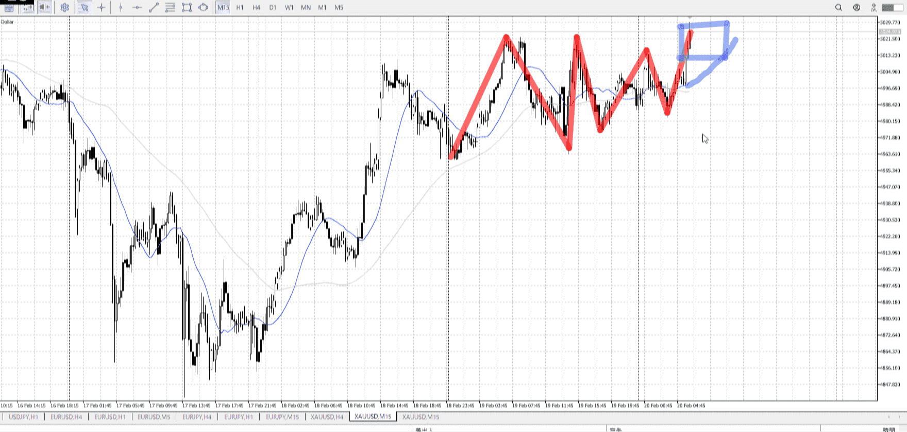
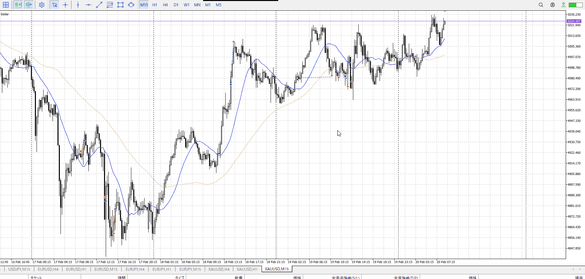
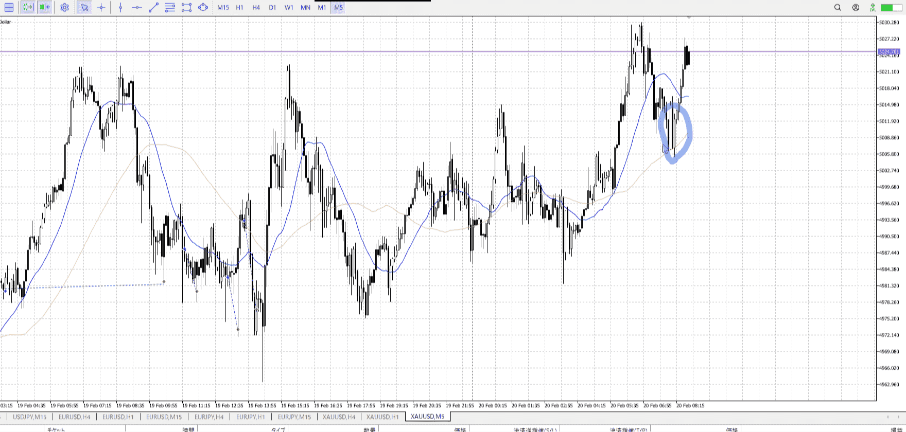
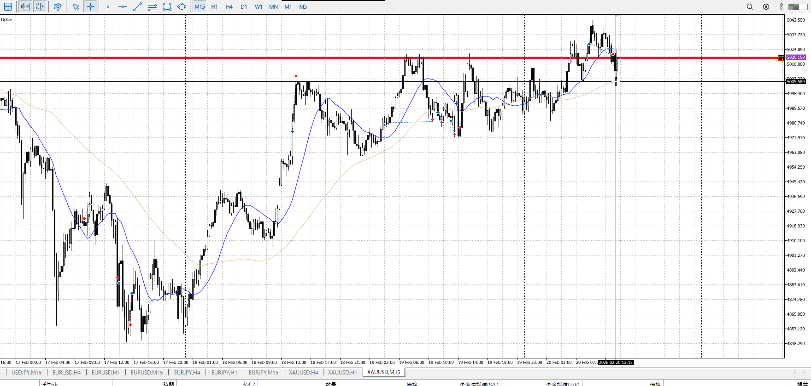

> [!note]
>- +1万 事前認識 **開始5分**

- [ ] [my](../my.md)(見ないと増える)
- [ ] 指標
    - 差し込まれる可能性有り、毎日

## 4h

＜ここに目線画像＞

- [x] トレーディングレンジ
    - m

方向：u

## 1h

＜ここに目線画像＞ ^4bb92f

方向：d

## 15m

＜ここに目線画像＞

方向：uR

全方向：uduR
^1d4903

- [x] 使用足全ての目線確認

## シナリオ

b:15m押し目
s:1h高値
- [x] 時間足ぶつかり

15m押し目と1h高値のどっちが勝つかのレンジ
- [x] 1hシナリオ
    - [ ] 明確か ? 続行 : 確定後考え直し

上がりつつ停滞
- [x] 日出日入、週出週入

下降と同じくらいの上昇、拮抗
- [x] 傾き比率

70k
昨日一昨日と比べ減った、今日は指標持ちなのでそれ待ちか
- [x] 前移動値

d200k
u178k
- [x] 前回上昇・下降値

## 位置

- [ ] 推進
- [ ] 調整
- [x] レンジ

## 方針
目線・シナリオ・強弱・調整
横幅・PA後・平均線方向・波
**ひきつけ**・軸時間・傾き比率

目線は15m買いたい1h売りたい、持ち合いは上の方
傾きは互角で今日は指標持ち
レンジなら端から入りたい

レンジ位置は上にある以上、降下が薄くなるので買いは優勢のはず
レンジらしく端からやるなら下から買いが妥当かな
安定でやるなら普通に抜けるまで待つのがいい

- [x] 買いたいなら
    - 上抜け、1h裏切り
        - 条件が少ないなら普通に押し待ち
    - レンジ下からRR重視買い
- [x] 売りたいなら
    - 下抜け戻り

OK!
Exchage Start.

---

## メモ

薄く切り上げている
しかし決定的なものは大してない

ここで抜き得ていくなら一日半分のレンジも相まって買いを指していけそう
もしここで上髭が出てくるなら買いにしては元気がない、押しを待ちたいがそういえば天井近いからしっかり待つ必要ありそう

その場合は15m平均がせめて追いつくまで

下髭欲しかったけど無く、ぐっと上がっていった

t
買えるなら（下位足が先に反応するから）青平均が黄色平均より上にくる

エントリーは5m、青丸で下髭付いたとこで買える

再度下がってきて、下髭付いたら買い

t
本当に1hが終わったなら、15mは一気に伸びる
そんなに揉まない

[レンジ](../レンジ.md)

m
近場でレンジが出来たならそれを優先するという考えはあったが、それが何の影響で出来て近場の高値とどう関係するかをあまり見てなかった
行動を変えるのは買えた後だが、考えを変えるのは買う前
これを抜いたら一気に目線変わるなという考えをもつ

レンジからの抜けが薄い気がするが、それ含め押しで入っていきたかった
うまく目線変わればたくさんとれるし、それまでの紆余曲折も余裕持てる

t
本来買いたかったとこまで落ちてきた、買える

今回は指標前なのでどの道ないが、発想は必要

![[../Entry/en20260221T024320]]

---

再検証

目線切替わり
片方が絶対にやってほしくないとこ

それの抵抗で出来たレンジなら
それを抜けば目線の高安も更新できる

怪しいことには変わりないので、下からしっかり入って余裕を持って見る

上昇を待ってて、直前に指標があって
普通に切って待てばよかった
決断力を無駄遣いしない

