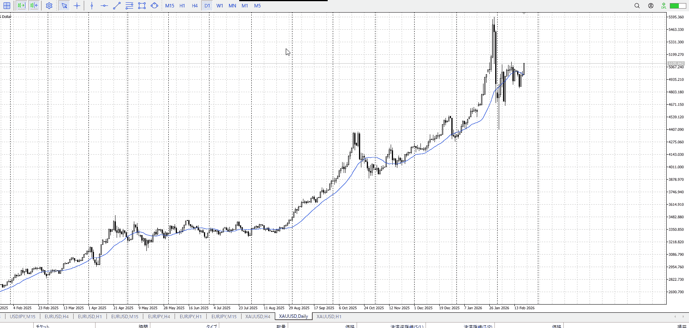
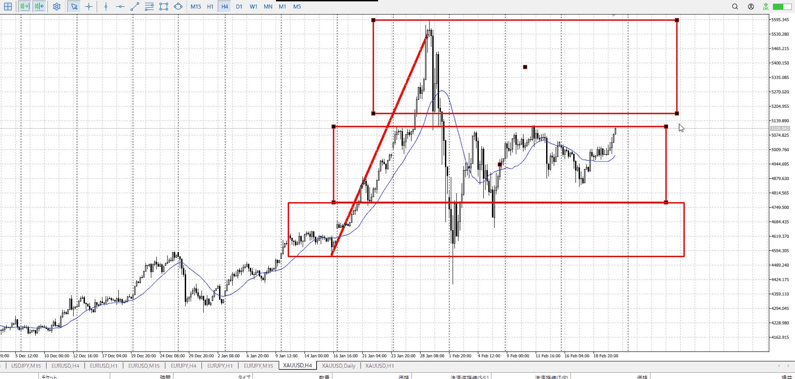
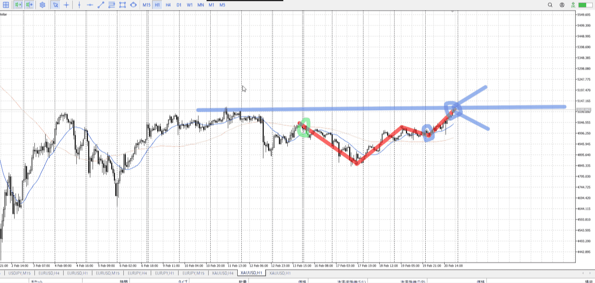
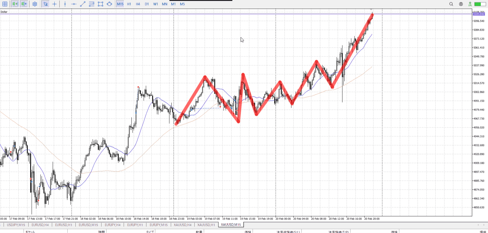

## 1d

＜ここに目線画像＞
下に振った後、切り上げかけて実線で上へ
越えこそしなかったが十分買いの起点になる

> [!note]
>- +1万 事前認識 **開始5分**

- [x] [my](../my.md)(見ないと増える)
- [x] 指標
    - 差し込まれる可能性有り、毎日

## 4h

＜ここに目線画像＞

- [x] トレーディングレンジ
    - m

方向：u

## 1h

＜ここに目線画像＞ ^4bb92f

方向：u

## 15m

＜ここに目線画像＞

方向：u

全方向：uuu
^1d4903

- [x] 使用足全ての目線確認

## シナリオ

b:1h押し目買い
s:4h天井
- [x] 時間足ぶつかり

- [x] 1hシナリオ
    - [x] 明確か ? 続行 : 確定後考え直し

上昇
- [x] 日出日入、週出週入

薄い下降から上昇
上昇より
- [x] 傾き比率

178k
- [x] 前移動値

178k
- [x] 前回上昇・下降値

## 位置

- [x] 推進
- [ ] 調整

## 方針
目線・シナリオ・強弱・調整
横幅・PA後・平均線方向・波
**ひきつけ**・軸時間・傾き比率

買い
普通に調整とその終わり待って買うだけ
開幕でぶち抜いてもやることは同じ、調整とその終わり待て

- [x] 買いたいなら
    - 前のレンジ近くまで落ちた後、平均が追いつく程度までレンジと下髭待ち伸び掴む
- [x] 売りたいなら
    - 前のレンジを下抜き

OK!
Exchage Start.

---

## メモ

---

再検証