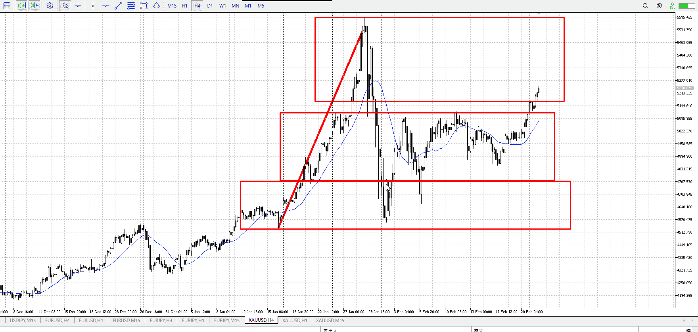
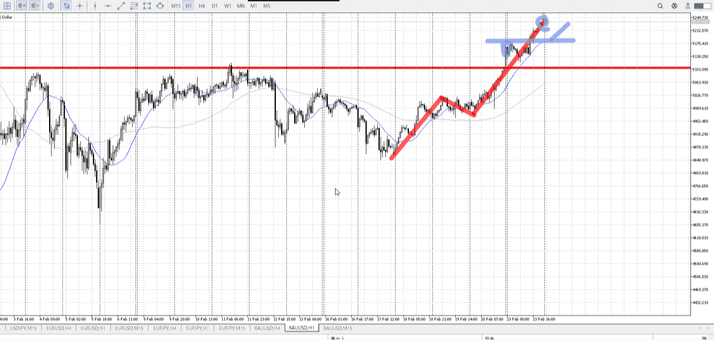
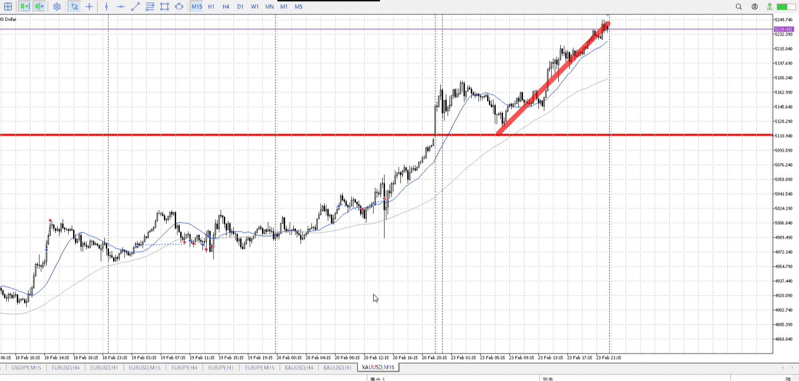

> [!note]
>- +1万 事前認識 **開始5分**

- [ ] [my](my.md)(見ないと増える)
- [ ] 指標
    - 差し込まれる可能性有り、毎日

## 4h

＜ここに目線画像＞

- [x] トレーディングレンジ
    - u

方向：u

## 1h

＜ここに目線画像＞ ^4bb92f

方向：u

## 15m

＜ここに目線画像＞

方向：u

全方向：uuu
^1d4903

- [x] 使用足全ての目線確認

## シナリオ

b:4h底
s:？
- [x] 時間足ぶつかり

どっか頭ぶつけるまで買い
- [x] 1hシナリオ
    - [x] 明確か ? 続行 : 確定後考え直し

上昇
- [x] 日出日入、週出週入

そもそも売りがいないので圧倒的優勢
- [x] 傾き比率

126k
- [x] 前移動値

1h170k
- [x] 前回上昇・下降値

## 位置

- [x] 推進
- [ ] 調整

## 方針
目線・シナリオ・強弱・調整
横幅・PA後・平均線方向・波
**ひきつけ**・軸時間・傾き比率

どっか頭ぶつけるまで買い
170k上がった後、調整と終わり待ち再度買い

- [x] 買いたいなら
    - 15m高値に落ちてきて短期買い
- [x] 売りたいなら
    - 15m安値割ってから

OK!
Exchage Start.

---

## メモ

---

再検証