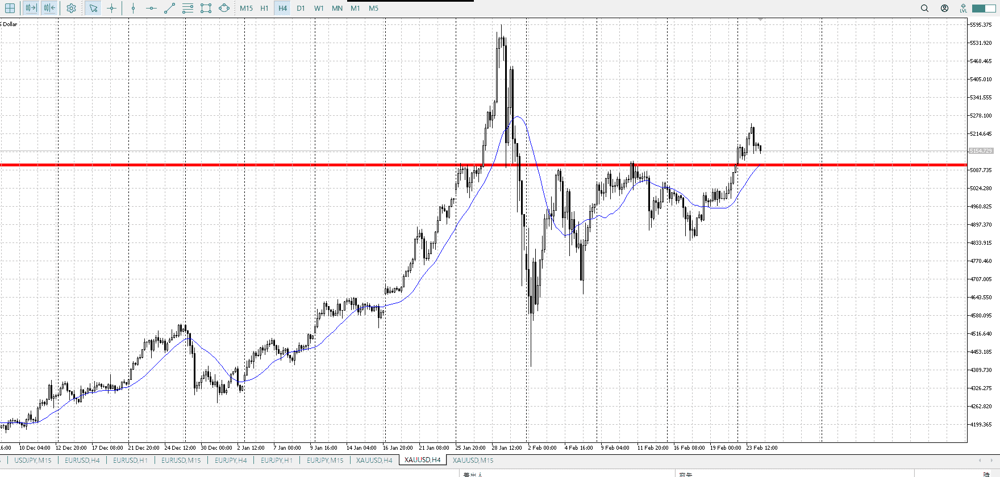
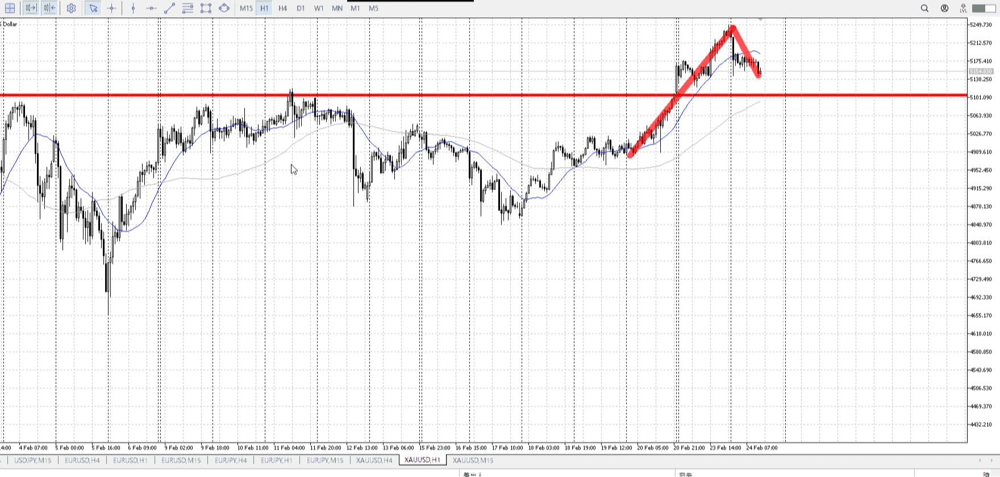
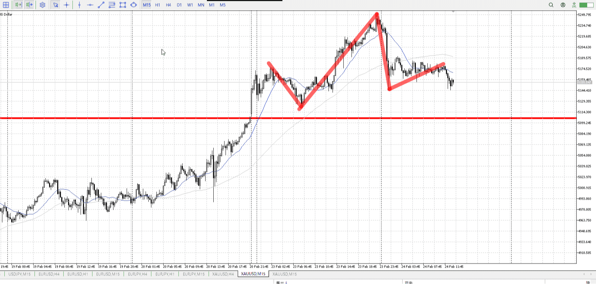
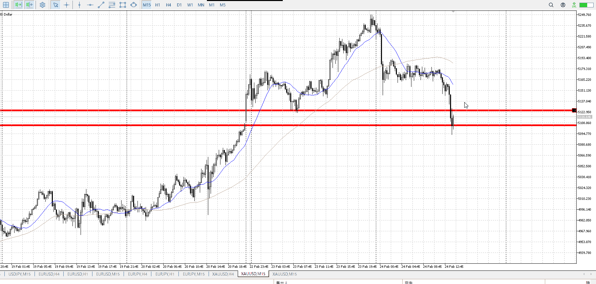
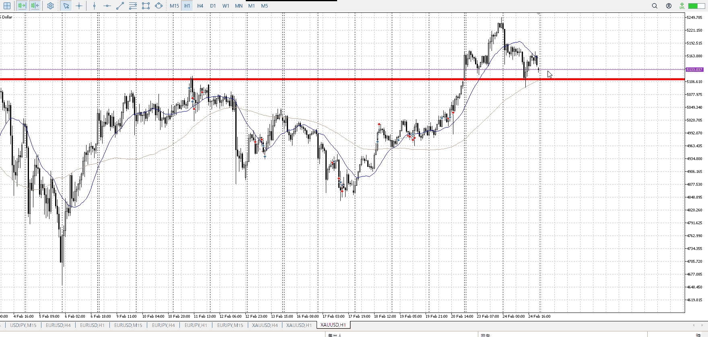

> [!note]
>- +1万 事前認識 **開始5分**

- [ ] [my](my.md)(見ないと増える)
- [ ] 指標
    - 差し込まれる可能性有り、毎日

## 4h

＜ここに目線画像＞

- [x] トレーディングレンジ
    - u

方向：u

## 1h

＜ここに目線画像＞ ^4bb92f

方向：u

## 15m

＜ここに目線画像＞

方向：u

全方向：uuu
^1d4903

- [x] 使用足全ての目線確認

## シナリオ

b:4h底
s:？
- [x] 時間足ぶつかり

どっか頭ぶつけるまで買い
- [x] 1hシナリオ
    - [x] 明確か ? 続行 : 確定後考え直し

上昇
- [x] 日出日入、週出週入

そもそも売りがいないので圧倒的優勢
- [x] 傾き比率

126k
- [x] 前移動値

1h170k
- [x] 前回上昇・下降値

## 位置

- [x] 推進
- [ ] 調整

## 方針
目線・シナリオ・強弱・調整
横幅・PA後・平均線方向・波
**ひきつけ**・軸時間・傾き比率

どっか頭ぶつけるまで買い
170k上がった後、調整と終わり待ち再度買い

- [x] 買いたいなら
    - 15m高値に落ちてきて短期買い
- [x] 売りたいなら
    - 15m安値割ってから

OK!
Exchage Start.

---

## メモ

ちょっと上昇に対して下降がキツイ
同じ以上の横幅取って落ちてないのでここで直接死ぬわけではないが、ここを下割すると辛いか

昨日の分で前回上昇と同じ分くらいは使い切ってる

とはいえ1hはここに何も作ってない
やるとすれば15m売りが単独で勝利だが、何に勝つかというと4h天井買い1h押し目買い
15m単独はきついので1h巻き込みたいがそれもない

また4hAも下に控えてる

となると単に1hの利確あたりで落ち、買いを探ってると見る
この落ちをどっかで下振りで否定して買いたい
今の15mレンジとか下振りして上に行けば、そもそも勢いよく落ちてるのは15mだけなので全ての売り要素が消える
そしたら押し目待って買い

一応前回の1h買いの高さで買うこともできる
それなら1hを味方につけられるはず

確定抜きされたので、いまいちここで止まるように見えない。
どのみち風呂で見てなかったので入れないが。

これで15m売りが出来るっちゃできる。
1hのフリが無い中ではきつい。

t
1hシナリオが15mになってる

t
ここで買うのは、1h4hの買いをもとにする
15mのレンジ下を元にするのは、上昇トレンド中で1hAの折れが出てないので押し目にしづらい
買わなくていい

---

再検証
t
頭ぶつけるまで
![[../../images/2026-02-24 2026-02-25 08.20.01.excalidraw]]

=伸びなくなるまで
その具体的な案を考えておく

![[../../images/2026-02-24 2026-02-25 08.42.02.excalidraw]]