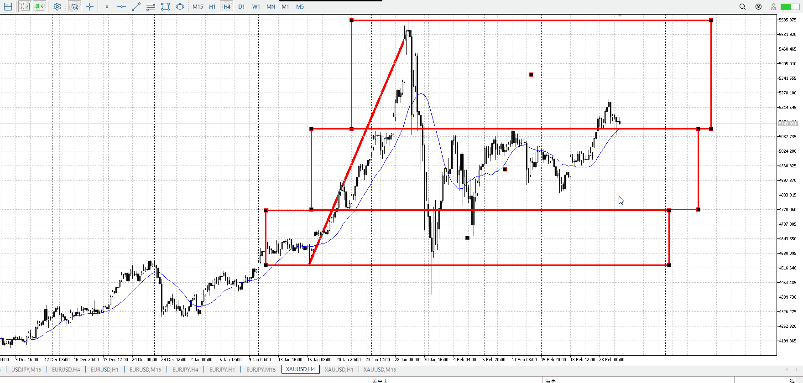
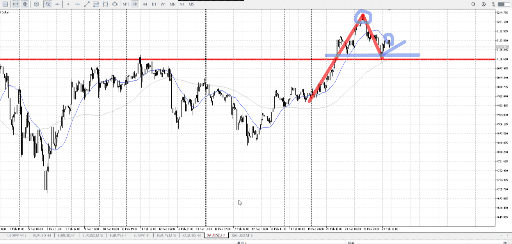
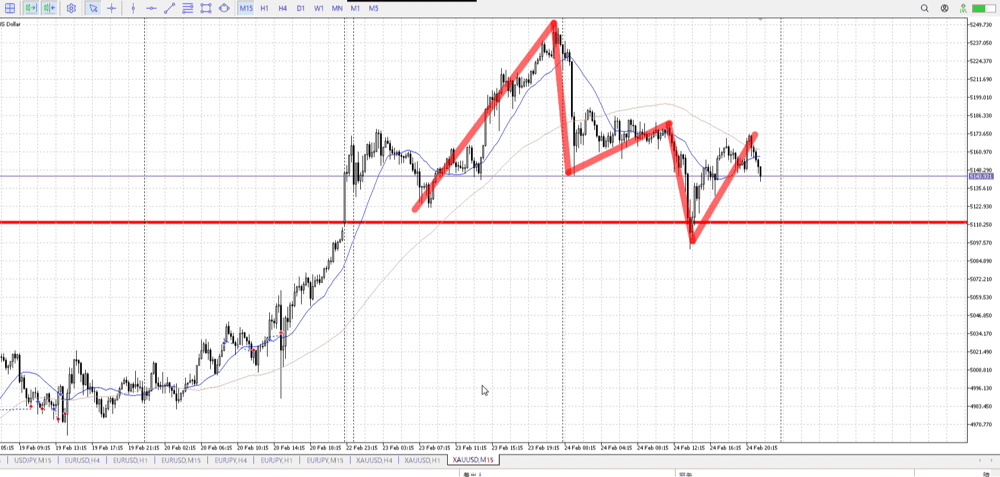

> [!note]
>- +1万 事前認識 **開始5分**

- [ ] [my](my.md)(見ないと増える)
- [ ] 指標
    - 差し込まれる可能性有り、毎日

## 4h

＜ここに目線画像＞

- [x] トレーディングレンジ
    - u

方向：u

## 1h

＜ここに目線画像＞ ^4bb92f

方向：u

## 15m

＜ここに目線画像＞

方向：d

全方向：uud
^1d4903

- [x] 使用足全ての目線確認

## シナリオ

b:4h底
s:1h高値
- [x] 時間足ぶつかり

4h底から上がる
ばしっと合うわけないんだから4h底で下髭付いたとき買ってみてればよかった
- [x] 1hシナリオ
    - [x] 明確か ? 続行 : 確定後考え直し

下降調整
- [x] 日出日入、週出週入

まだ少し下降が急
- [x] 傾き比率

136k
- [x] 前移動値

d206k
u268k
- [x] 前回上昇・下降値

## 位置

- [ ] 推進
- [x] 調整

## 方針
目線・シナリオ・強弱・調整
横幅・PA後・平均線方向・波
**ひきつけ**・軸時間・傾き比率

調整中
上昇に対して下降が少しきついままなので、もう少しレンジしてから伸びる予想
15m目線を切り替える前から伸びるフリは出るはず、横幅を待ったら5mも使用してその伸びを掴む

あるいは4h底から再び買ってもいい
4hからの買いにしてはそんなに勢い無かったのが気になる

- [x] 買いたいなら
    - 4h底
    - 15mレンジ抜き押し
- [x] 売りたいなら
    - 4h底を抜いてから
    - 15m目線下により、レンジから戻り売りをかけてくる短期勢力には注意

OK!
Exchage Start.

---

## メモ
![[../Last_Entry/len20260225T095337.md]]

![[../Entry/en20260225T113104.md]]
![[../Entry/en20260226T122020.md]]

5m見るのが早すぎ

髭につられない、それは話が違うとなるような下髭は予想した物だけ考える
上位足で意味ある髭を
上位足見る

---

再検証