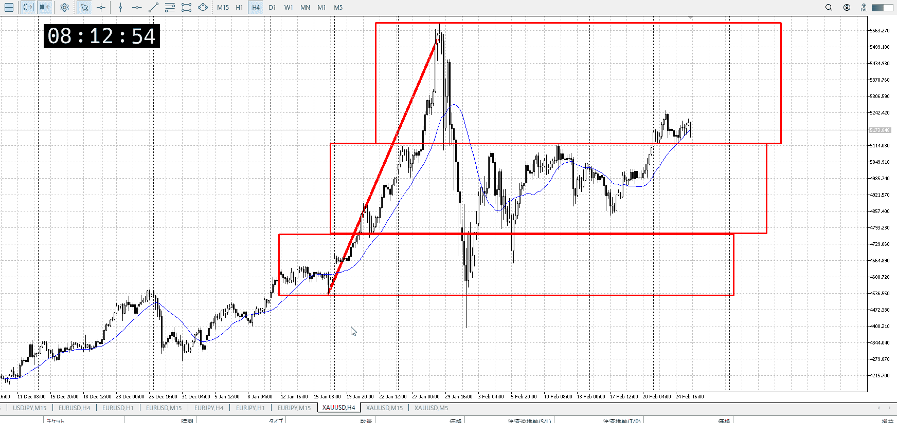
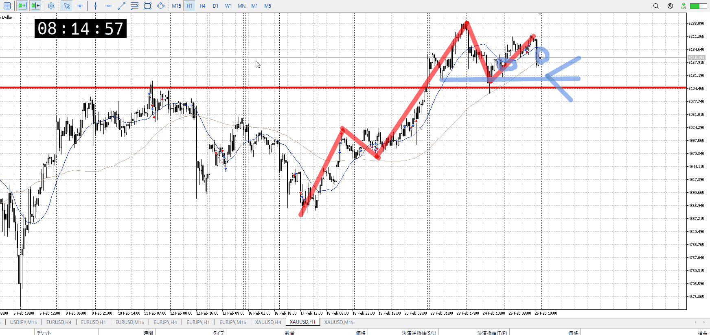
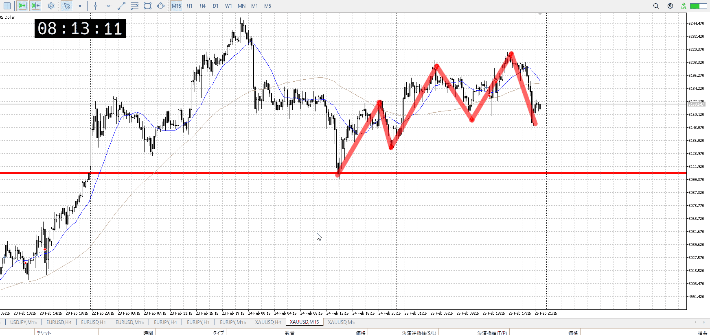

> [!note]
>- +1万 事前認識 **開始5分**

- [ ] [my](my.md)(見ないと増える)
- [ ] 指標
    - 差し込まれる可能性有り、毎日

## 4h

＜ここに目線画像＞

- [x] トレーディングレンジ
    - u

方向：u

## 1h

＜ここに目線画像＞ ^4bb92f

方向：u

## 15m

＜ここに目線画像＞

方向：u

全方向：uuu
^1d4903

- [x] 使用足全ての目線確認

## シナリオ

b:4h天井
s:1h高値
- [x] 時間足ぶつかり

ダブルトップっぽくなってきたので売りの可能性を考慮
- [x] 1hシナリオ
    - [x] 明確か ? 続行 : 確定後考え直し

ちょい上昇
- [x] 日出日入、週出週入

下降以上にかけて7割程度
- [x] 傾き比率

78k
- [x] 前移動値

122k
- [x] 前回上昇・下降値

## 位置

- [ ] 推進
- [x] 調整

## 方針
目線・シナリオ・強弱・調整
横幅・PA後・平均線方向・波
**ひきつけ**・軸時間・傾き比率

買いたいが、ダブルトップっぽい
一応売りを警戒しつつ、傾き比率も都度見つつ、絶対に髭だけにつられないこと
予想した場所で、15mが買いやすい高さと横幅で買う

- [x] 買いたいなら
    - ネック割りへの下降を調整として否定
        - 具体的にはレンジから上抜け押し、下振りなど
- [x] 売りたいなら
    - ダブルトップネック割り、その前振り含め
    - こちらは抜けがあり得る

それまではやらない

OK!
Exchage Start.

---

## メモ
[my2026-02-26](../My_Test/my2026-02-26.md)

---

再検証