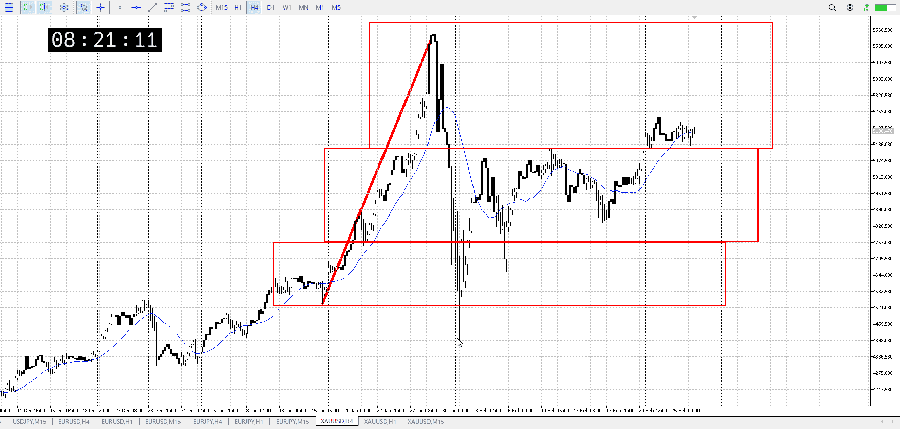
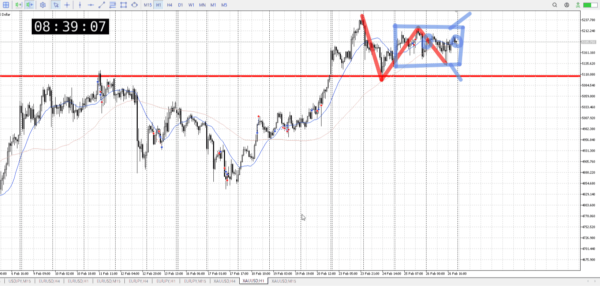
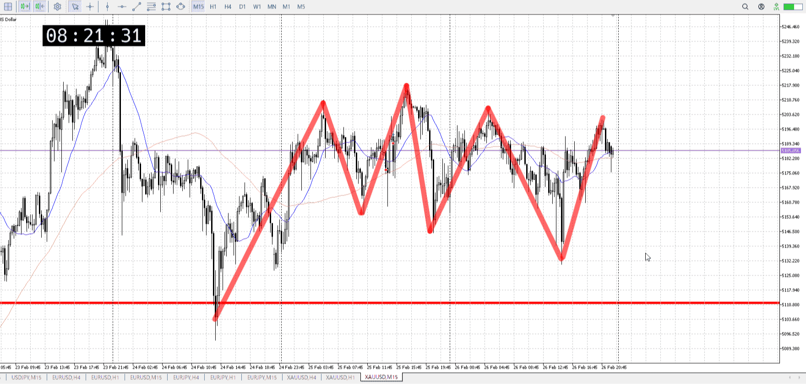
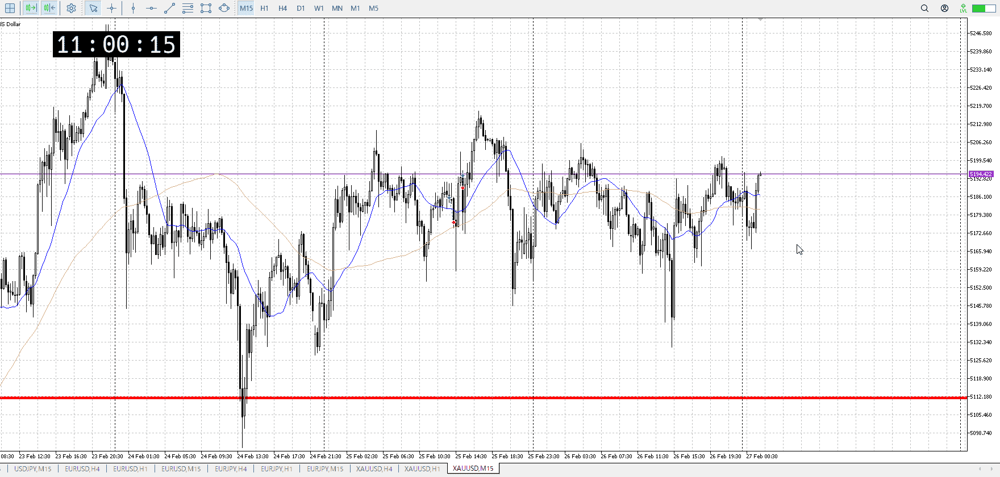
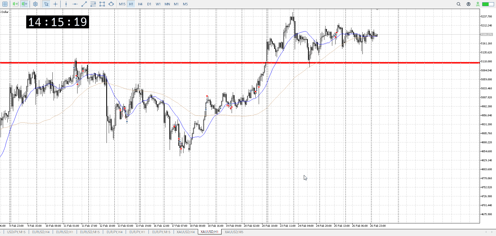
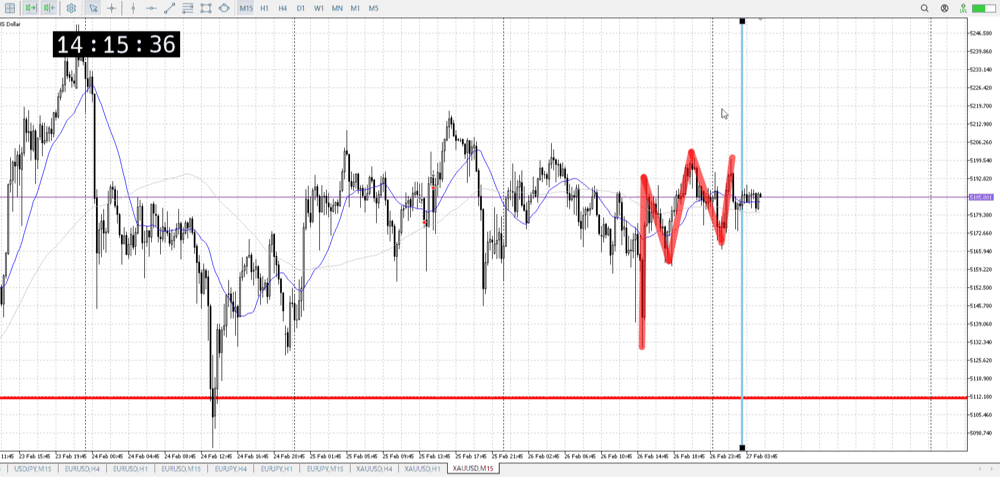
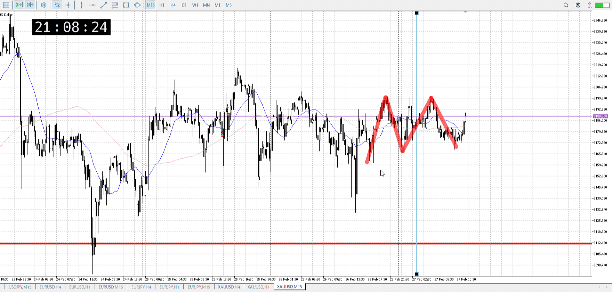

> [!note]
>- +1万 事前認識 **開始5分**

- [x] [my](my.md)(見ないと増える)
- [x] 指標
    - 差し込まれる可能性有り、毎日

## 4h

＜ここに目線画像＞

- [x] トレーディングレンジ
    - u

方向：u

## 1h

＜ここに目線画像＞ ^m4vbvu

方向：u

## 15m

＜ここに目線画像＞

方向：R

全方向：uuR
^50ygmr

- [x] 使用足全ての目線確認

## シナリオ

b:4h押し目
s:1h高値
- [x] 時間足ぶつかり

どっち行くか分からない
明確に抜けるか振りかあたり決まってから書いたほうがいいかも
- [x] 1hシナリオ
    - [ ] 明確か ? 続行 : 確定後考え直し

同値
- [x] 日出日入、週出週入

上昇早め
ただレンジは抜けず
- [x] 傾き比率

73k
- [x] 前移動値

u117k
- [x] 前回上昇・下降値

## 位置

- [ ] 推進
- [x] 調整

## 方針
目線・シナリオ・強弱・調整
横幅・PA後・平均線方向・波
**ひきつけ**・軸時間・傾き比率

15mがどっちか分からなくなった
1hは変わらず上、下髭を出してるのでそれ込みでも雄下がらない
15mは機能の上昇でも天井を抜けられなかったので、ガッツリレンジがあり得る

上張り付きなどがあってようやく戦いが始まるかと
今のままでは何も分からない
上位足に方向感が無さすぎる

- [x] 買いたいなら
    - 上張り付きなど買いの優勢を見て、押し目買い
- [x] 売りたいなら
    - レンジ下抜き戻り

OK!
Exchage Start.

## メモ

上に偏り目になってきた
15mは何もしてないので、横の高値抜いて押し目作って買いたい

下髭は昼前にレンジ下は勝率低くないかと思って止めた
無

無すぎてちょっとやそっとじゃ抜けない
が上に貼りつき始めてるのは事実だし、上はありえるはず
下振りか上抜け押しを、しかしこれだけレンジなら抜けたら決定的である気もするが
上抜けで1h高値に対して15m押し目で対抗すればちょうどか

別にレンジ下じゃなく押し目なのでは
じゃあ買うべきだったか

[my2026-02-27](../My_Test/my2026-02-27.md)

上昇に対し同程度の下降
レンジ

高値抜いて1hサポートを受けないと買えない
![[../After_Entry/Aen20260227T110221.md]]

---

再検証