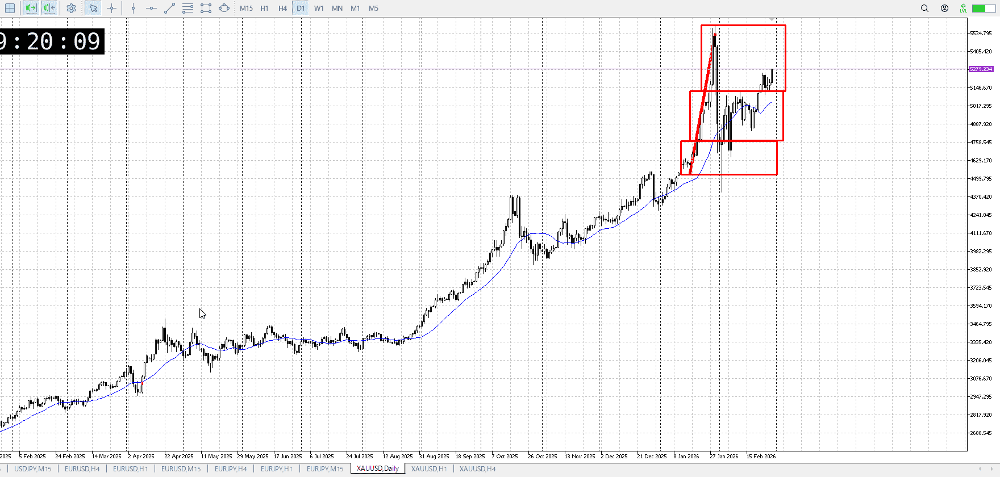
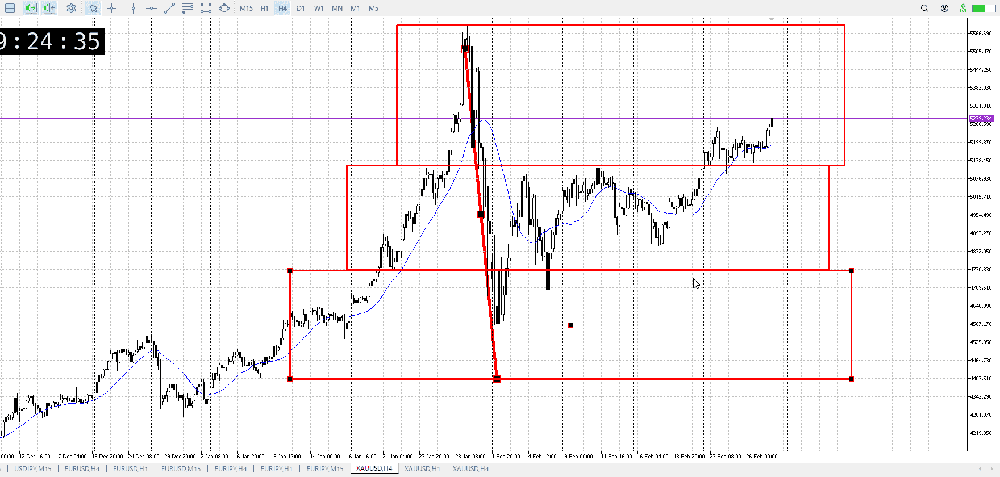
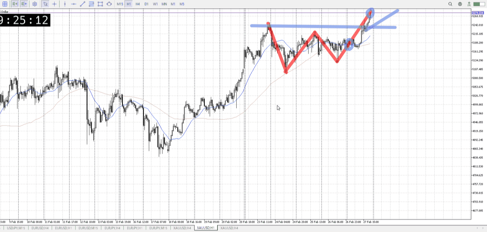
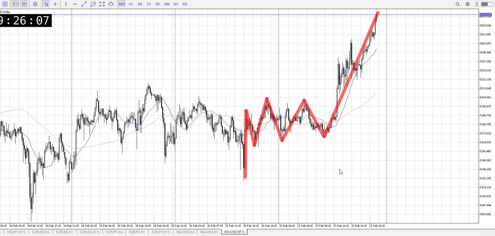
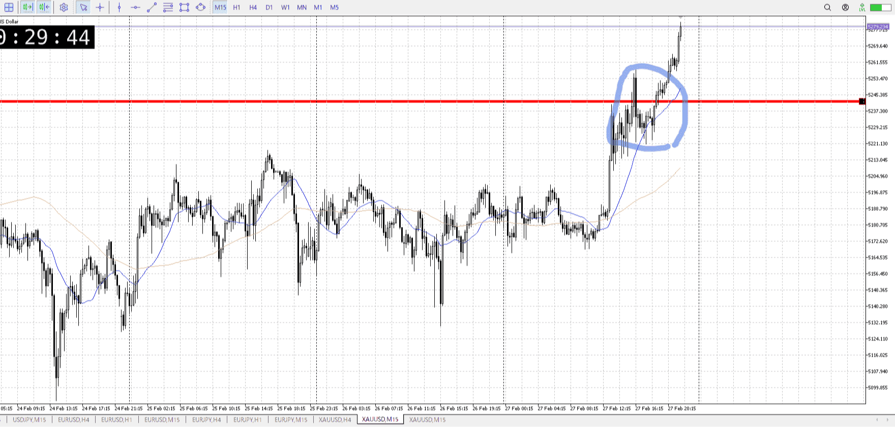
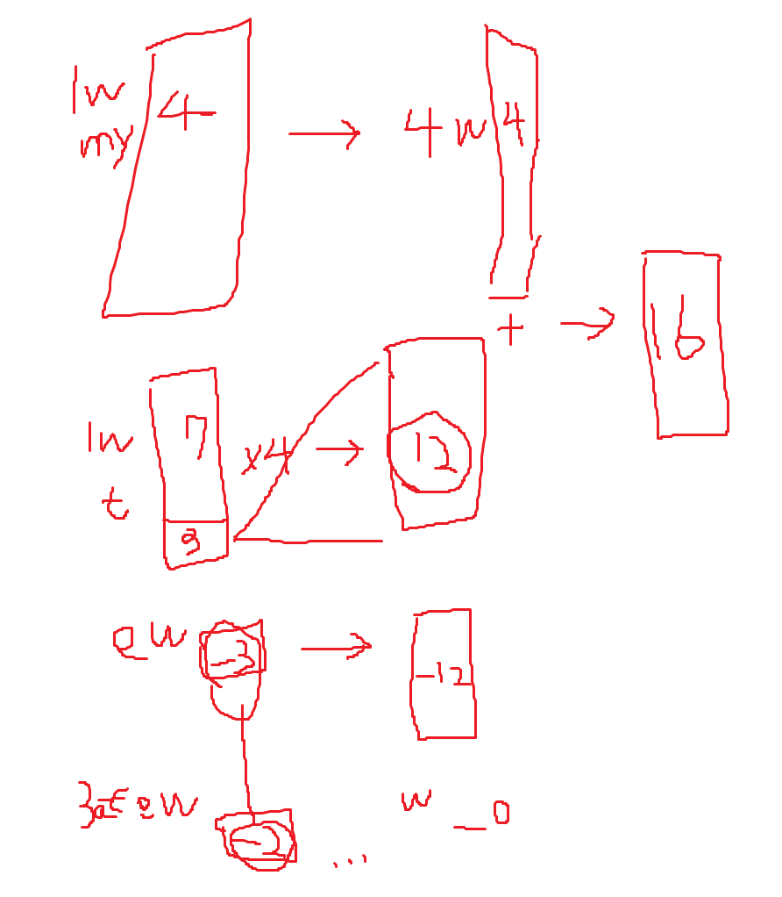

## 1d

＜ここに目線画像＞

上がった
押し目買いと言った形

> [!note]
>- +1万 事前認識 **開始5分**

- [x] [my](my.md)(見ないと増える)
- [x] 指標
    - 差し込まれる可能性有り、毎日

## 4h

＜ここに目線画像＞

- [x] トレーディングレンジ
    - u

方向：u

## 1h

＜ここに目線画像＞ ^4j2758

方向：u

## 15m

＜ここに目線画像＞

方向：u

全方向：uuu
^s6tfms

- [x] 使用足全ての目線確認

## シナリオ

b:4h天井
s:?
- [x] 時間足ぶつかり

押し目買い
- [x] 1hシナリオ
    - [x] 明確か ? 続行 : 確定後考え直し

上抜き
- [x] 日出日入、週出週入

角度は変わらないけど上抜き
- [x] 傾き比率

110k
- [x] 前移動値

4hu400k
- [x] 前回上昇・下降値

## 位置

- [x] 推進
- [ ] 調整

## 方針
目線・シナリオ・強弱・調整
横幅・PA後・平均線方向・波
**ひきつけ**・軸時間・傾き比率

推進。4hレベルの押し目と言える。4h下だが。
これに15mとかから乗っかるか、調整待つか。

- [x] 買いたいなら
    - 15mのレンジから推進に乗っていく
    - 1hで押しを待って買う
- [x] 売りたいなら
    - 1h安値を割るとかから

OK!
Exchage Start.

## メモ
t

今回の波で気にされてたのは、青丸部分
ここで上昇が止められた、売りがいたとこ
つまり赤横高さがより気にされてる、ここを押し目買いとしてみる

指定はしたが、無視してどんどん上がっていくことの方が考えられる
その場合はどうしようもない、月曜であがって火曜水曜レンジ木曜抜け押し狙いとかになる

補助は3割プラス、得
加えて増える資金を増やすのに使える、加速する

こちらの損が±0である限り問題ない

問題はロットを増やすと増える損が、補助で増える得よりも早く増えること
ロット分で増える損切以上に、損切のプレッシャーを受けた分で、小さくなったり補填に金かけたりで、エントリーに合理性が消えて損が増えてる

補助を外せばプレッシャーは受けない
しかし自分で増やしたところで、いずれプレッシャーは受ける
自分で増やした分むしろより大きいプレッシャー

補助を外せば損得両方を自分の責任にし、より勉強できる
何処で入ろうが自責は自責、勉強は可能

補助を外せば消し飛んだ時自分の余ってる金で補填できる
補填は補助があっても借金として可能

借金が増える、返せる見込みがない
FXで稼げばいい、どの道その予定でそれを早める

現時点、2月は-46k
いやpointsで出せ

---

再検証