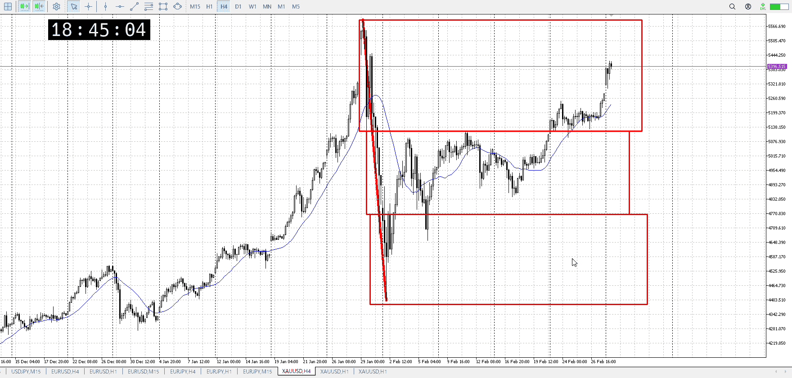
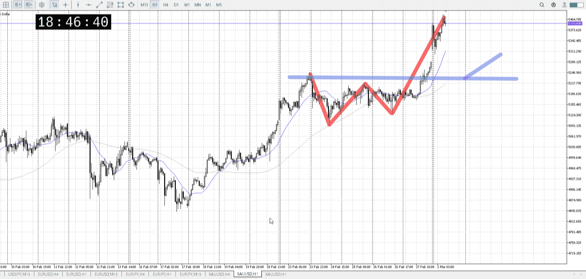
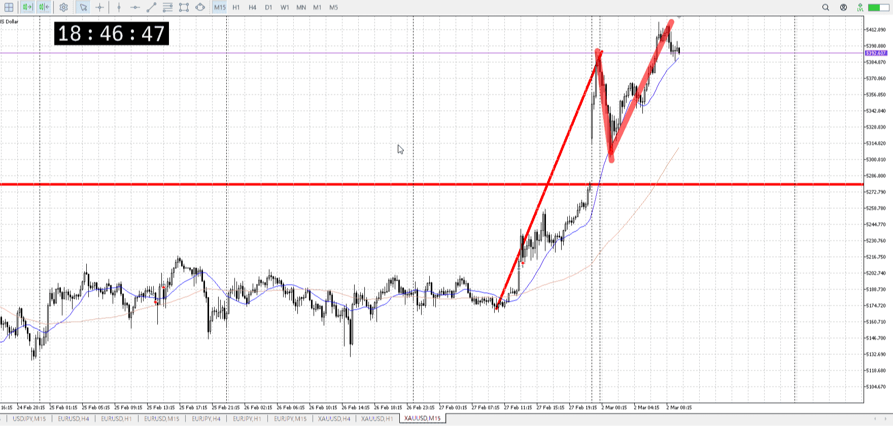
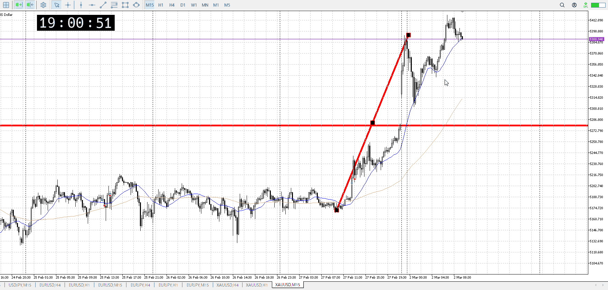
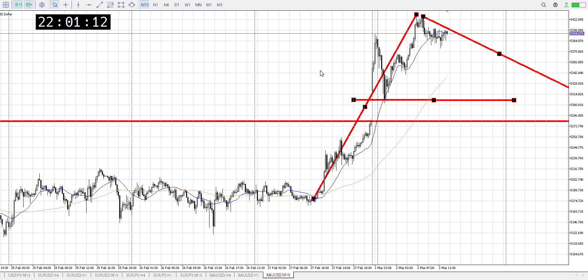

> [!note]
>- +1万 事前認識 **開始5分**

- [x] [my](my.md)(見ないと増える)
- [x] 指標
    - 差し込まれる可能性有り、毎日
金曜10:30雇用統計
## 4h

＜ここに目線画像＞

- [x] トレーディングレンジ
    - u

方向：d

## 1h

＜ここに目線画像＞ ^pds0at

方向：u

## 15m

＜ここに目線画像＞

方向：u

全方向：duu
^6sfsbd

- [x] 使用足全ての目線確認

## シナリオ

b:4h天井
s:？
- [x] 時間足ぶつかり

1h押し目
ここまで落ちる前に、1波の上昇を掴みたいとこではあった
- [x] 1hシナリオ
    - [x] 明確か ? 続行 : 確定後考え直し

上昇
- [x] 日出日入、週出週入

上
- [x] 傾き比率

110k
- [x] 前移動値

4h400k
- [x] 前回上昇・下降値

## 位置

- [x] 推進
- [ ] 調整

## 方針
目線・シナリオ・強弱・調整
横幅・PA後・平均線方向・波
**ひきつけ**・軸時間・傾き比率

現在320k消費

買いたいんだけど、気にされてるとこに来ない
今は気にされてるのかどうか分からない高さだし、上に出た部分がかなり抑えめな感じ

深押しして、も今日の始値くらいか
そこにくるならむしろ上昇が死にかねない

- [ ] 買いたいなら
    - レンジとか押し目
- [ ] 売りたいなら
    - レンジとか戻り

OK!
Exchage Start.

## メモ

t
全体の買い圧力を元に、短期の押し目を短期で買っていく
これも勝っても高値までで、抜けは期待しない

m
手前二つまでなら一波の中だったが、平均が下に折れ始めてるし15m前回上昇に対して時間がかかっている
いや、下折れの終了を掴めるか？

![[../Before_and_Mid_Entry/BaMen00080302T100455.md]]

![[../Before_and_Mid_Entry/BaMen00080302T103826.md]]

---

再検証