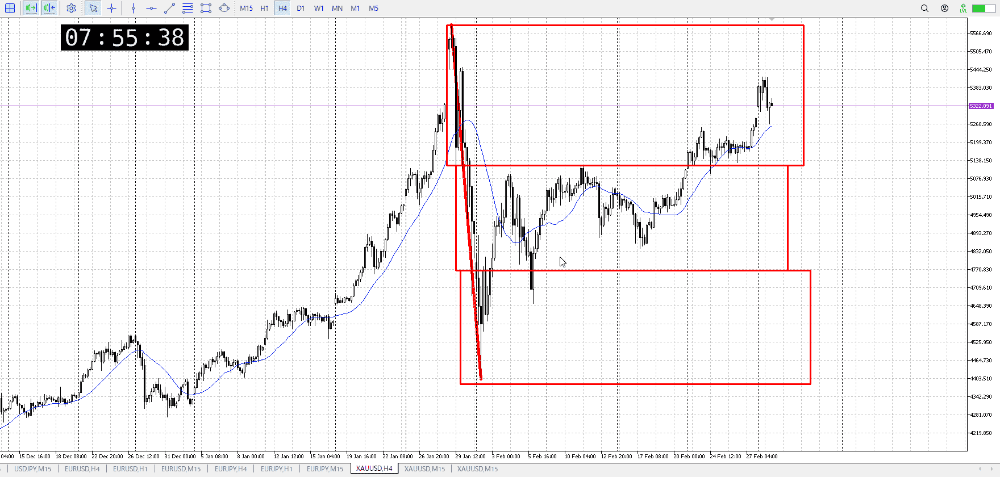
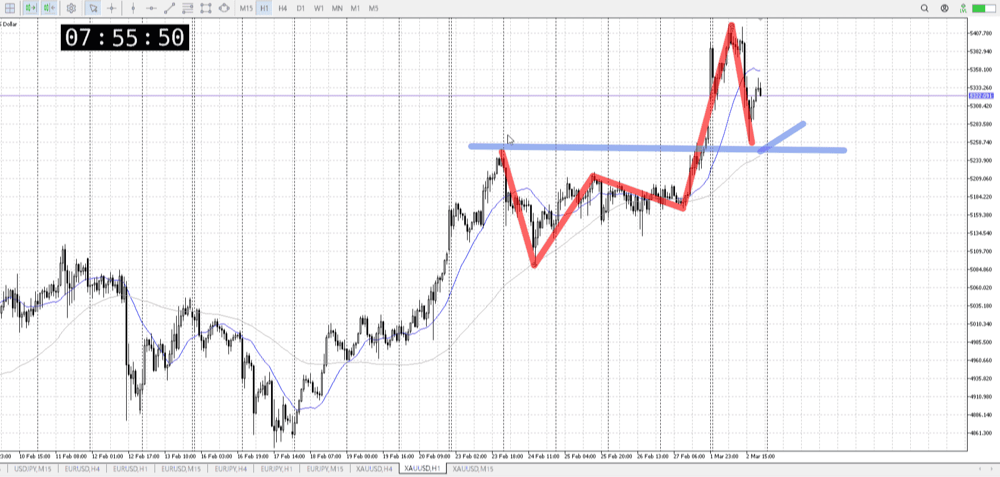
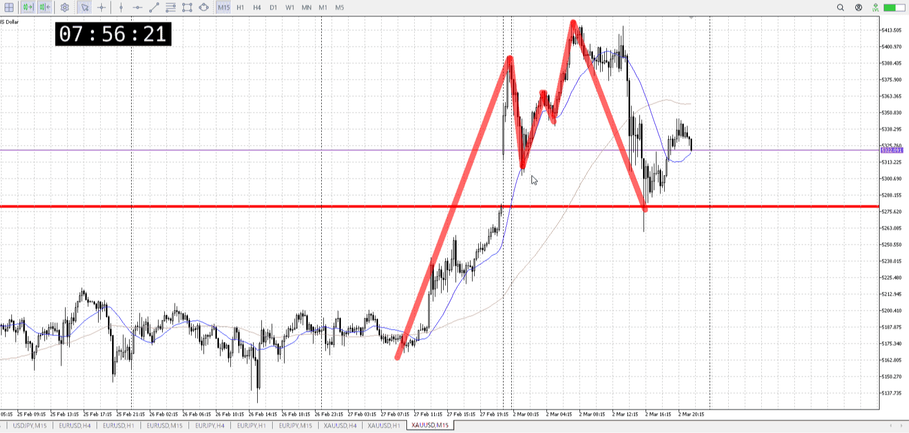
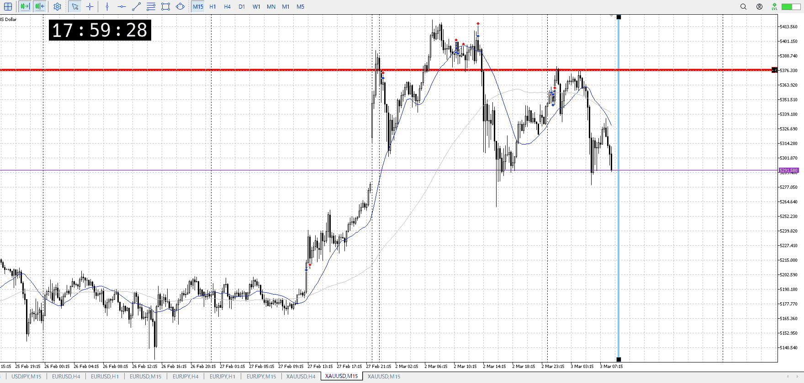
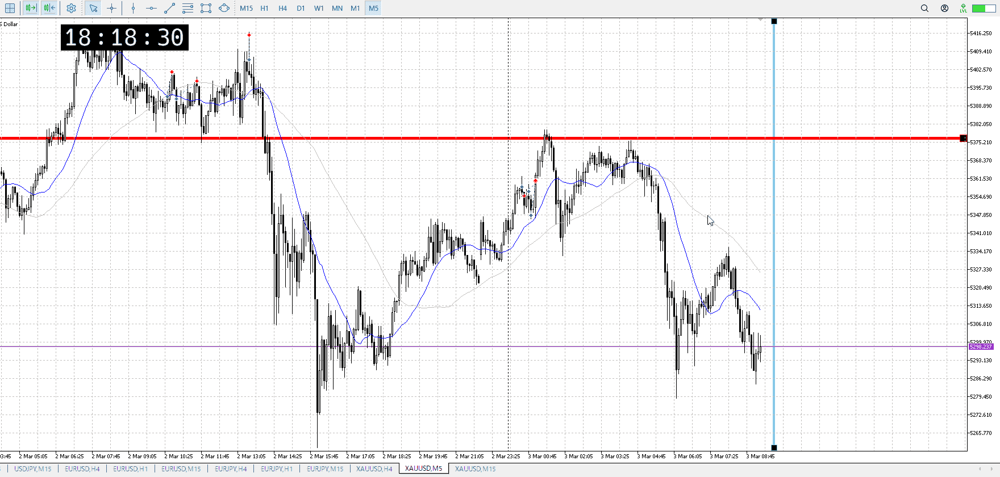
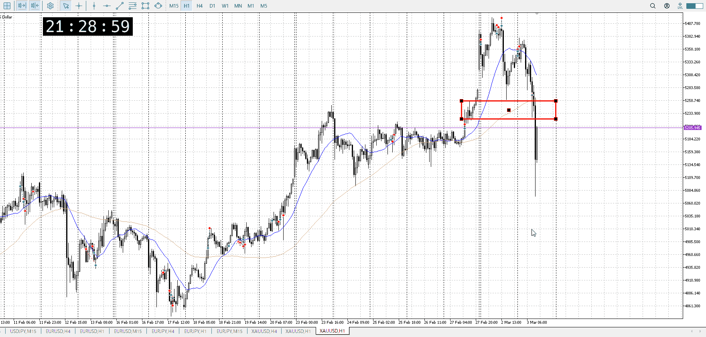
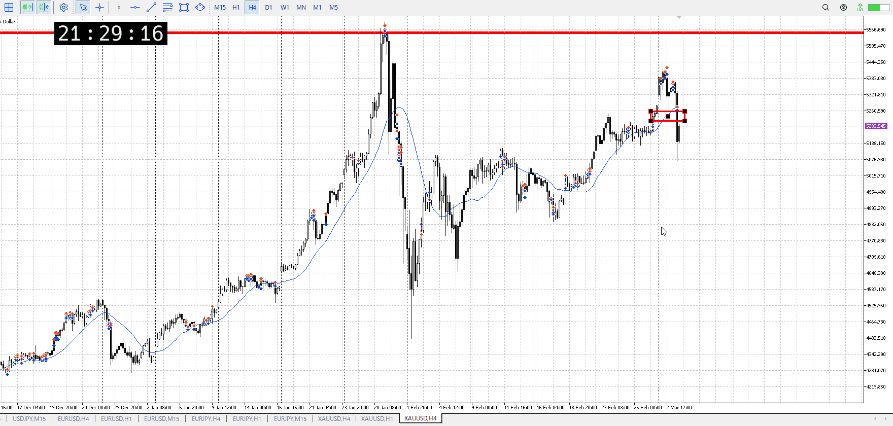

> [!note]
>- +1万 事前認識 **開始5分**

- [ ] [my](my.md)(見ないと増える)
- [ ] 指標
    - 差し込まれる可能性有り、毎日

## 4h

＜ここに目線画像＞

- [x] トレーディングレンジ
    - u

方向：d

## 1h

＜ここに目線画像＞ ^nldjvu

方向：u

## 15m

＜ここに目線画像＞

方向：d

全方向：dud
^37v3ja

- [x] 使用足全ての目線確認

## シナリオ

b:4h天井
s:？
- [x] 時間足ぶつかり

落ちてきたので押し目で買い
- [x] 1hシナリオ
    - [x] 明確か ? 続行 : 確定後考え直し

- [ ] 日出日入、週出週入

少し下降が急だが止められてればOK
- [x] 傾き比率

158k
- [x] 前移動値

247k
- [x] 前回上昇・下降値

## 位置

- [ ] 推進
- [x] 調整

## 方針
目線・シナリオ・強弱・調整
横幅・PA後・平均線方向・波
**ひきつけ**・軸時間・傾き比率

- [x] 買いたいなら
    - 押し目から買い
- [x] 売りたいなら
    - 押し目買い失敗から売り

OK!
Exchage Start.

## メモ

売りは成功してるが、15mも1hも大事なとこは抜けてないので買いで考える

![[../After_Entry/Aen00080303T061528.md]]

5m
この先5mでも買うなら、直近の高値は抜けておきたいところ
前の落ちが21barで、縦線はその倍

直近高値抜いて、そこから押し目を買いたい
底を抜くと15mの目線が、とっくに下だわ

ともかく15mで売りが入れられるかも、1h買いまで
でもその1h買いって15mの底くらいなんだが
これを撃ち抜くようなら1hレンジ下まで行くかも
早とちりはしないこと

![[../After_Entry/Aen00080303T065514.md]]

---

再検証

買い売りには逆の足の受け止め、つまりレンジが常に必要

**ここで買われているという確認**が必要
これがあるから上抜けで買ったなと言うのが分かるし、下抜けで売ったなというのが分かる

今回はレンジ無し
前回の波での買い場所というのもあるが、**今回また買われるかの確認にレンジが必要**

レンジが出来てないので手が出せない
時間足を下げても出来てないので無理

今回は1hの押し目があり、危険な場所
1hの押し目を完全に抜いたと分かるには、根拠にしたい15mの売りとの拮抗、つまりレンジを作って抜く必要がある

今回はない
なので無理

また、戻しを取るにしても変
抜けは当然レンジ抜けた瞬間、戻りはレンジへの戻り
なのでレンジがあったと想定している場所まで戻ったところを取る

今回はそこまでも戻ってない
1hに反する行動内であり、迂闊

で、1hも下になった
売るにしても平均が追いつきレンジになるまで、落ち着くまで待ち
今日はもう無理