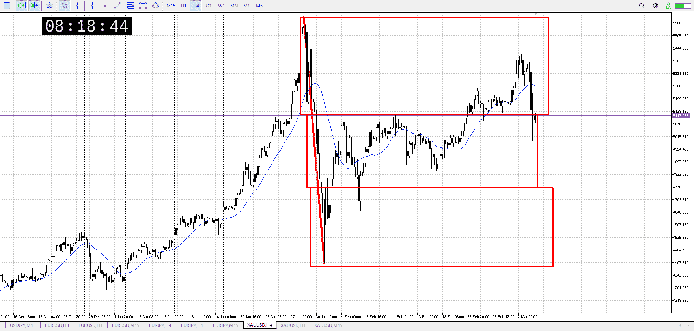
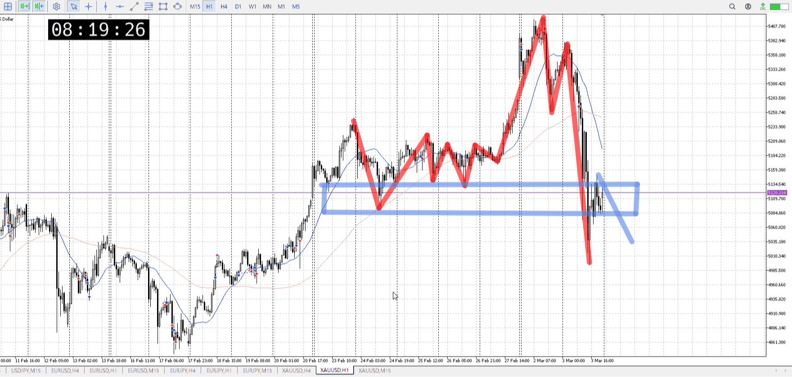
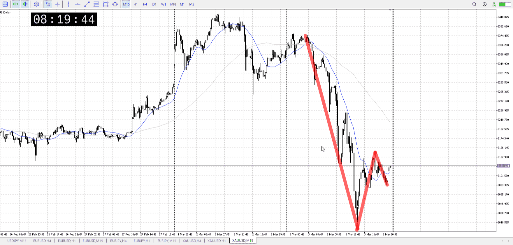
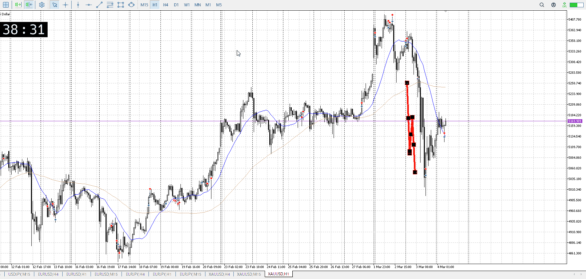
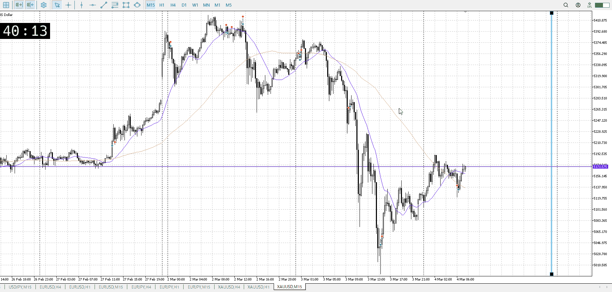
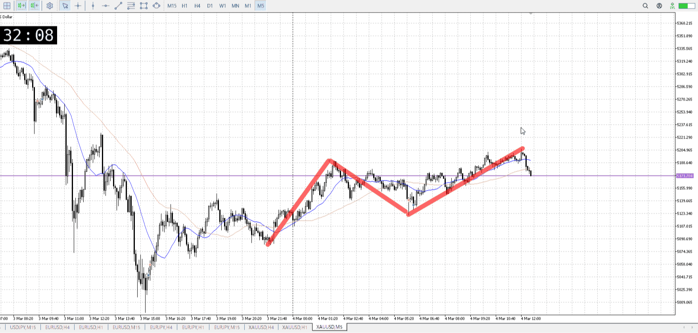

> [!note]
>- +1万 事前認識 **開始5分**

- [ ] [my](my.md)(見ないと増える)
- [ ] 指標
    - 差し込まれる可能性有り、毎日

## 4h

＜ここに目線画像＞

- [x] トレーディングレンジ
    - u

方向：d

## 1h

＜ここに目線画像＞ ^fbj36o

方向：d

## 15m

＜ここに目線画像＞

方向：d

全方向：ddd
^gqzrii

- [x] 使用足全ての目線確認

## シナリオ

b:?
s:1h前回安値
- [x] 時間足ぶつかり

15ｍとしては買われてる（下揃ってないが広義のレンジ出来てる）
この辺から売られるだろうなと広めにとった、あくまで予想
- [x] 1hシナリオ
    - [x] 明確か ? 続行 : 確定後考え直し

下降
- [x] 日出日入、週出週入

下
- [x] 傾き比率

378k
- [x] 前移動値

378k（同上）
- [x] 前回上昇・下降値

## 位置

- [x] 推進
- [ ] 調整

## 方針
目線・シナリオ・強弱・調整
横幅・PA後・平均線方向・波
**ひきつけ**・軸時間・傾き比率

下向き、推進中
天井は若干揃い始め

売り側としては底が揃ってほしい、その買い場を抜いたところを売るので
4h深押し抜き返しも考えられるが、1hに反するので今は無し

理想は上昇で調整を取った後、それを下に、推進に変えていくパターン
なのでもうちょいかかる

- [x] 買いたいなら
    - レンジ待ち
- [x] 売りたいなら
    - レンジ待ち

t
まず1h戻り売りを考える
![[../../images/2026-03-04 2026-03-04 10.44.28.excalidraw]]
現在地が黒丸、考えるのが青四角
ここで例えば15mレンジを下抜け戻りしても、上振り下抜けしても好きに売ればいい
レンジがあるなら、1hの売り勢が居るのは分かるので好きに

これは1hの話
1hでそもそも戻り売りが出来ない状況というのは、事前どころか三、四の策
というか出てから考えればいい、1hだから余裕がある

![[../../images/2026-03-04 2026-03-04 10.47.52.excalidraw]]
1hでこういうの
出てから

あくまでまず戻り売り

OK!
Exchage Start.

## メモ

1h
下降30

15m
下降45、上昇45以上でいけそう
だが下髭が付いたので。戻り待つ

5m
売り場が揃ってるのが下しかないので、底に降りるまで売れない

![[../After_Entry/Aen00080305T013143.md]]

---

再検証