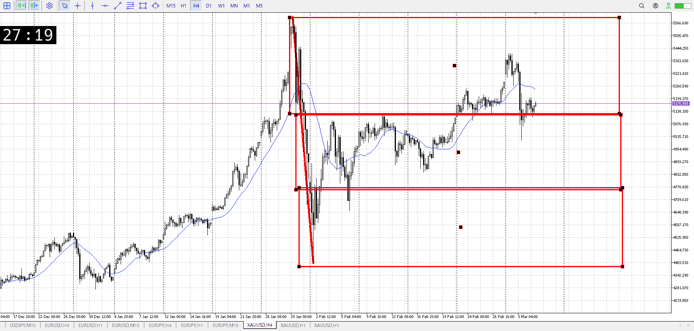
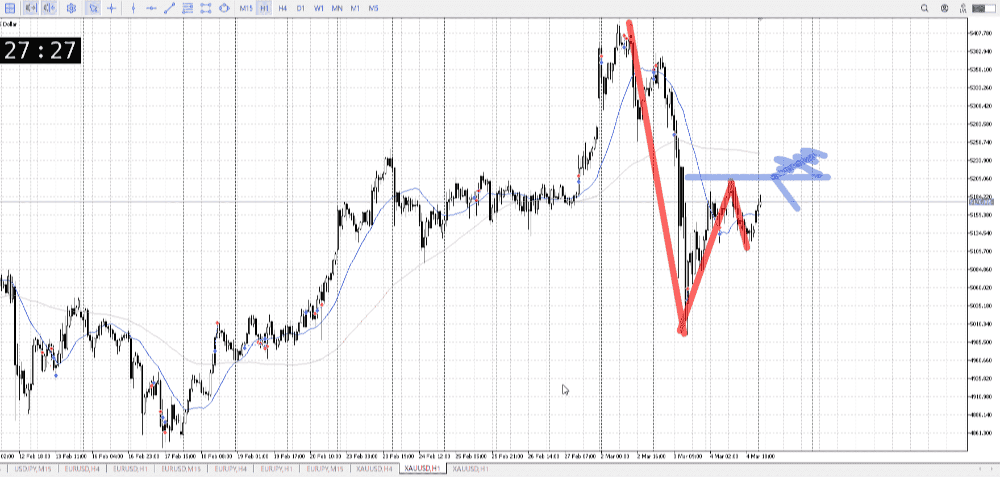
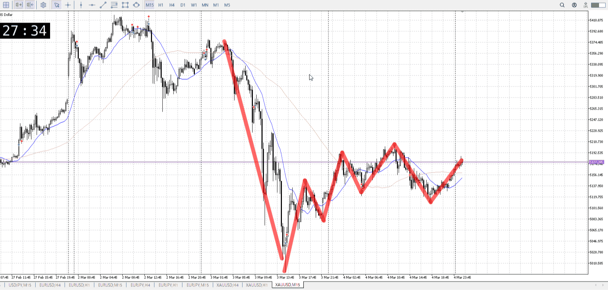
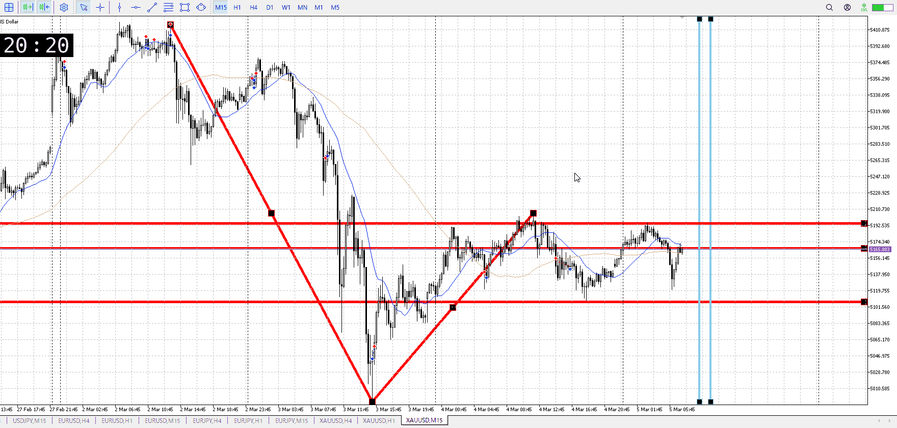
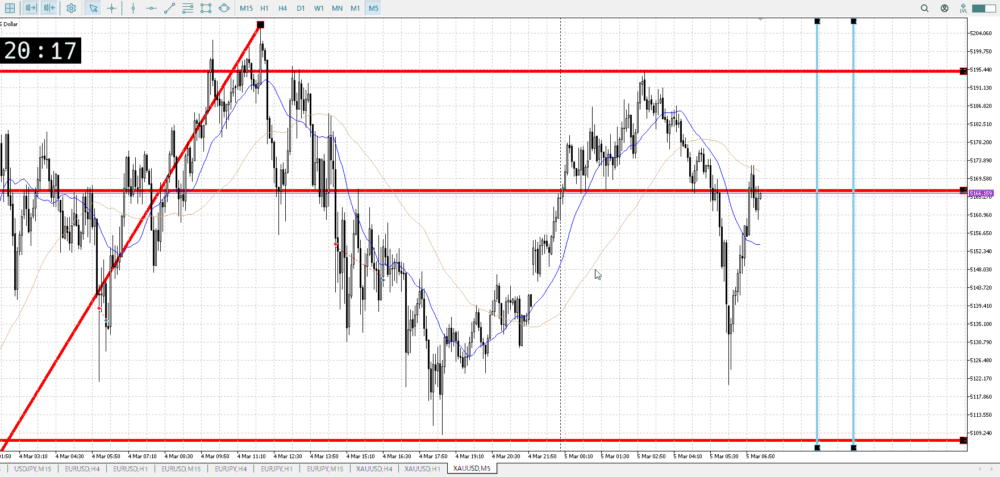
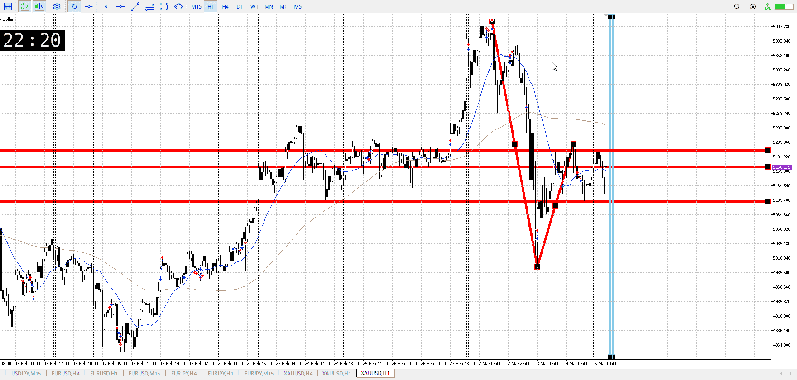

> [!note]
>- +1万 事前認識 **開始5分**

- [x] [my](my.md)(見ないと増える)
- [x] 指標
    - 差し込まれる可能性有り、毎日

## 4h

＜ここに目線画像＞

- [x] トレーディングレンジ
    - u

方向：d

## 1h

＜ここに目線画像＞ ^a95aa0

方向：d

## 15m

＜ここに目線画像＞

方向：d

全方向：ddd
^f8nptv

- [x] 使用足全ての目線確認

## シナリオ

b:4h天井、1h安値
s:1h半値
- [x] 時間足ぶつかり

1hに従い売り
買いは考えたけどやっぱりまだ早いと思った、トレンド出たわけでもなし
- [x] 1hシナリオ
    - [x] 明確か ? 続行 : 確定後考え直し

ちょい上昇レンジ
- [x] 日出日入、週出週入

下降の傾きはいいが横幅が半分以下しかない
- [x] 傾き比率

93k
- [x] 前移動値

d423k
- [x] 前回上昇・下降値

## 位置

- [ ] 推進
- [x] 調整

## 方針
目線・シナリオ・強弱・調整
横幅・PA後・平均線方向・波
**ひきつけ**・軸時間・傾き比率

まだ売りを見る
15mを更新して下トレンドになってから、今回で割るべき15mの底ははっきりした
これを抜けばしっかりとれるはず

- [x] 買いたいなら
    - 1hで天井がはっきりするくらいのレンジが出てから
- [x] 売りたいなら
    - 15m底抜け戻り

t
天井もはっきりしてきたので、ここから売るが出来る
もちろん下位足をみて

大きく落ちるなら、大きく調整が要る

OK!
Exchage Start.

## メモ
![[../Before_and_Mid_Entry/BaMen00080305T030347.md]]

売るにしては上昇が早すぎ、買うにしては目線が変わってない
と思ったが、15mで見ると上昇の速さはそうでもない？

そもそも下降のタイミングが早く、それを半分の時間で半分戻した
ただ1hを見ると気にしてた高さに触れて戻ったともいえる、上昇が収まるまで待つ

15m平均は気づいてない
5m平均は今から上がり始め

今いるとこが15mで買い売り気にしてる部分なのは間違いない、ここでのレンジ決着を元に入りたいがレンジ出来るのかこれ
買い売りがされている、拮抗の証拠を元に入る
なら平均線も来てほしい

![[../Before_and_Mid_Entry/BaMen20260305T042621.md]]

![[../Before_and_Mid_Entry/BaMen20260305T105635.md]]

![[../After_Entry/Aen20260305T114220.md]]

![[../Before_and_Mid_Entry/BaMen20260306T121112.md]]

---

再検証

