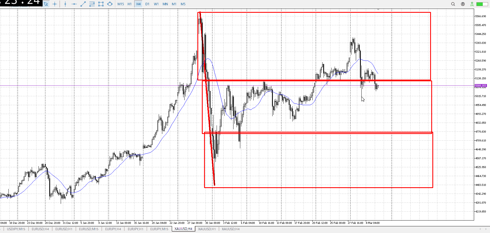
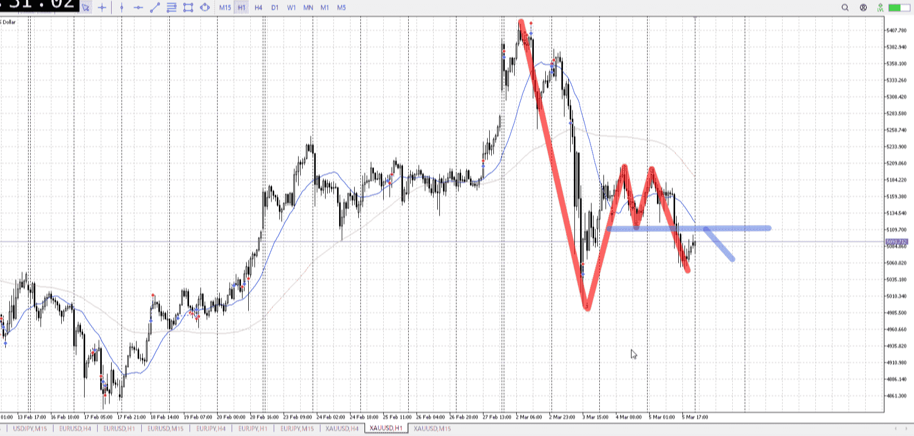
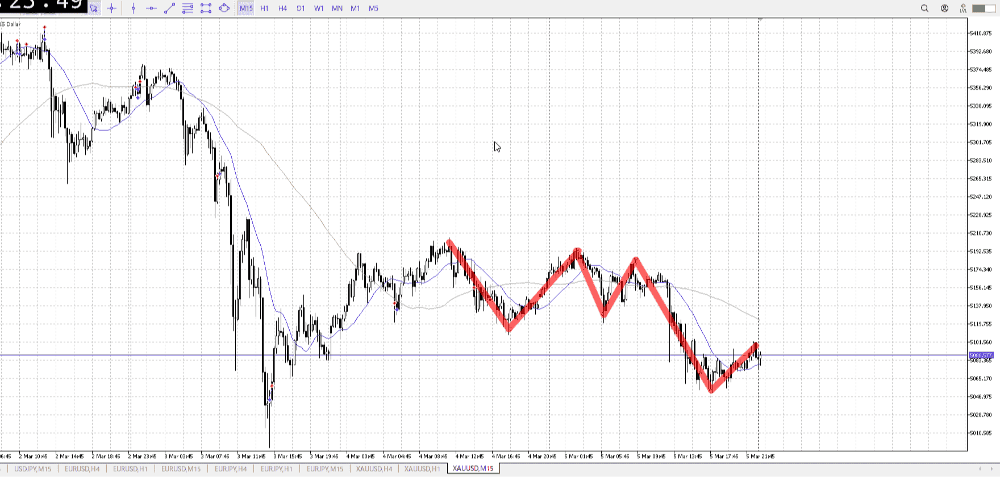
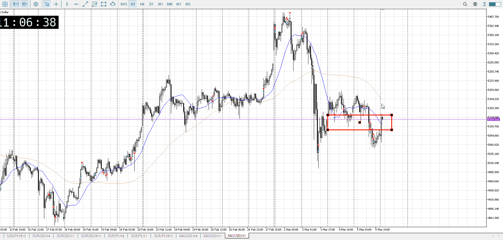
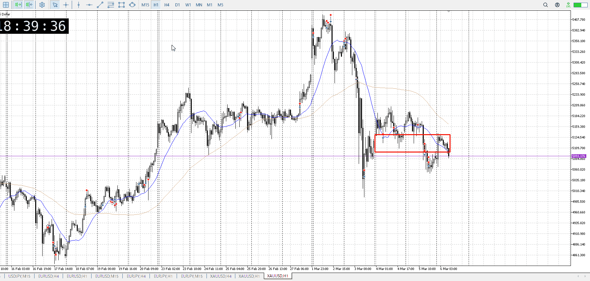
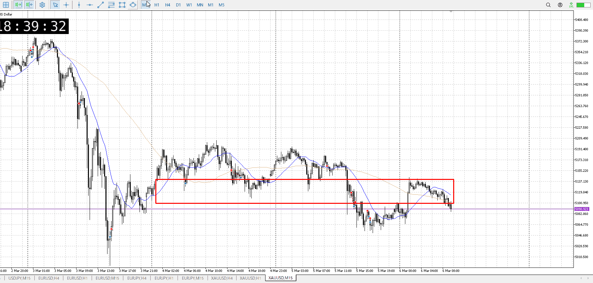
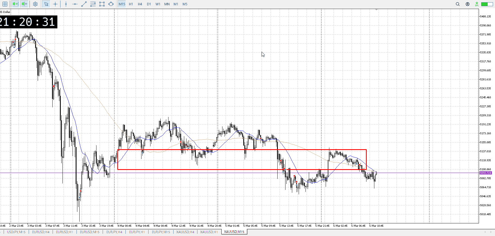
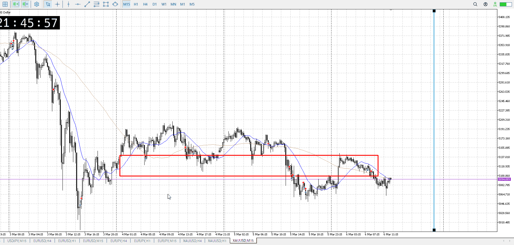
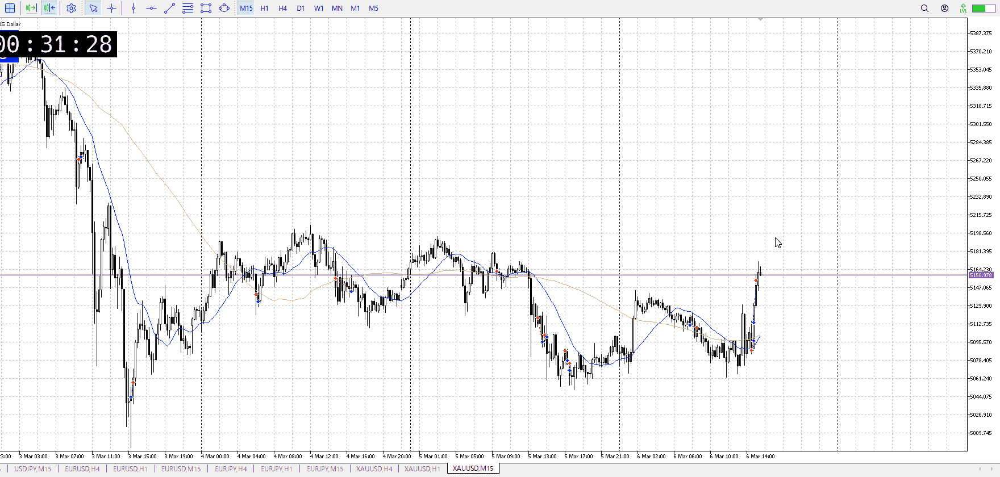
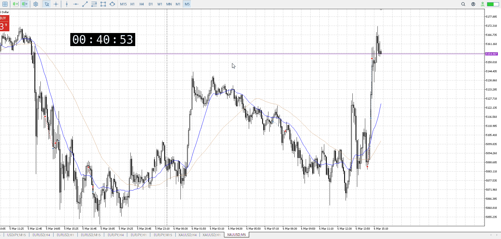

> [!note]
>- +1万 事前認識 **開始5分**

- [x] [my](my.md)(見ないと増える)
- [x] 指標
    - 差し込まれる可能性有り、毎日
22:30雇用統計
## 4h

＜ここに目線画像＞

- [x] トレーディングレンジ
    - m

方向：d

## 1h

＜ここに目線画像＞ ^cjnm28

方向：d

## 15m

＜ここに目線画像＞

方向：d

全方向：ddd
^85pyax

- [x] 使用足全ての目線確認

## シナリオ

b:1h安値、4h天井
s:1h半値
- [x] 時間足ぶつかり

レンジへの戻り売り
- [x] 1hシナリオ
    - [ ] 明確か ? 続行 : 確定後考え直し

昨日を覆う下降
- [x] 日出日入、週出週入

ちょっと下降強め
15mでみると両方ゆるい
- [x] 傾き比率

140k
- [x] 前移動値

422k
- [x] 前回上昇・下降値

## 位置

- [x] 推進
- [ ] 調整

## 方針
目線・シナリオ・強弱・調整
横幅・PA後・平均線方向・波
**ひきつけ**・軸時間・傾き比率

推進始まりなので、これに戻り売りでついていきたい
どちらも緩やかかつ指標控え、しっかり横幅を取る

- [x] 買いたいなら
    - 戻り売り失敗、レンジ天井抜け
- [x] 売りたいなら
    - レンジ戻り売り

OK!
Exchage Start.

> [!Info]
>- +1万 簡易テスト **開始5分**

> [!Tip]
>- Minecraftは3hまで
## メモ
[my2026-03-06](../My_Test/my2026-03-06.md)

急上昇は驚きだが、戻り売り場を完全に抜いたわけではない
まだ売り

左下の以前のやつは、戻り売りで出来てたレンジを一気に高値まで戻したから
これはまだ戻り売り場のはず

手を出しにくい緩やかな下降
売りたいところで売られたんだから手を出せるはずなんだけど

以前のような十分な横幅が取れてるわけでもない
特異な一本が出たわけでもない
手を出しにくい

じゃあどうするか
15mがレンジに急上昇、緩やかな下降と上がりそうな流れになっている
これを折れば落とせるはず

ここは上昇の最後の壁
これを折ればそりゃいけるんだけど、底が近い
上昇の壁を抜いても、1hの壁がある
ここから売るのはちょっと辛い

もちろん1hの壁を抜くなら可能性はあるが

下降が40barなので、本来なら青線辺りまで必要
ただ指標がある

---

再検証
t
昨日のやつの5m後売りは可能
それが無理でも同じ高さに戻ってきて売りも可能

フラクタルと平均線

いつもは止まった判定は複数の髭を元にしている
これはフラクタルを元に定めているので、根拠の上昇が早ければ単一の髭で入る

元々売りたくて、買いを返して5m押し目買いと1h売りをぶつける
5mの押し目買いで上昇4bar、なので髭は単一でその瞬間売り

そしてそれが下で上髭にも関わらず上に伸び、早かったため5m勝利
1h損切を巻き込むので抜け買い

利確は早めに5m直近高値
1hを巻き込んでない、それが横幅からもわかる
平均線で短期が下、長期が上であることからも分かる

買って伸びるなら短期が上、長期が下
横幅や3波を狙うと自然とそうなる

小数第一位を1とし、x1万円稼いだら次へ
0.02は2万円で、0.03は5万円で、0.04は7万円で
n+(n-1)
