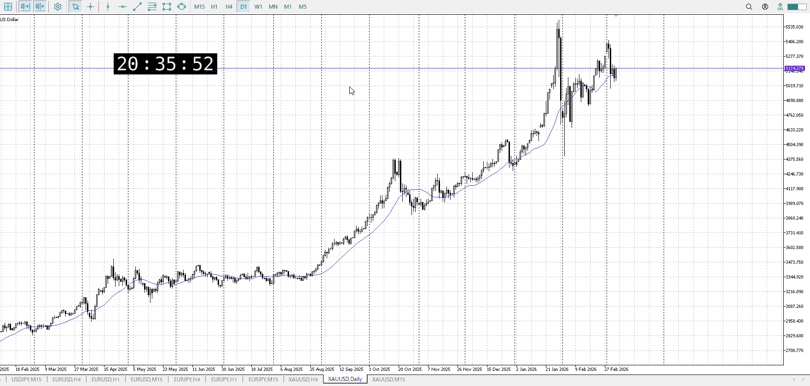
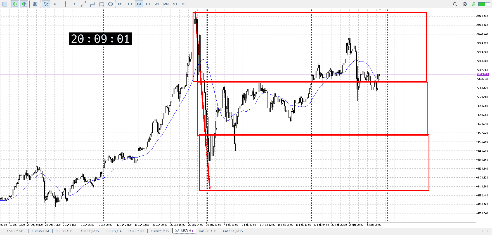
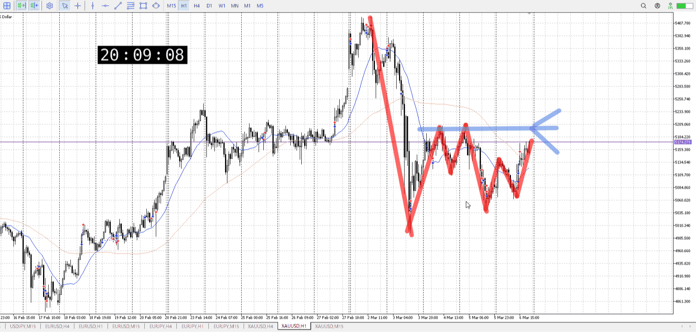
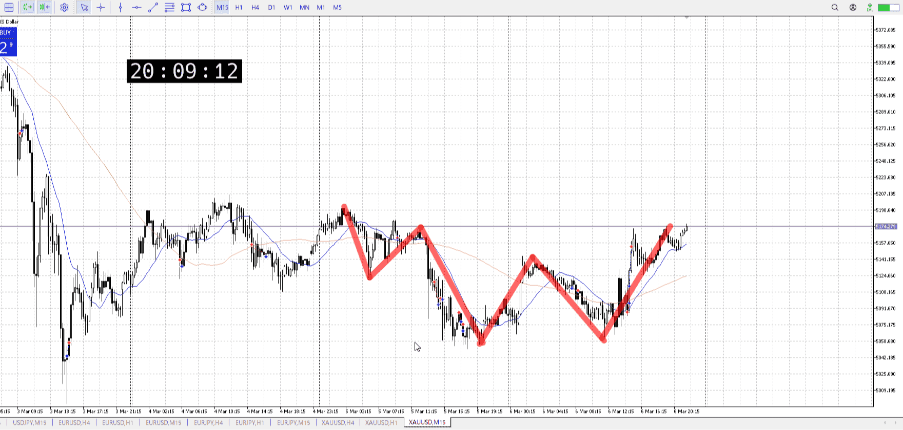

## 1d

＜ここに目線画像＞
下降を下髭止め、上昇

> [!note]
>- +1万 事前認識 **開始5分**

- [x] [my](my.md)(見ないと増える)
- [x] 指標
    - 差し込まれる可能性有り、毎日
水曜九時半CPI
## 4h

＜ここに目線画像＞

- [x] トレーディングレンジ
    - u

方向：d

## 1h

＜ここに目線画像＞ ^rxin88

方向：d

## 15m

＜ここに目線画像＞

方向：u

全方向：ddu
^0blz3z

- [x] 使用足全ての目線確認

## シナリオ


b:15m押し目
s:1h高値
- [x] 時間足ぶつかり

一度1hが敗北したとはいえ、1h目線は売り
一応売りの可能性を考える、このぶつかりでレンジしそう
- [x] 1hシナリオ
    - [x] 明確か ? 続行 : 確定後考え直し


- [ ] 日出日入、週出週入


- [ ] 傾き比率


- [ ] 前移動値


- [ ] 前回上昇・下降値

## 位置

- [ ] 推進
- [ ] 調整

## 方針
目線・シナリオ・強弱・調整
横幅・PA後・平均線方向・波
**ひきつけ**・軸時間・傾き比率


- [ ] 買いたいなら
    - 
- [ ] 売りたいなら
    - 


```meta-bind-button
style: default
label: Send
actions:
  - type: "replaceSelf"
    replacement: "\n\nOK!\nExchage Start."
```

> [!Info]
>- +1万 簡易テスト **開始5分**

> [!Tip]
>- Minecraftは3hまで
## メモ


---

再検証