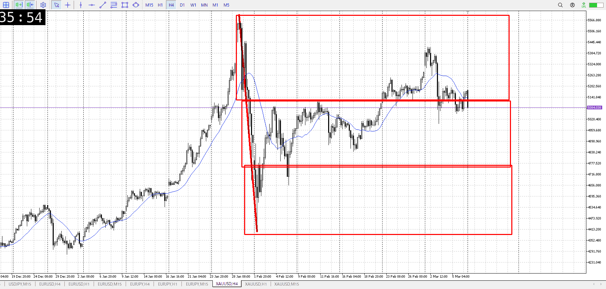
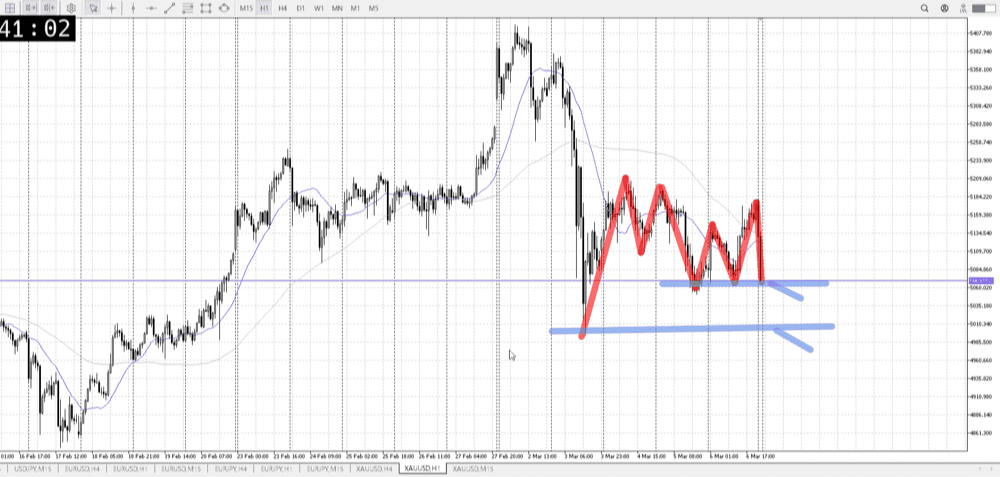
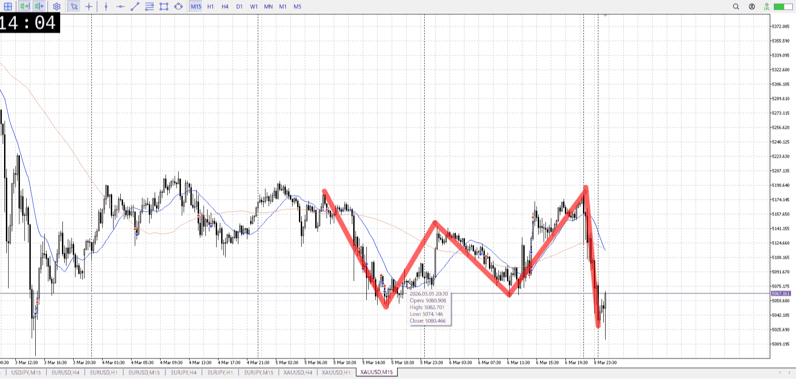

> [!note]
>- +1万 事前認識 **開始5分**

- [ ] [my](my.md)(見ないと増える)
- [ ] 指標
    - 差し込まれる可能性有り、毎日

## 4h

＜ここに目線画像＞

- [x] トレーディングレンジ
    - m

方向：d

## 1h

＜ここに目線画像＞ ^mixsqn

方向：d

## 15m

＜ここに目線画像＞

方向：d

全方向：ddd
^p89e4s

- [x] 使用足全ての目線確認

## シナリオ

b:1h安値
s:15m上昇損切、1h直近天井
- [x] 時間足ぶつかり

落ちる前提で
- [x] 1hシナリオ
    - [x] 明確か ? 続行 : 確定後考え直し

上昇/下降
- [x] 日出日入、週出週入

下降
- [x] 傾き比率

120k
- [x] 前移動値

416k
- [x] 前回上昇・下降値

## 位置

- [x] 推進
- [ ] 調整

## 方針
目線・シナリオ・強弱・調整
横幅・PA後・平均線方向・波
**ひきつけ**・軸時間・傾き比率

売り

1hの急激な売りを受け止め、上昇するかというところで再び急激な売り
これは事前の横幅も無いので反応は無理、じゃないけど厳しい
時間帯的にも

これを元に売っていく方がいい
1h半値が一つの候補として、どこかで1h安値との最後のレンジを作るはず
その1h安値の損切を巻きこめば売れる

- [x] 買いたい勢
    - 1h安値からレンジ買い
- [x] 売りたい勢
    - 1h半値などから戻り売り

売り
買いたい勢の損切に合わせる

OK!
Exchage Start.

> [!Info]
>- +1万 簡易テスト **開始5分**

> [!Tip]
>- Minecraftは3hまで
## メモ
![[../After_Entry/Aen20260309T113434.md]]

---

再検証