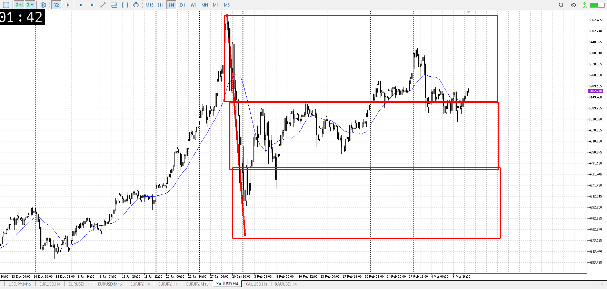
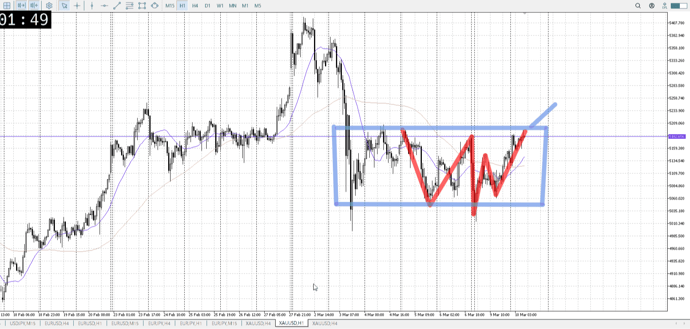
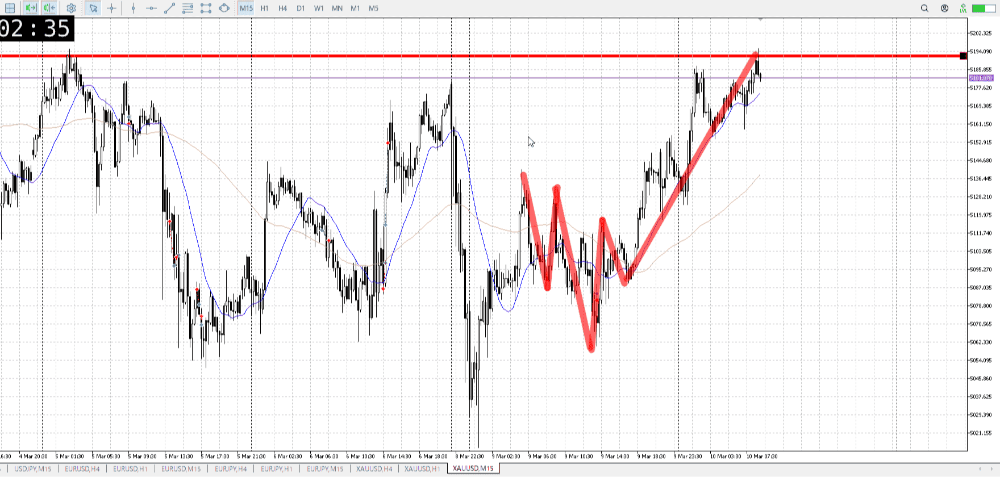
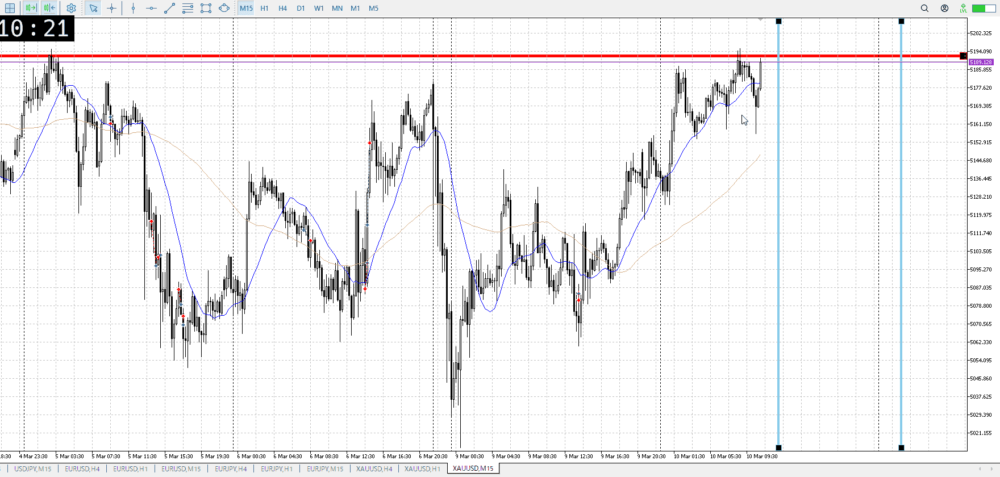
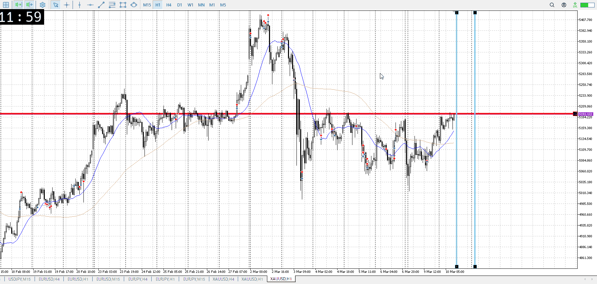
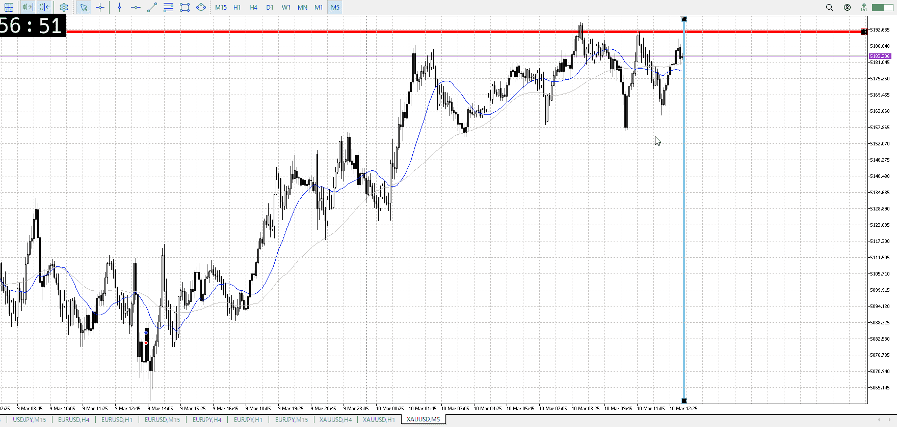

> [!note]
>- +1万 事前認識 **開始5分**

- [ ] [my](my.md)(見ないと増える)
- [ ] 指標
    - 差し込まれる可能性有り、毎日

## 4h

＜ここに目線画像＞

- [x] トレーディングレンジ
    - u

方向：d

## 1h

＜ここに目線画像＞ ^0c0wsv

方向：d

## 15m

＜ここに目線画像＞

方向：u

全方向：ddu
^8377sp

- [x] 使用足全ての目線確認

## シナリオ

b:1h底
s:1h天井
- [x] 時間足ぶつかり

直近の15mトレンドとしても買いが優勢
- [x] 1hシナリオ
    - [x] 明確か ? 続行 : 確定後考え直し

上昇
- [x] 日出日入、週出週入

買い
ただし前回の売りに対して緩やかに上昇
- [x] 傾き比率

142k
- [x] 前移動値

d417k
- [x] 前回上昇・下降値

## 位置

- [ ] 推進
- [x] 調整

## 方針
目線・シナリオ・強弱・調整
横幅・PA後・平均線方向・波
**ひきつけ**・軸時間・傾き比率

1hが売りなので売りを考える

売りとしてはここがラストチャンス、ここを抜かれると終わる
なのでここでいきなり抜かれるということはないはず、丁寧に横幅が欲しい
今は何もできない

短期買い勢は上昇直じゃなく押しで上がりたいはず
一旦押しになる前回レンジ上などまで降りたい

- [x] 買いたい勢
    - 落ちて押しを探し、売りラストと戦ってから崩れ
- [x] 売りたい勢
    - 買いたい勢の損切

OK!
Exchage Start.

> [!Info]
>- +1万 簡易テスト **開始5分**

> [!Tip]
>- Minecraftは3hまで
## メモ

全然溜めずに上がっていこうとしてる
1hの売りが失敗したのが最初の始まりではあったが、にしたって

これだと入れない上昇の可能性もある
それは無視して、入れるものに入っていけ

損切を巻き込んだわけでもないこんな上で、売り場の売りの否定があるわけでもない場所で
買うのは難しくないか
必ず1hの調整を待て

というか売りたいのだから、先に売る方法を模索したい
買いの損切しかないけども
つまりレンジして下抜け

若干下降が弱いか……？わからん。
![[../After_Entry/Aen20260310T111736.md]]

---

再検証