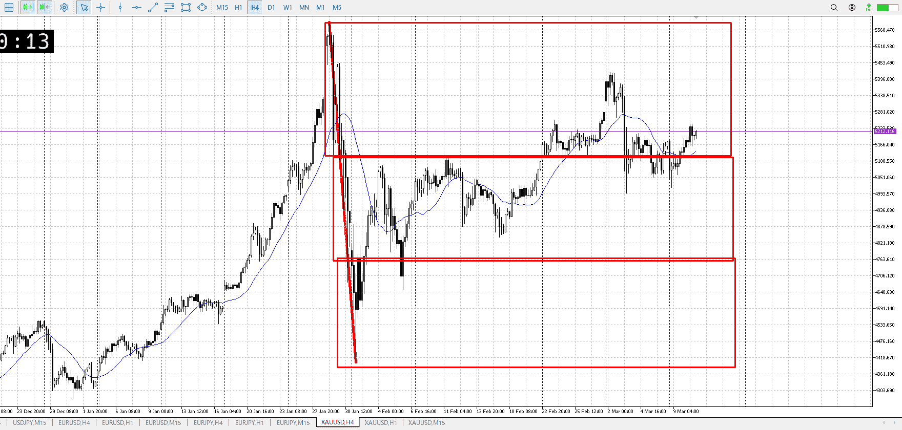
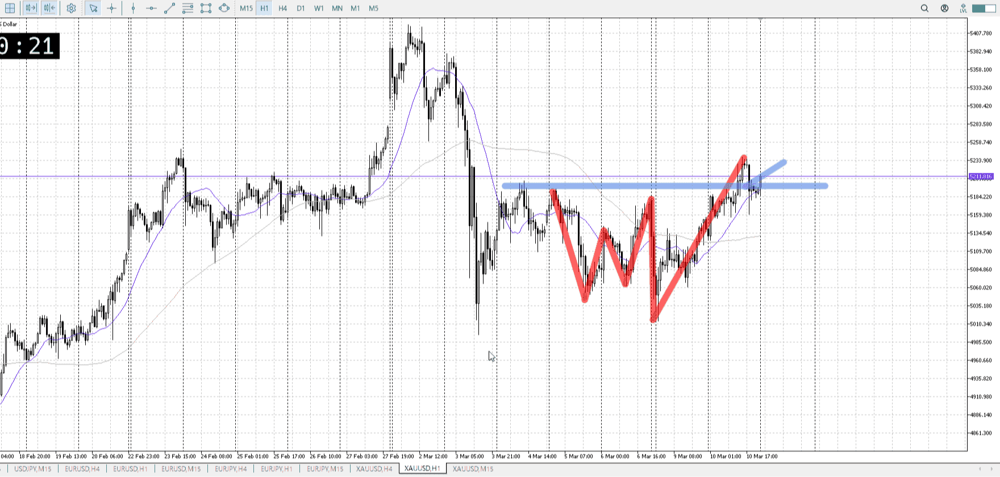
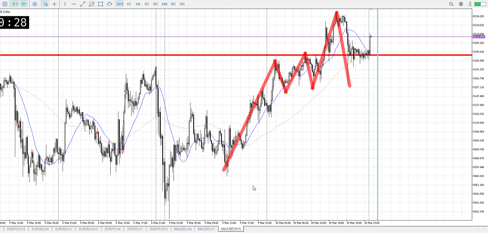
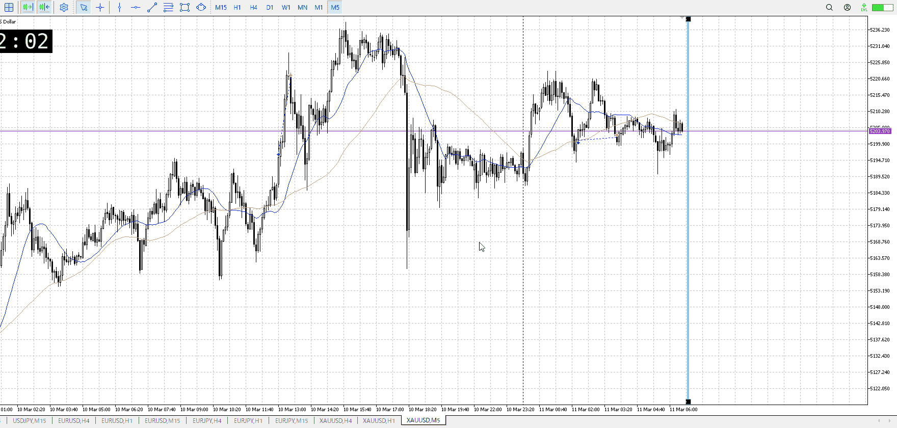
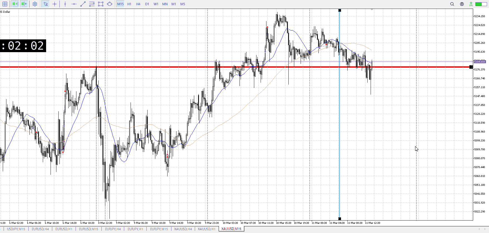

> [!note]
>- +1万 事前認識 **開始5分**

- [ ] [my](my.md)(見ないと増える)
- [ ] 指標
    - 差し込まれる可能性有り、毎日

## 4h

＜ここに目線画像＞

- [x] トレーディングレンジ
    - u

方向：d

## 1h

＜ここに目線画像＞ ^4tqu6w

方向：u

## 15m

＜ここに目線画像＞

方向：u

全方向：duu
^m222do

- [x] 使用足全ての目線確認

## シナリオ

b:1h底、15m押し目
s:？
- [x] 時間足ぶつかり

1hが買いになったので
- [x] 1hシナリオ
    - [x] 明確か ? 続行 : 確定後考え直し

上昇
- [x] 日出日入、週出週入

1h
上昇
15m
上昇に対して下降が強めだが、下髭と平均線で止められてるっぽい
- [x] 傾き比率

114k
- [x] 前移動値

253k
- [x] 前回上昇・下降値

## 位置

- [x] 推進
- [ ] 調整

## 方針
目線・シナリオ・強弱・調整
横幅・PA後・平均線方向・波
**ひきつけ**・軸時間・傾き比率

買い

1hは推進中、15mが押し目にいてここから買うなら推進一波で飛んでいくことになる
とはいえ上に抜けてる分が1hでは心もとないし、一波で抜けるか返るかしかないと思う

15mは急に落ちた後、平均線が追いつく程度まで横幅を取った
落ちない証拠として下髭を1h15mともにつけていて、結構買えそう

ちゃんと直近レンジ迄落ちを待つ
1hの抜けにしてはちょっと遅い気もするが、押し目で買うには買うはず

- [x] 買いたい勢
    - 15m押し目で1hの波についていく
- [x] 売りたい勢
    - 買いの損切

OK!
Exchage Start.

> [!Info]
>- +1万 簡易テスト **開始5分**

> [!Tip]
>- Minecraftは3hまで
## メモ
![[../After_Entry/Aen20260311T023112.md]]

ここが1hの押し目なのは確か
そしてレンジが出来始めてるのも確か、売り否定したら買っていきたい

ものすごく若干落ちてる。

ゆっくり下がってて、どこ抜けたのを元にすりゃいいんだ
一時間ズレてたとはいえあった指標もあまり意味はなく

戻り売りを狙うのはまだ買いだろうから無理だし
短期で売るのも横幅足りないし
やるとこねえな

---

再検証