> [!note]
>- +1万 事前認識 **開始5分**

- [ ] [my](my.md)(見ないと増える)
- [ ] 指標
    - 差し込まれる可能性有り、毎日

## 4h
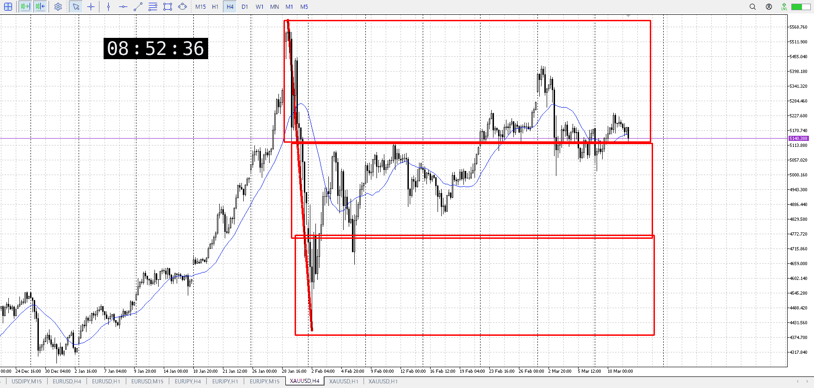
＜ここに目線画像＞

- [x] トレーディングレンジ
    - u

方向：d

## 1h
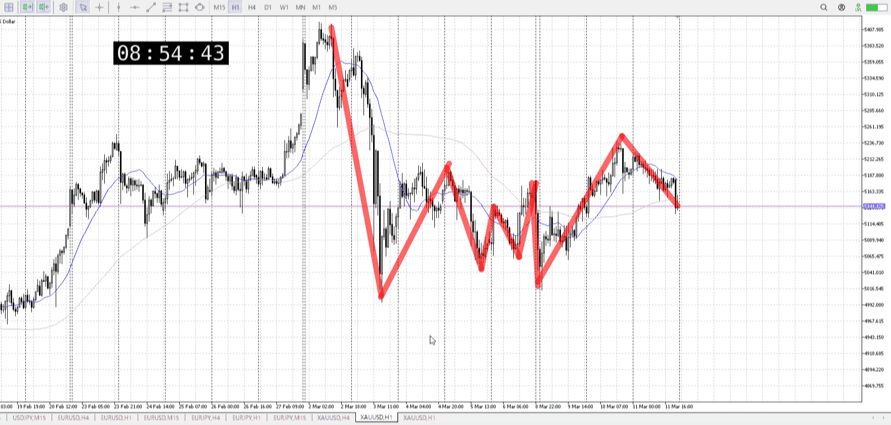
＜ここに目線画像＞ ^1attwy

方向：u

## 15m
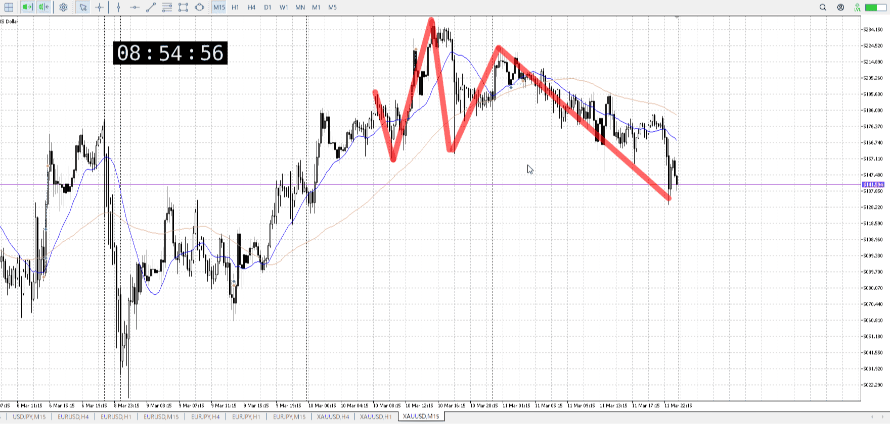
＜ここに目線画像＞

方向：d

全方向：dud
^s9wdss

- [x] 使用足全ての目線確認

## シナリオ

b:1h押し目買い
s:4h半値？
- [x] 時間足ぶつかり

レンジもないし半値くらいしか思い当たらないが、明確じゃない。
確定してから。
- [x] 1hシナリオ
    - [x] 明確か ? 続行 : 確定後考え直し

じわじわ下降、前日始値
- [x] 日出日入、週出週入

一応下降が弱い
1h前回上昇過ぎて半分程度
- [x] 傾き比率

93k
- [x] 前移動値

u175k
- [x] 前回上昇・下降値

## 位置

- [ ] 推進
- [x] 調整

## 方針
目線・シナリオ・強弱・調整
横幅・PA後・平均線方向・波
**ひきつけ**・軸時間・傾き比率

買いたい
なので今は調整、どっち行くか分かんないよりはシンプル
どこかで普通にレンジ作って、で上抜きを待ちたいところ

売りたい勢は15mの流れをそのままにしたいはずなので、ひたすら戻り売りか
それを折ればいい

- [x] 買いたい勢
    - 押し目を探し、上抜きを待つ
- [x] 売りたい勢
    - 短期で戻り売りを繰り返し

OK!
Exchage Start.

> [!Info]
>- +1万 簡易テスト **開始5分**

> [!Tip]
>- Minecraftは3hまで
## メモ
一応4hの上昇幅に縦を引いた
これに気を付けつつ買いを探す

> [!note]
>- +1万 事前認識 **開始5分**

- [x] [my](my.md)(見ないと増える)
- [x] 指標
    - 差し込まれる可能性有り、毎日

## 4h
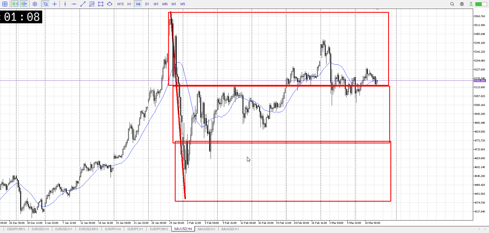
＜ここに目線画像＞

- [x] トレーディングレンジ
    - m

方向：d

## 1h
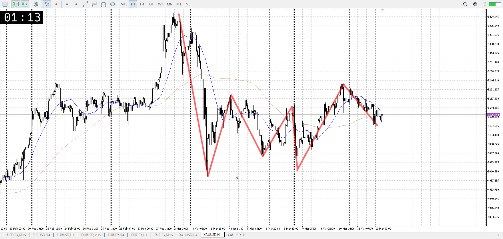
＜ここに目線画像＞ ^yr9kxb

方向：d

## 15m
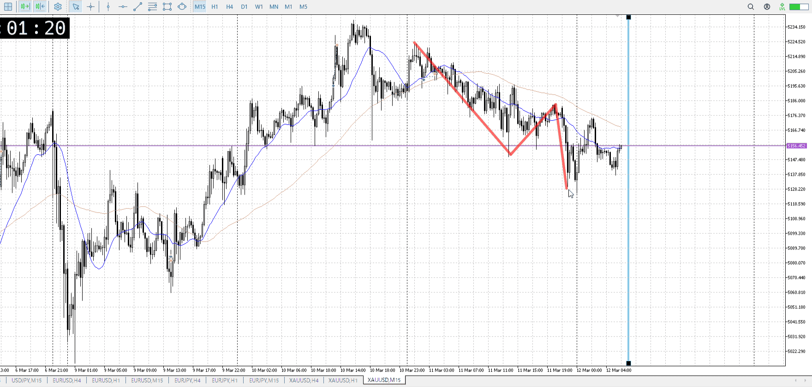
＜ここに目線画像＞

方向：d

全方向：ddd
^1cmdwm

- [x] 使用足全ての目線確認

## シナリオ

b:1h安値、4h天井
s:1h天井
- [x] 時間足ぶつかり

売りたいが直近の上昇と引っかかり無しが邪魔
せめて高値使うか半値レンジか、明確に欲しい
- [x] 1hシナリオ
    - [x] 明確か ? 続行 : 確定後考え直し

昨日の始値へ
- [x] 日出日入、週出週入

ちょっと遅め落ち
- [x] 傾き比率

93k
- [x] 前移動値

u175k
- [x] 前回上昇・下降値

## 位置

- [x] 推進
- [ ] 調整

## 方針
目線・シナリオ・強弱・調整
横幅・PA後・平均線方向・波
**ひきつけ**・軸時間・傾き比率

売りたい
直近の上昇が邪魔だが、半値などのレンジで折るか直近高値から折るかあたりで

買いには4hの天井が手伝っている
ここから売れてもこの底を抜くのはちょっと厳しいか

- [x] 買いたい勢
    - 直近の買いを元に短期半値から買い
    - 押し目を探して上抜けと同じ
- [x] 売りたい勢
    - 買いの損切
    - 戻り売り

OK!
Exchage Start.

> [!Info]
>- +1万 簡易テスト **開始5分**

> [!Tip]
>- Minecraftは3hまで
## メモ
売りたい方なのに上昇して、ゆっくり下降
ただ上の突き出しはそんな長くないし1h揃った床も抜けてる、が時間帯が悪い

総合的に微妙

売る視点で見ると、1hはまだA触れたはじめで横が足りてない
4h上昇と同じ横取ったので動きはありそう

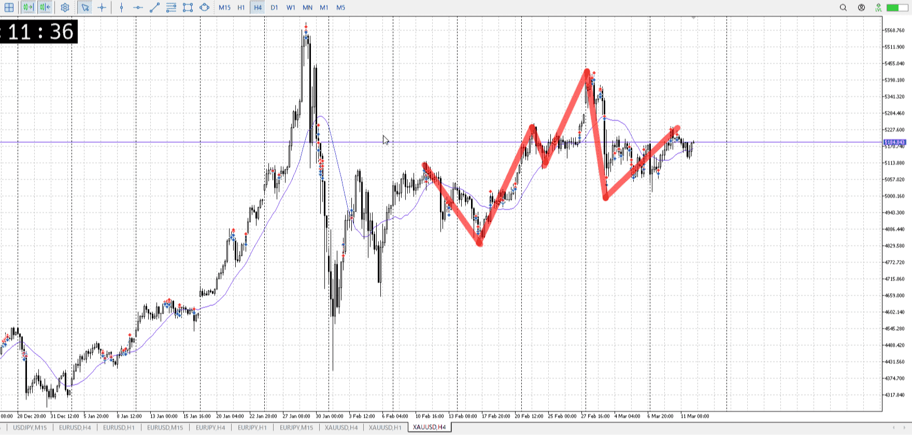
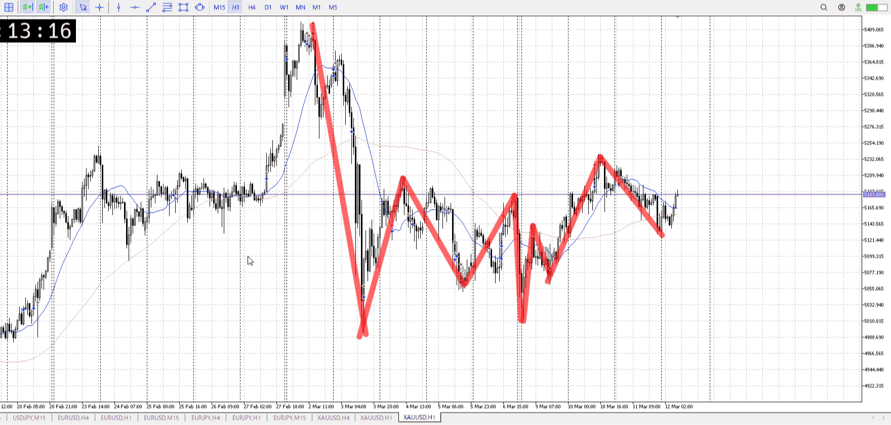
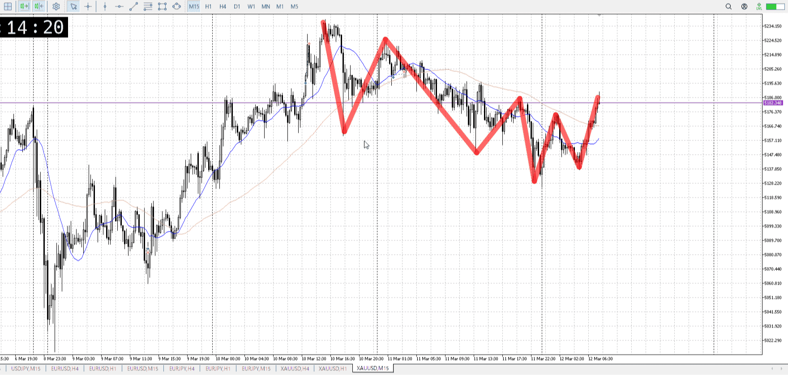
4hのトレンド押し買い、1hの天井売り、15m安値更新失敗
下降薄い中から4hが勝ったか

上昇は15m11bar
下降に同等の幅が欲しくなる
そのまま買っても上昇の端になる、抜けを狙うには前の横幅とか足りない
![[../Before_and_Mid_Entry/BaMen20260312T063434.md]]

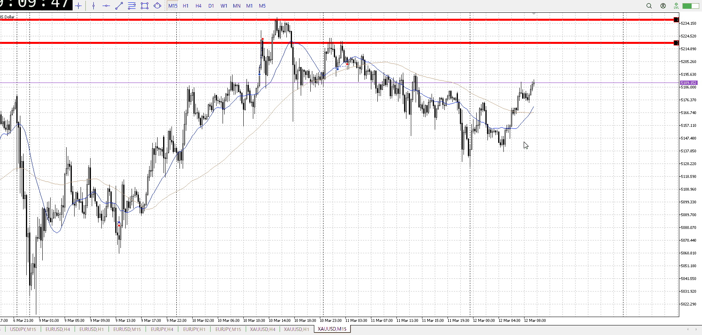
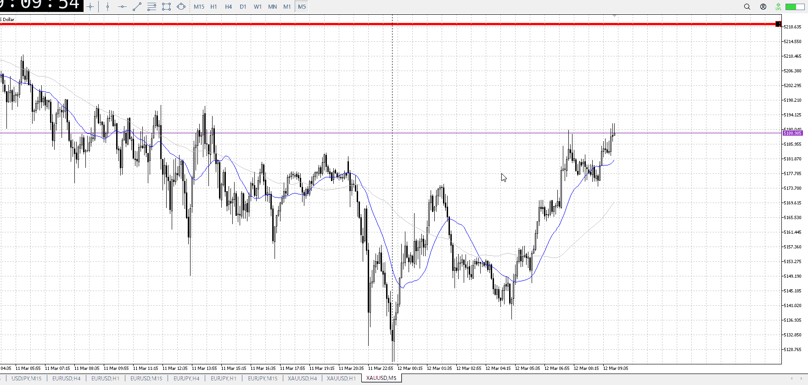

いや、買うにしては早すぎる
15mの目線だぞ、ここでぶつかるの
もうちょっとちゃんと横幅取りたい

横幅とりたいのだが、一波で伸びたのでこれに合わせた下降を取ることになる
つまりどこから測ればいいのかわっかんね、静観

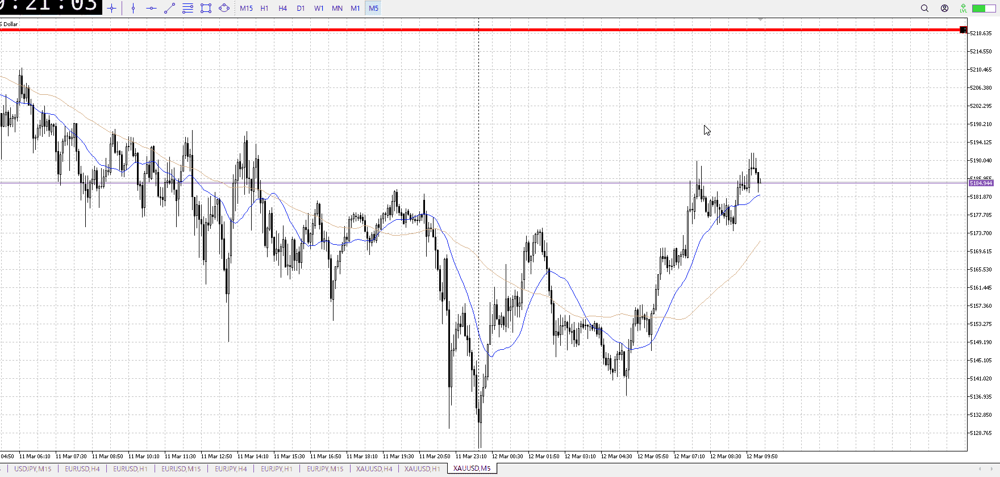

まだ下向きではない
根拠に仕様としてる奴がレンジじゃないし、ここでの下髭もあまり意味がない

あとあまりはみ出てない
トレンドというよりダブルトップみたいになっていて買いにくい
波がついてきてないんでダブルトップではない

この15m一波を調整として売れるか
一瞬目線が上になるので下抜けが結構やばいか
![[../Before_and_Mid_Entry/BaMen20260312T093647.md]]

1hが売りなので売り
15mAはまだ全然上
なので5mをスッと抜けないなら切る

![[../After_Entry/Aen20260312T095101.md]]

t
目線は一旦おいといて、緩やかな下降から上昇
これを見ると買い

そのうえで押し目を作るとは、理想的には平均線と波でこう
![[../../images/2026-03-12 2026-03-12 22.39.48.excalidraw]]
波が出る、ローソクが出る
そのうえで、今回の
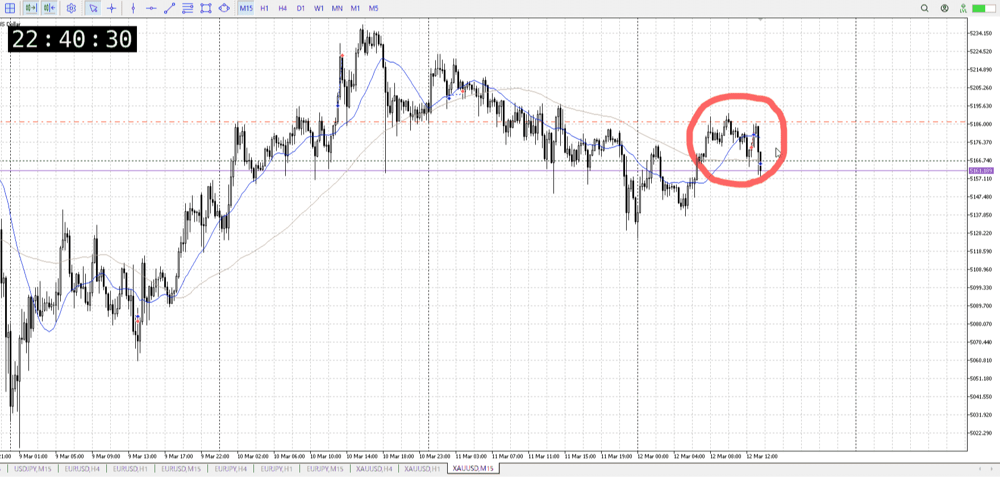
売ってる箇所は落ちはじめ、ここが押しを試している場所
売るにしても、この押しの扱いがどうなるかを見てからでないといけない
あと横幅が足りない

押し試し、なのでここで直で買えるわけでもないことに注意
ただ売り目線だろうとこの流れから売れないよねが重要

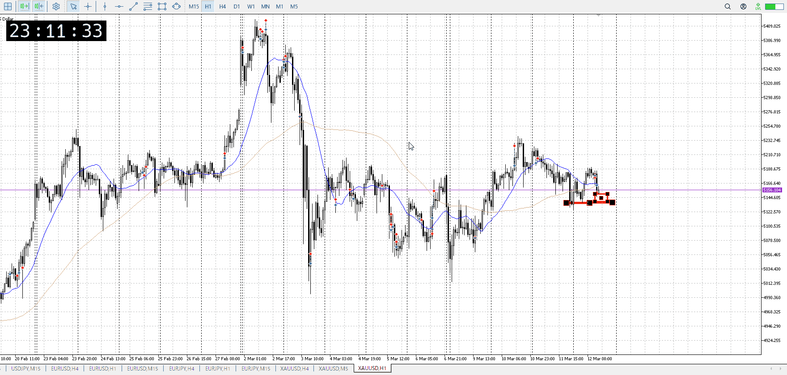
この後は流れ買いを利用し、直近の底からレンジと買いを考える
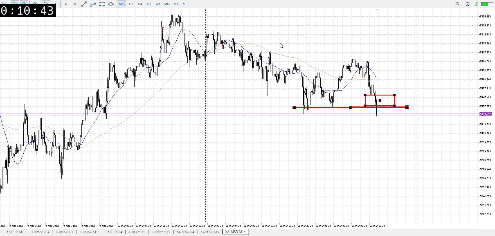
時間が悪い。
異様な謎の売りが出てる。あまりに直前が何もなさすぎて何もできない。

---

再検証