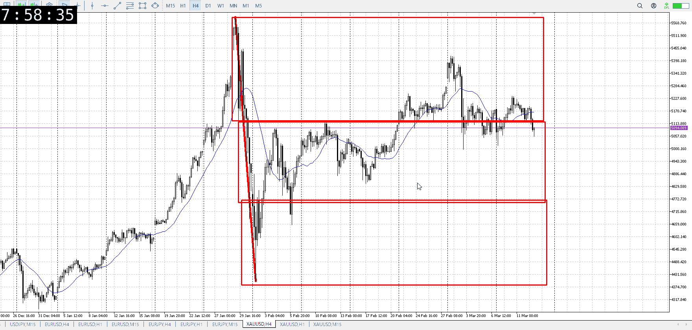
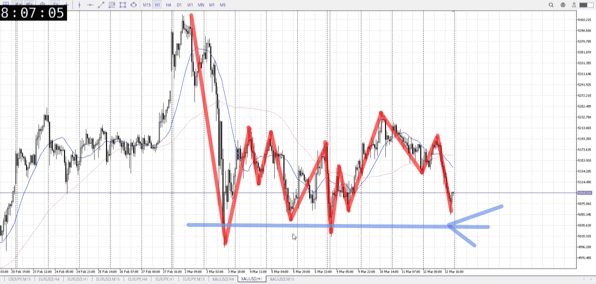
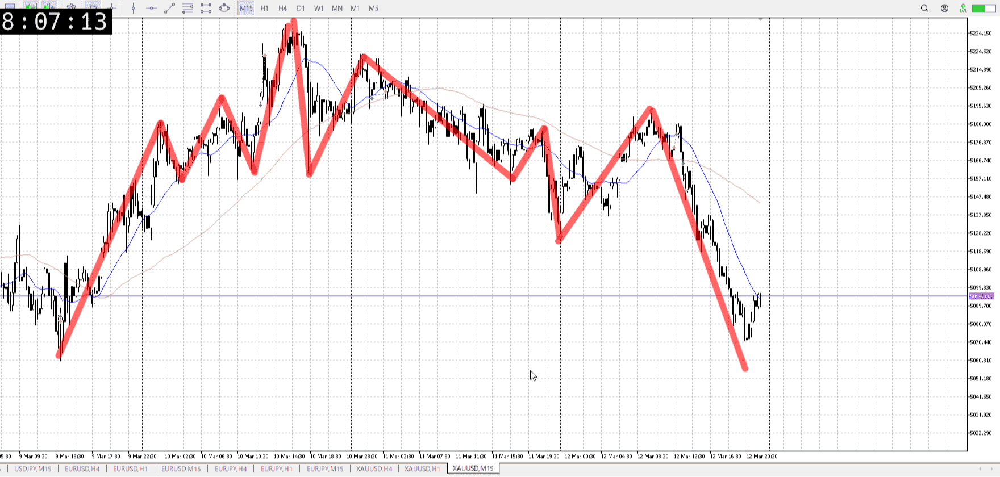
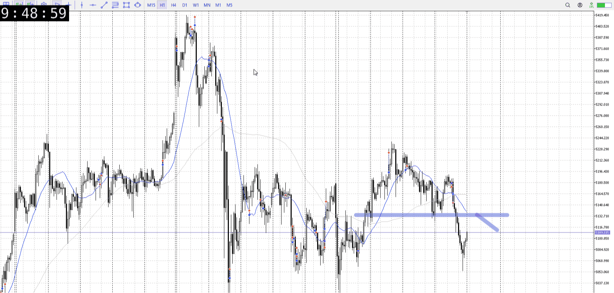
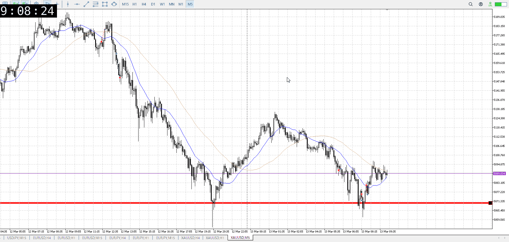
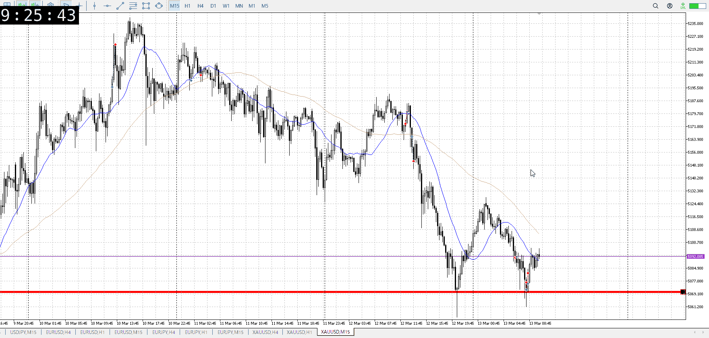
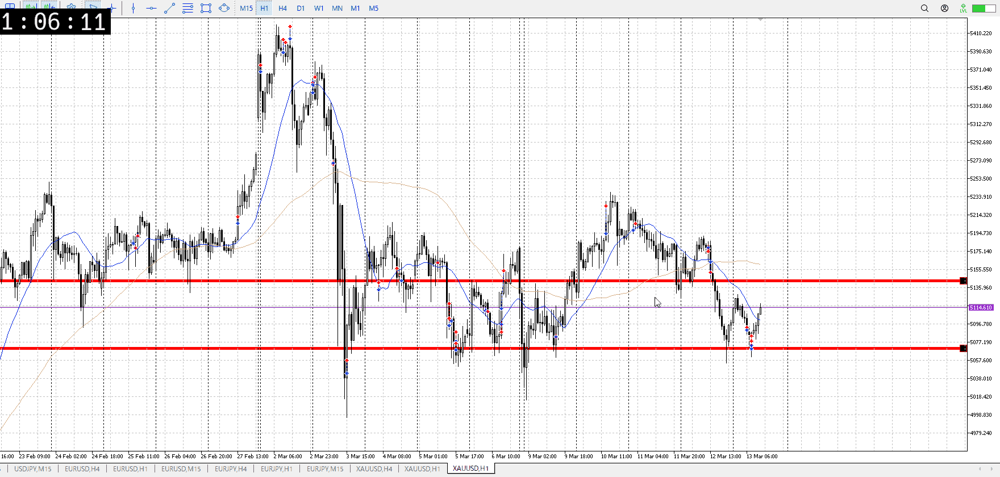
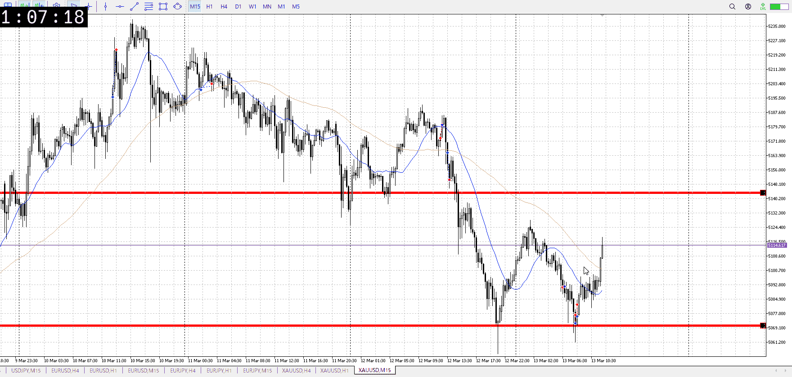

> [!note]
>- +1万 事前認識 **開始5分**

- [x] [my](my.md)(見ないと増える)
- [x] 指標
    - 差し込まれる可能性有り、毎日

## 4h

＜ここに目線画像＞

- [x] トレーディングレンジ
    - m

方向：d

## 1h

＜ここに目線画像＞ ^s30zm9

方向：d

## 15m

＜ここに目線画像＞

方向：d

全方向：ddd
^yawl68

- [x] 使用足全ての目線確認

## シナリオ

b:1h床？
s:1h天井
- [x] 時間足ぶつかり

レンジらしく床からどうするか
上抜けから落ちてきたので一応下抜け考える
実際は溜めが必要なのでまだ分からないが大きい
- [x] 1hシナリオ
    - [ ] 明確か ? 続行 : 確定後考え直し

緩やか下降から上昇失敗落ち
- [x] 日出日入、週出週入

急降下
- [x] 傾き比率

135k
- [x] 前移動値

135k
- [x] 前回上昇・下降値

## 位置

- [x] 推進
- [ ] 調整

## 方針
目線・シナリオ・強弱・調整
横幅・PA後・平均線方向・波
**ひきつけ**・軸時間・傾き比率

売りたい
がここは1h買い付近、迂闊に売れない
レンジ的に買いを挟むかもしれない、売るならよほど溜めて底を抜かないと

- [x] 買いたい勢
    - レンジなどで売りが落ち着いてから上抜き買い
- [x] 売りたい勢
    - 買いの損切

昨日は売りにしては早い位置だった
掴めない売り

OK!
Exchage Start.

> [!Info]
>- +1万 簡易テスト **開始5分**

> [!Tip]
>- Minecraftは3hまで
## メモ

ノーマークだったけどこうもあるか

![[../After_Entry/Aen20260313T052332.md]]

床からの上昇が振るわないところ
ここの迷いを下抜け売りたい

若干売りがのんびりしてる不安要素

おう

正式にレンジになるにはここで返る必要がある

1hから見直すと、押し目買いを否定して底までいって、抜けたら買いがしばらくいない場所で上昇
まあ最後の抵抗だろうというとこ

---

再検証