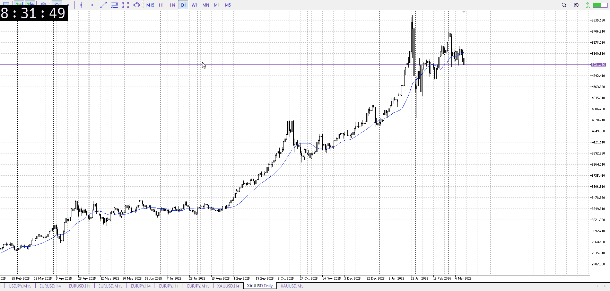
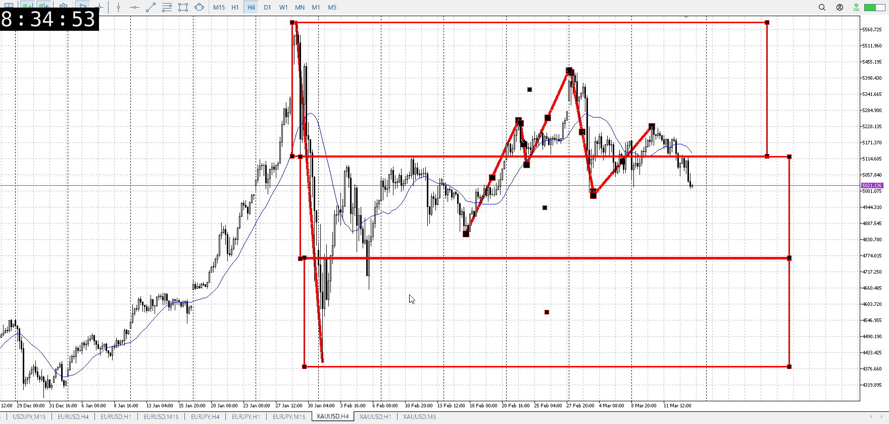
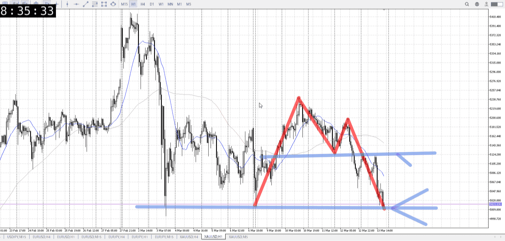
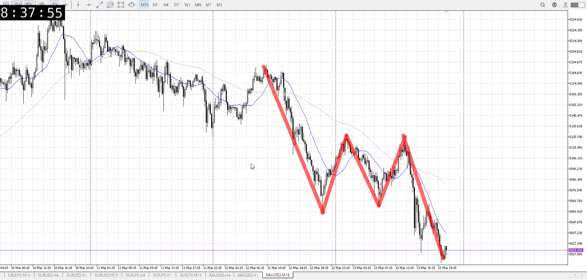

## 1d

＜ここに目線画像＞
抜けきってはいないけど実線で下

> [!note]
>- +1万 事前認識 **開始5分**

- [x] [my](my.md)(見ないと増える)
- [x] 指標
    - 差し込まれる可能性有り、毎日

水曜27:00FOMC

## 4h

＜ここに目線画像＞

- [x] トレーディングレンジ
    - m

方向：d

## 1h

＜ここに目線画像＞ ^gv37kc

方向：d

## 15m

＜ここに目線画像＞

方向：d

全方向：ddd
^ic3flw

- [x] 使用足全ての目線確認

## シナリオ

b:4h床
s:?1h前回安値
- [x] 時間足ぶつかり

金曜が戻らなかったので、抜けのシナリオも考慮
跳ね返ったとしてもシナリオを越えるまでは売り
- [x] 1hシナリオ
    - [x] 明確か ? 続行 : 確定後考え直し

落ち、週初めまで押し
- [x] 日出日入、週出週入

下降優勢
- [x] 傾き比率

117k
- [x] 前移動値

180k
- [x] 前回上昇・下降値

## 位置

- [x] 推進
- [ ] 調整

## 方針
目線・シナリオ・強弱・調整
横幅・PA後・平均線方向・波
**ひきつけ**・軸時間・傾き比率

下への落ち、売り
上への調整から、シナリオにぶつかった時を狙って売りが一つ
抜けたら月曜なので抜け売りは無理、戻り売りを狙う

- [x] 買いたい勢
    - 底から買い
- [x] 売りたい勢
    - 底からの買いの止まり売り
    - 抜きの戻り売り

OK!
Exchage Start.

> [!Info]
>- +1万 簡易テスト **開始5分**

> [!Tip]
>- Minecraftは3hまで
## メモ
一週間振り返り
月曜
月曜売り、月曜でちょっと甘すぎ

火曜
1h天井抜けた後下髭を複数、再度抜けを買い
押しも買おう

水曜
昼は伸びにくさが辛い

木曜
前回の上抜けの後緩やかな下降、まだ買いは継続中
目線は下だが流れで買える

金曜
裏切り下の一度目戻り売り
レンジっぽくないが裏切りから十分横幅取ってるから短期売れる

その後のレンジ上からは、時間が遅くて落ちが速い
レンジ下抜け戻りなら取れるかもではあるが、正式に戻り売れるのは深夜なので難しい

---

再検証