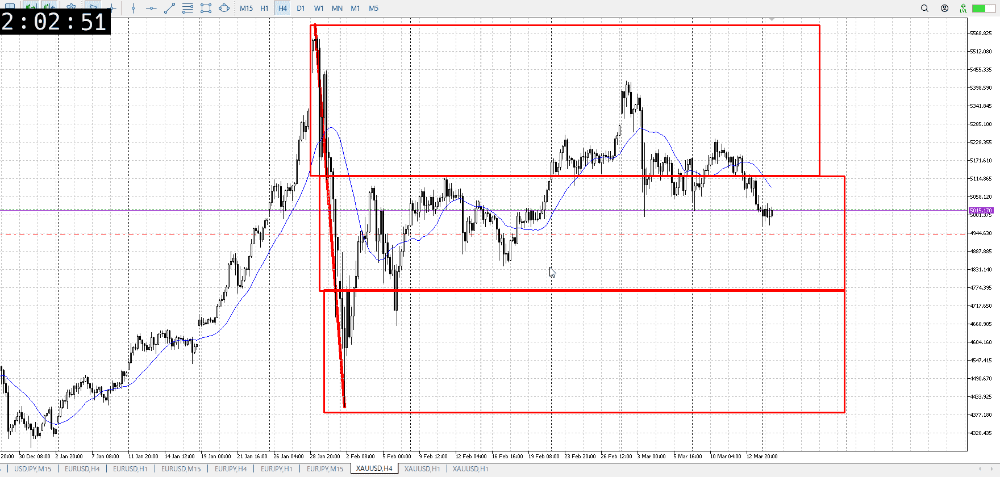
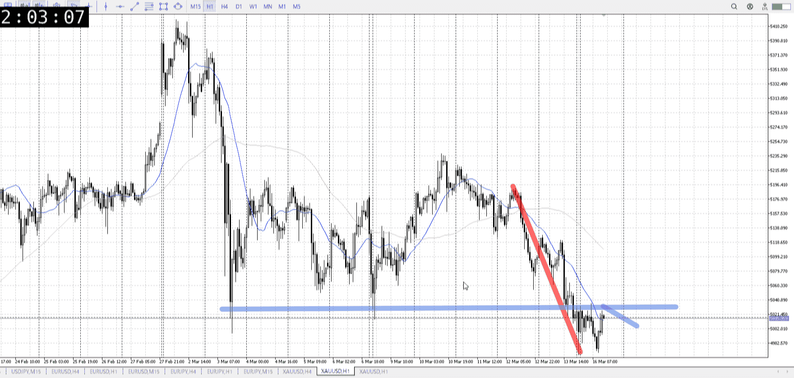
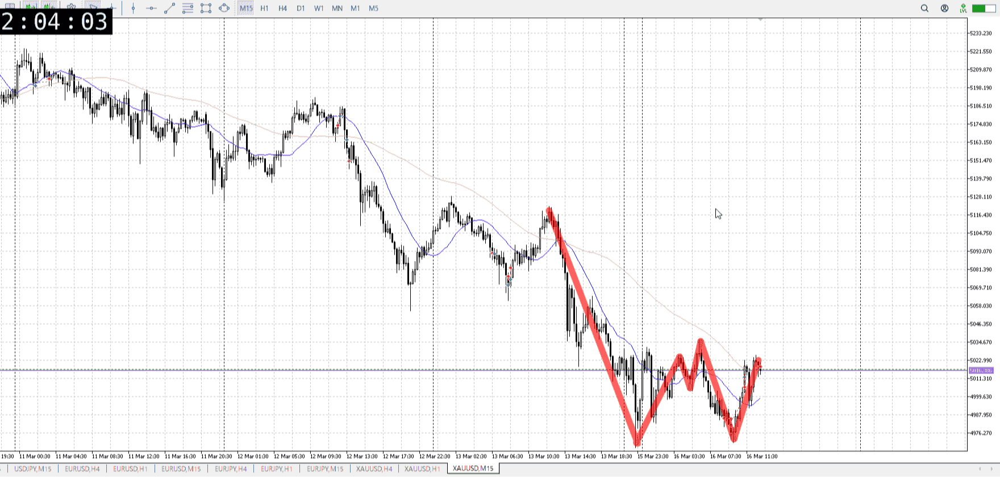

> [!note]
>- +1万 事前認識 **開始5分**

- [ ] [my](my.md)(見ないと増える)
- [ ] 指標
    - 差し込まれる可能性有り、毎日

## 4h

＜ここに目線画像＞

- [x] トレーディングレンジ
    - m

方向：d

## 1h

＜ここに目線画像＞ ^l2kpzm

方向：d

## 15m

＜ここに目線画像＞

方向：d

全方向：ddd
^tasovz

- [x] 使用足全ての目線確認

## シナリオ

b:1h床
s:1h天井
- [x] 時間足ぶつかり

戻り売り
早く戻っているとはいえ、売りの目線は変わってないので買いはしない
- [x] 1hシナリオ
    - [x] 明確か ? 続行 : 確定後考え直し

週初め戻り、下降
- [x] 日出日入、週出週入

売りの方が早い
- [x] 傾き比率

111k
- [x] 前移動値

222k
- [x] 前回上昇・下降値

## 位置

- [x] 推進
- [ ] 調整

## 方針
目線・シナリオ・強弱・調整
横幅・PA後・平均線方向・波
**ひきつけ**・軸時間・傾き比率

売りは売り
下目線として戻りを売り

- [x] 買いたい勢
    - 戻り売り否定
- [x] 売りたい勢
    - 戻り売り

OK!
Exchage Start.

> [!Info]
>- +1万 簡易テスト **開始5分**

> [!Tip]
>- Minecraftは3hまで
## メモ

---

再検証