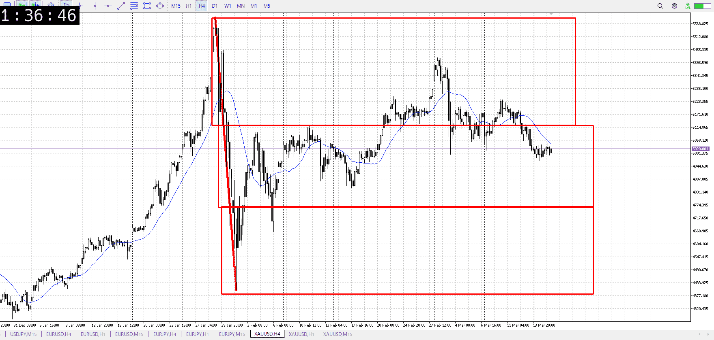
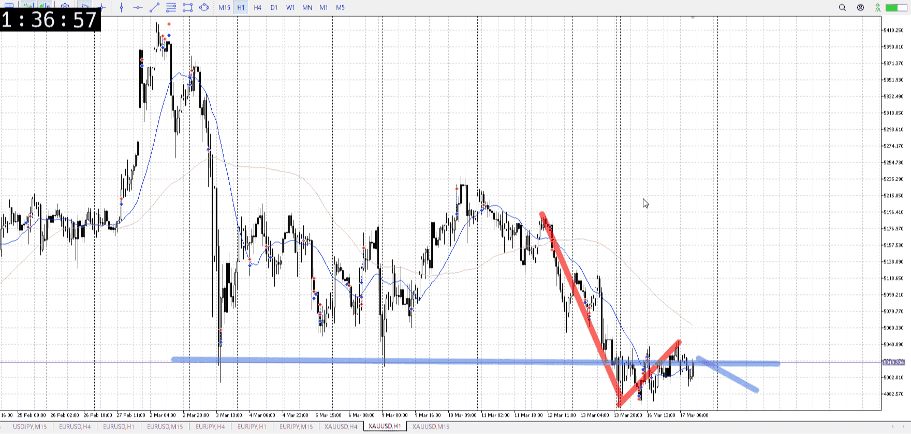
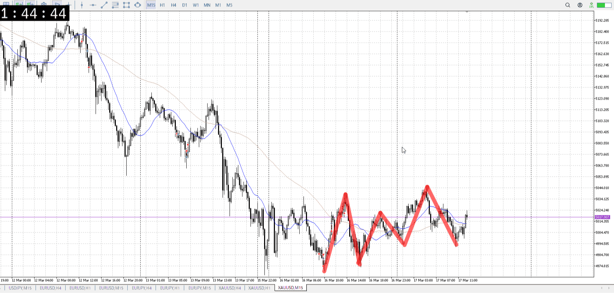
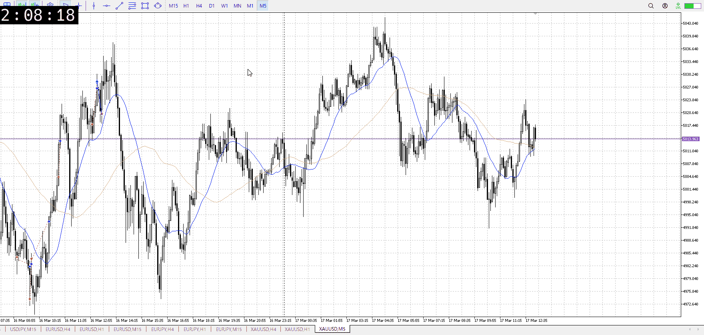

> [!note]
>- +1万 事前認識 **開始5分**

- [x] [my](my.md)(見ないと増える)
- [x] 指標
    - 差し込まれる可能性有り、毎日
4時FOMC
## 4h

＜ここに目線画像＞

- [x] トレーディングレンジ
    - m

方向：d

## 1h

＜ここに目線画像＞ ^rje95w

方向：d

## 15m

＜ここに目線画像＞

方向：d

全方向：ddd
^wucx3l

- [x] 使用足全ての目線確認

## シナリオ

b:？
s:1h床
- [x] 時間足ぶつかり

戻り売り待ち
4hAも来て15m波同等切り下げ切りも来た、そろそろ
FOMCが怖いが売れる
- [x] 1hシナリオ
    - [x] 明確か ? 続行 : 確定後考え直し

同値
- [x] 日出日入、週出週入

買いが薄く、売り狙い目
- [x] 傾き比率

## 位置

- [ ] 推進
- [x] 調整

## 方針
目線・シナリオ・強弱・調整
横幅・PA後・平均線方向・波
**ひきつけ**・軸時間・傾き比率・流れ

売り
一日レンジが用意され、4hA追いつき、15m切り上げ否定
売れそう、が一日レンジの下抜き部分が少ないのとFOMC待ちで床抜きは厳しそう

- [x] 買いたい勢
    - 一日レンジの床から買い
- [x] 売りたい勢
    - レンジの天井から売り

OK!
Exchage Start.

> [!Info]
>- +1万 簡易テスト **開始5分**

> [!Tip]
>- Minecraftは3hまで
## メモ

となるとこの辺って前回の波に当たって売りやすそうではある
あるけど勝率が欲しい場面なのでもう少し待つ

---

再検証