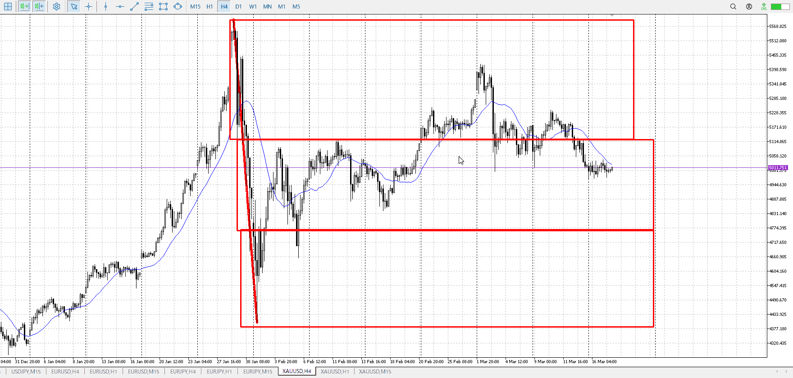
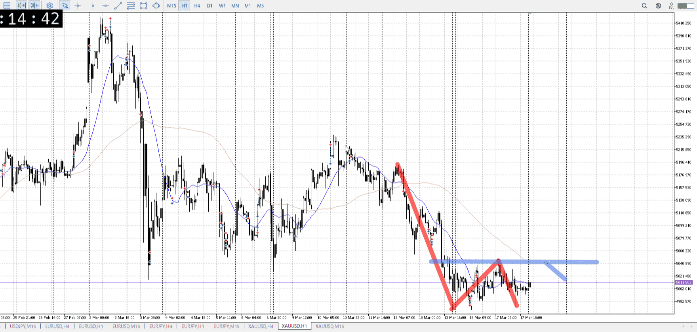
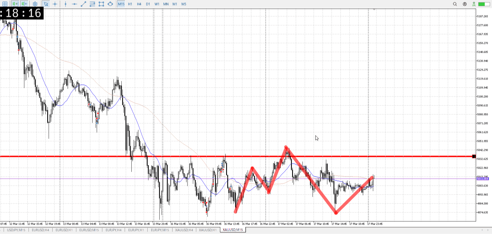
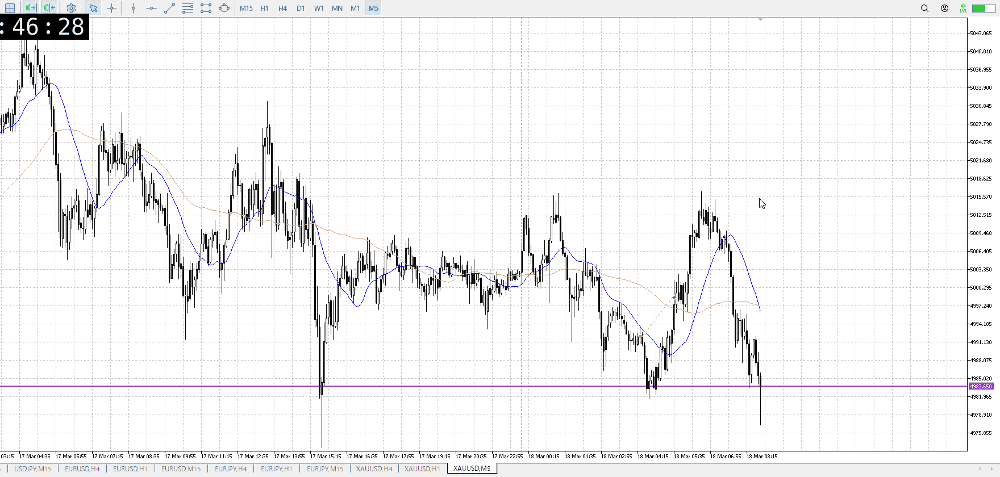
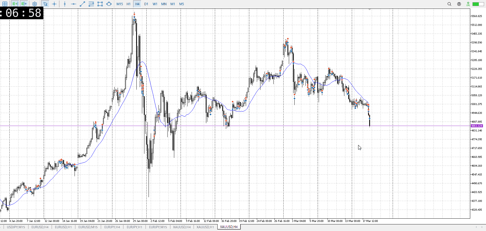

> [!note]
>- +1万 事前認識 **開始5分**

- [x] [my](my.md)(見ないと増える)
- [x] 指標
    - 差し込まれる可能性有り、毎日
水曜の27:00FOMC
## 4h

＜ここに目線画像＞

- [x] トレーディングレンジ
    - m

方向：d

## 1h

＜ここに目線画像＞ ^0bucc3

方向：d

## 15m

＜ここに目線画像＞

方向：d

全方向：ddd
^ygizou

- [x] 使用足全ての目線確認

## シナリオ

b:1h床
s:1h天井
- [x] 時間足ぶつかり

小レンジしつつ1h前回底をなぞる
売りたい
- [x] 1hシナリオ
    - [x] 明確か ? 続行 : 確定後考え直し

同値
- [x] 日出日入、週出週入

下降が若干強いが、そもそもが小さい
- [x] 傾き比率

## 位置

- [ ] 推進
- [x] 調整

## 方針
目線・シナリオ・強弱・調整
横幅・PA後・平均線方向・波
**ひきつけ**・軸時間・傾き比率・流れ

売り
二日分レンジが出来たので、これをFOMCで抜くのが理想
ただその前に抜くのもあり得る、どの道売りで売り

- [x] 買いたい勢
    - 1h床から天井まで
- [x] 売りたい勢
    - 天井から売り

OK!
Exchage Start.

> [!Info]
>- +1万 簡易テスト **開始5分**

> [!Tip]
>- Minecraftは3hまで
## メモ
[my2026-03-18](../My_Test/my2026-03-18.md)

![[../Before_and_Mid_Entry/BaMen20260318T012123.md]]

![[../After_Entry/Aen20260318T032153.md]]

上昇が早く、売るなら一旦これのケアを待ちたい

上昇と下降は同程度

![[../After_Entry/Aen20260318T075849.md]]

![[../After_Entry/Aen20260318T090833.md]]

---

再検証
t

上昇が早かったが、ここで割るにはFOMCが邪魔
そのうえで直近の流れもあるので売れる
予定で大きな動きがあるならそれまで大きな動きはないものとしてできる

t
fomc待ち
これがあっても現在抜けるのがあるなら、そっち優先
利確も通常通り下髭何本を待てばいい

レンジ中央から入ってるものは、抜けを期待している
FOMCで上昇を考えるなら、レンジ中央というどっちつかずは入れない
持ちっぱなしが正解

指標は今のローソクの動きを越えない
ローソクが動かない->指標があるから、というのが正しく
指標がある->ローソクが動かない、というのは間違い、これは未来予知であり不能

ローソク優先
