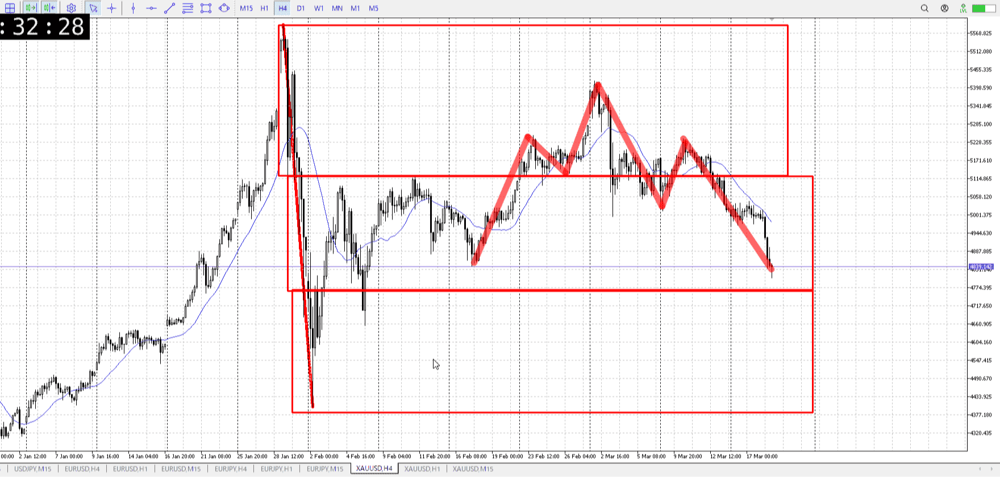
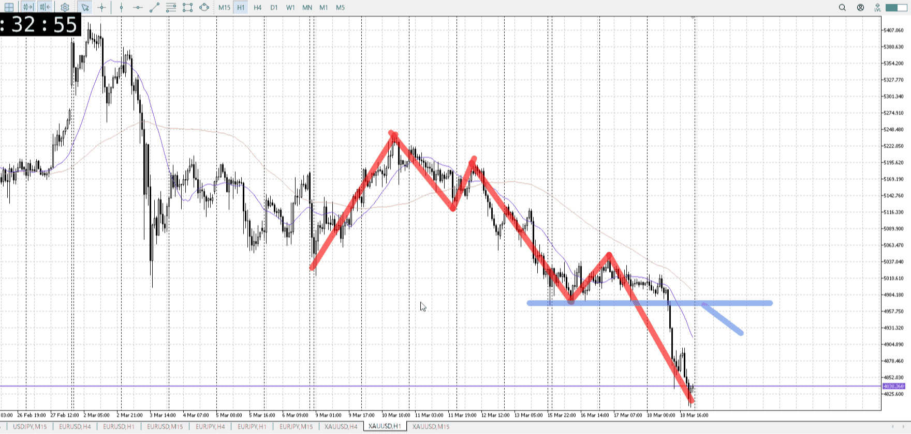
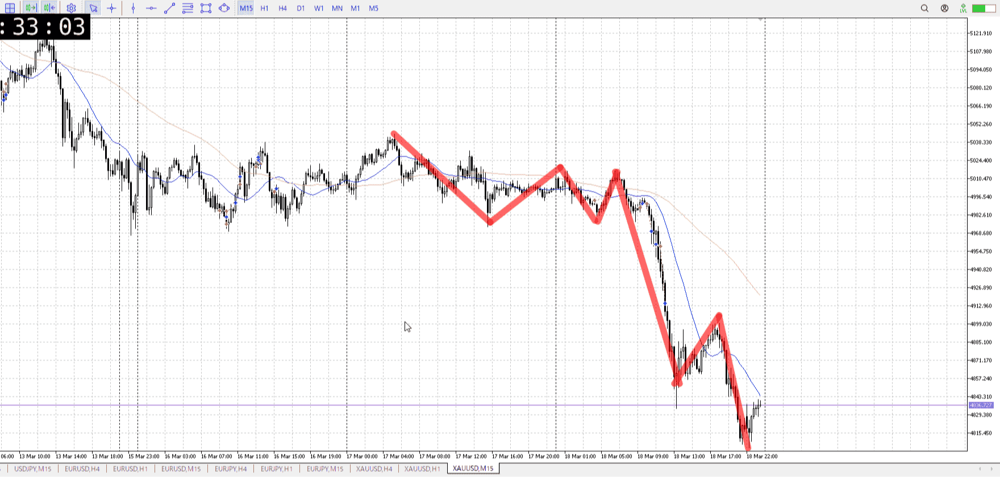
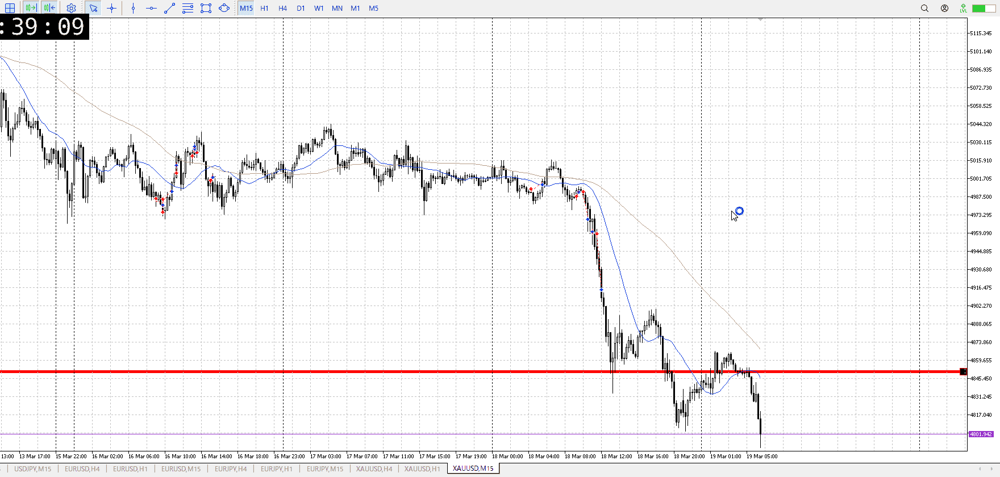

> [!note]
>- +1万 事前認識 **開始5分**

- [ ] [my](my.md)(見ないと増える)
- [ ] 指標
    - 差し込まれる可能性有り、毎日

## 4h

＜ここに目線画像＞

- [x] トレーディングレンジ
    - m

方向：d

## 1h

＜ここに目線画像＞ ^vkwcyo

方向：d

## 15m

＜ここに目線画像＞

方向：d

全方向：ddd
^aspxkf

- [x] 使用足全ての目線確認

## シナリオ

b:4h前回床？
s:1h前回安値
- [x] 時間足ぶつかり

戻り売り
4h落ちたので完全
- [x] 1hシナリオ
    - [x] 明確か ? 続行 : 確定後考え直し

落ち
- [x] 日出日入、週出週入

売り
- [x] 傾き比率

## 位置

- [x] 推進
- [ ] 調整

## 方針
目線・シナリオ・強弱・調整
横幅・PA後・平均線方向・波
**ひきつけ**・軸時間・傾き比率・流れ

売り
昨日で落ちたので戻り売り、その為のレンジ
4hの安値を抜くために1hを溜める

- [x] 買いたい勢
    - 4h安値から買い
- [x] 売りたい勢
    - レンジ溜めて戻り売り

OK!
Exchage Start.

> [!Info]
>- +1万 簡易テスト **開始5分**

> [!Tip]
>- Minecraftは3hまで
## メモ

1hは溜めるけど、それとは別に15mの溜めで売れた

---

再検証
t
売れるが、フラクタルを意識しての話
元々が4h損切なので、その勢い考慮で売る
普段はやらない