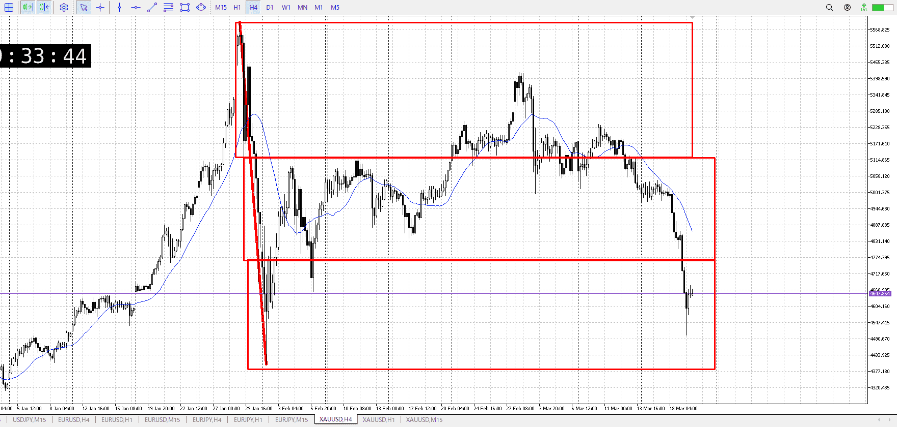
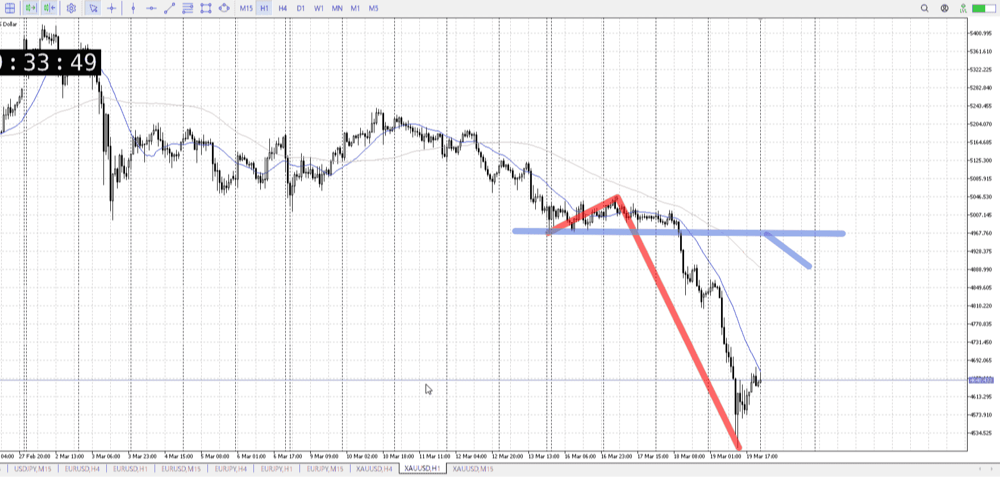
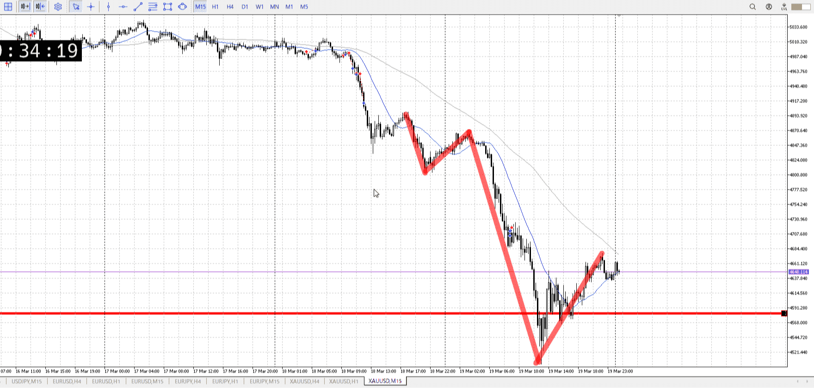

> [!note]
>- +1万 事前認識 **開始5分**

- [ ] [my](my.md)(見ないと増える)
- [ ] 指標
    - 差し込まれる可能性有り、毎日
    - ローソク優先

## 4h

＜ここに目線画像＞

- [x] トレーディングレンジ
    - d

方向：d

## 1h

＜ここに目線画像＞ ^tnoudy

方向：d

## 15m

＜ここに目線画像＞

方向：d

全方向：ddd
^ybpmxj

- [x] 使用足全ての目線確認

## シナリオ

b:4h安値
s:1hレンジ下
- [x] 時間足ぶつかり

理想的にはここだけど前で戻る可能性もある
相手は4hなので時間は取る
- [x] 1hシナリオ
    - [x] 明確か ? 続行 : 確定後考え直し

下降
- [x] 日出日入、週出週入

下
- [x] 傾き比率

## 位置

- [x] 推進
- [ ] 調整

## 方針
目線・シナリオ・強弱・調整
横幅・PA後・平均線方向・波
**ひきつけ**・軸時間・傾き比率・流れ

売り
調整を待ってから売る
4hの底なのでそれを気を付けて

- [x] 買いたい勢
    - レンジ破るか、売り場まで売り
- [x] 売りたい勢
    - 買いが負けるの待って売り

OK!
Exchage Start.

> [!Info]
>- +1万 簡易テスト **開始5分**

> [!Tip]
>- Minecraftは3hまで
## メモ

---

再検証