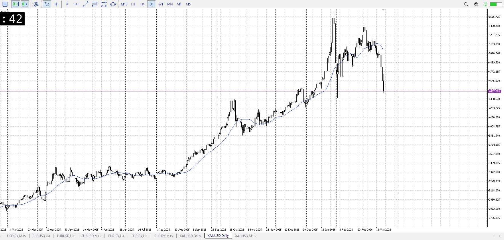
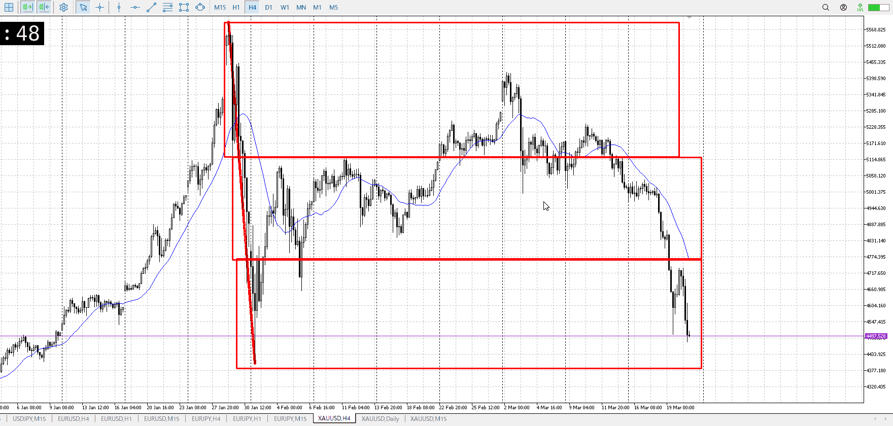
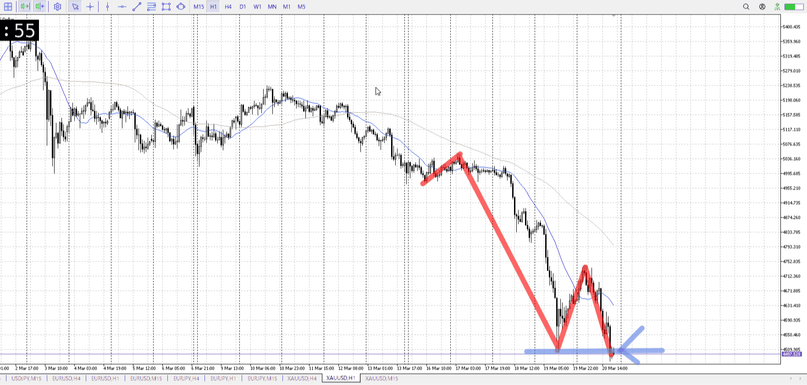
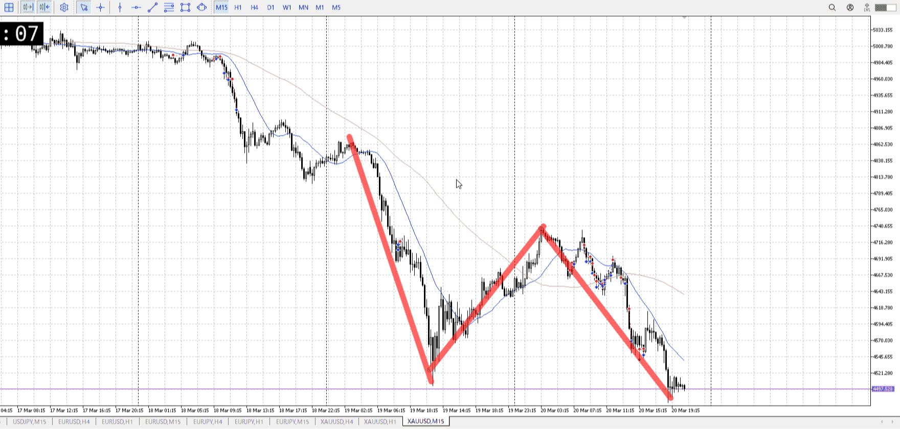

## 1d

＜ここに目線画像＞
直落ち
抜けはないが、下へのかなりの圧力

> [!note]
>- +1万 事前認識 **開始5分**

- [x] [my](my.md)(見ないと増える)
- [x] 指標
    - 差し込まれる可能性有り、毎日
    - ローソク優先

## 4h

＜ここに目線画像＞

- [x] トレーディングレンジ
    - d

方向：d

## 1h

＜ここに目線画像＞ ^ydc8iy

方向：d

## 15m

＜ここに目線画像＞

方向：d

全方向：ddd
^v31f6v

- [x] 使用足全ての目線確認

## シナリオ

b:4h底、1h底
s:4hレンジ抜けに始まり、1hレンジ抜け
- [x] 時間足ぶつかり

底について反発弱め、反発は描いてるが抜け期待
抜けた後は4h髭迄
- [x] 1hシナリオ
    - [x] 明確か ? 続行 : 確定後考え直し

下降
- [x] 日出日入、週出週入

大体同値
- [x] 傾き比率

## 位置

- [x] 推進
- [ ] 調整

## 方針
目線・シナリオ・強弱・調整
横幅・PA後・平均線方向・波
**ひきつけ**・軸時間・傾き比率・流れ

売り
1hの底まで来たが、金曜で反発少な目
買いが居ないということで売り圧力が高い

売りを期待したいところ、その場合は4hひげまで
4hAはまだ追いついてない

- [x] 買いたい勢
    - 15mの目線を切り替える程度に上昇、それから
- [x] 売りたい勢
    - 底抜け

OK!
Exchage Start.

> [!Info]
>- +1万 簡易テスト **開始5分**

> [!Tip]
>- Minecraftは3hまで
## メモ
週の見直しをすること

4h下抜きから始まった
なので積極売り

そこから長いレンジ
短期で売りが考えられる場面を取りに行った

水曜
FOMCが怖かったが、動いているローソクをそれより優先すべき

木曜
4h抜きというスピードを考慮すれば短期更新で入れた

金曜
確定で入ったが、これが出来たのはバックに4hが居たから
本来は分析を密にしてもっと早く入れた

また、ここのところ金曜の夜でトレンドが転換した事例は少ない
なので短期で入ることは可能

短期で入っても、フラクタル的に大きく取ること

---

再検証