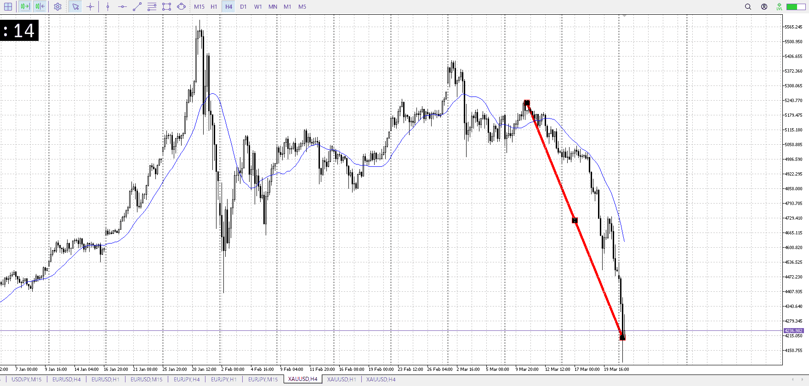
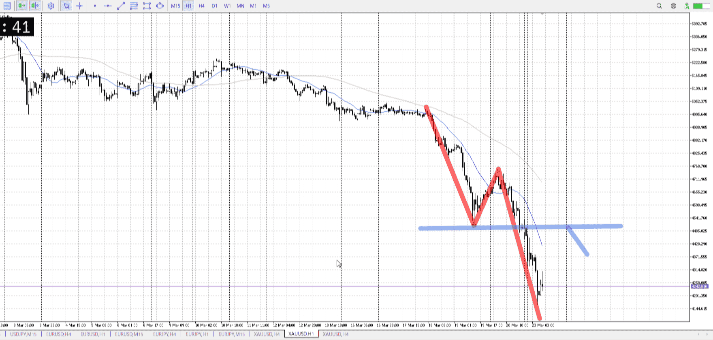
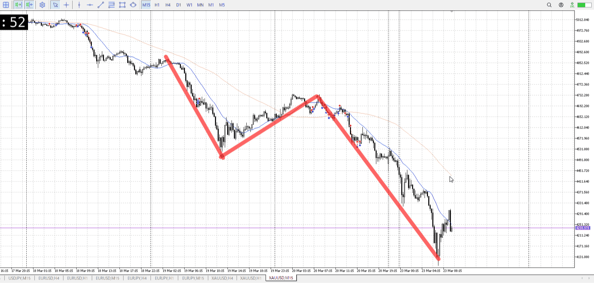

> [!note]
>- +1万 事前認識 **開始5分**

- [x] [my](my.md)(見ないと増える)
- [x] 指標
    - 差し込まれる可能性有り、毎日
    - ローソク優先

## 4h

＜ここに目線画像＞

- [x] トレーディングレンジ
    - d

方向：d

## 1h

＜ここに目線画像＞ ^1ta79s

方向：d

## 15m

＜ここに目線画像＞

方向：d

全方向：ddd
^bjoe6g

- [x] 使用足全ての目線確認

## シナリオ

b:1d前回もみ合い？
s:4h抜け
- [x] 時間足ぶつかり

1dを抜くために、このへんまでためがある想定
- [x] 1hシナリオ
    - [x] 明確か ? 続行 : 確定後考え直し

下降
- [x] 日出日入、週出週入

下降
- [x] 傾き比率

## 位置

- [x] 推進
- [ ] 調整

## 方針
目線・シナリオ・強弱・調整
横幅・PA後・平均線方向・波
**ひきつけ**・軸時間・傾き比率・流れ

売りたい
が、ここは1dの抵抗であり落ちてきた勢いだけではきつい

加えて落ちすぎてどこだろうと損切が持てない
現時点で短期でも50kある
なのでいつも以上に引きつけとか、損切少な目とか意識
抜けは無理

- [ ] 買いたい勢
    - 1d抵抗で買い
- [ ] 売りたい勢
    - 4h1hの前回の安値までひきつけ、売りたい

OK!
Exchage Start.

> [!Info]
>- +1万 簡易テスト **開始5分**

> [!Tip]
>- Minecraftは3hまで
## メモ
日足の[オーバーシュート](../オーバーシュート.md)かもしれない
オーバーシュートの定義を要検索

[横幅](../横軸.md)も同じようにかかる

戻り売り迄上昇
時間がかかる

![[../After_Entry/Aen20260324T084619.md]]

---

再検証