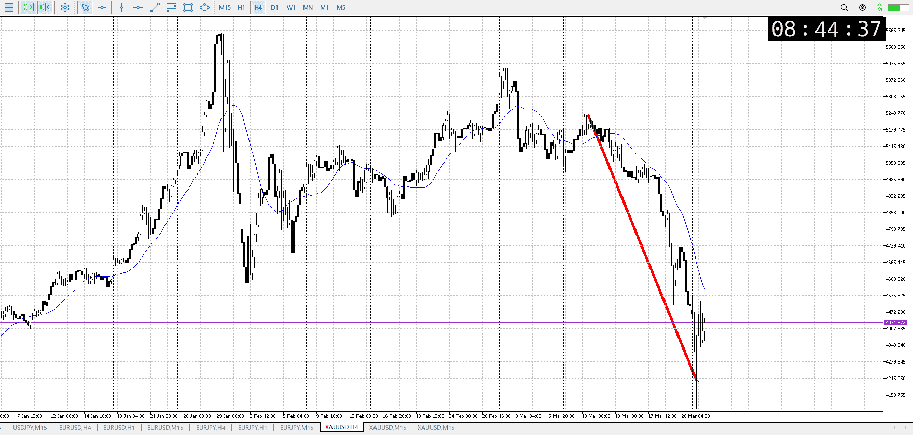
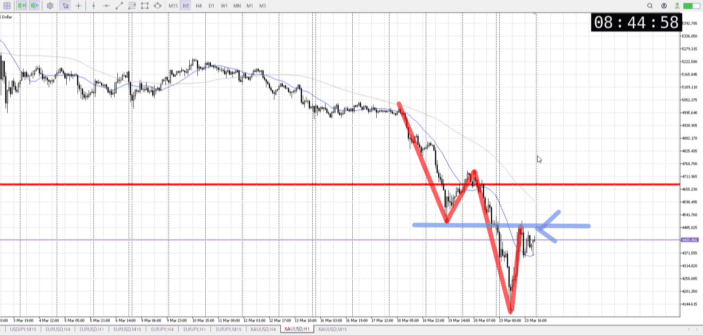
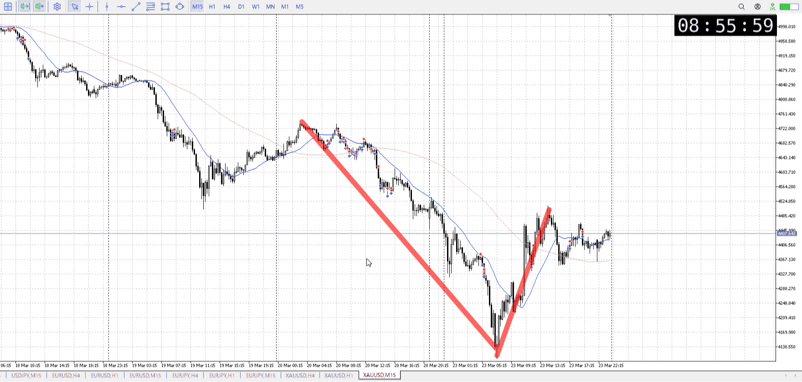

> [!note]
>- +1万 事前認識 **開始5分**

- [x] [my](my.md)(見ないと増える)
- [x] 指標
    - 差し込まれる可能性有り、毎日
    - ローソク優先

## 4h

＜ここに目線画像＞

- [x] トレーディングレンジ
    - d

方向：d

## 1h

＜ここに目線画像＞ ^nfs47u

方向：d

## 15m

＜ここに目線画像＞

方向：d

全方向：ddd
^bzbins

- [x] 使用足全ての目線確認

## シナリオ

b:1d持合い周辺
s:1h前回安値
- [x] 時間足ぶつかり

戻り売りと、日足オーバーシュートによる抜け
- [x] 1hシナリオ
    - [x] 明確か ? 続行 : 確定後考え直し

410k、落ちてから同値
- [x] 日出日入、週出週入

短いが買いが強い
- [x] 傾き比率

## 位置

- [ ] 推進
- [x] 調整

## 方針
目線・シナリオ・強弱・調整
横幅・PA後・平均線方向・波
**ひきつけ**・軸時間・傾き比率・流れ

目線は売りだが、日足のオーバーシュートを警戒
5m短期としては買える場面

前回の横幅を考えると、また昼頃に動きそうな目安
買いをかけるには引きつけが必要なので注意
また4hが上髭で揃い、大きくは取れない

短期が買い、長期が売りなので4hAが来るとかで変化がない限りレンジしそう
どのみち取引はかなり引きつけてから

- [x] 買いたい勢
    - 底から短期買い
- [x] 売りたい勢
    - 1h前回安値から売り

OK!
Exchage Start.

> [!Info]
>- +1万 簡易テスト **開始5分**

> [!Tip]
>- Minecraftは3hまで
## メモ

![[../After_Entry/Aen20260325T014816.md]]

---

再検証