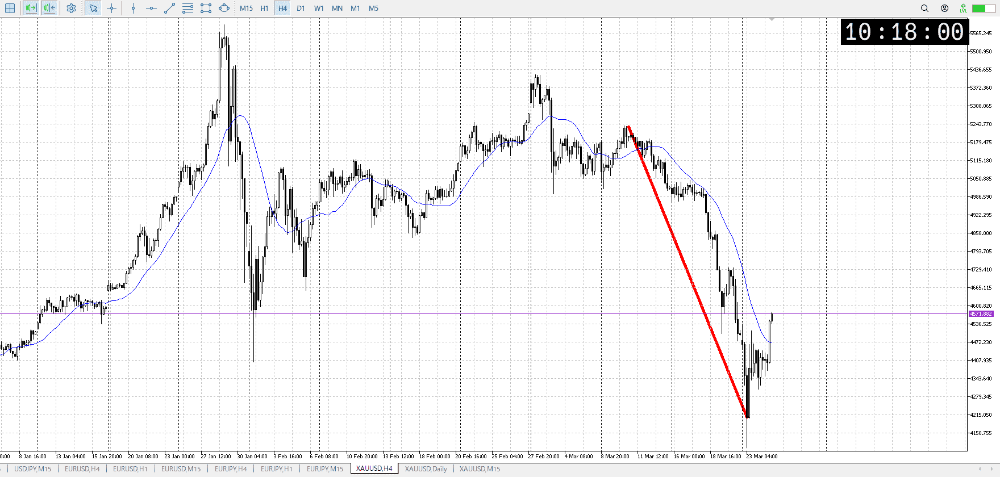
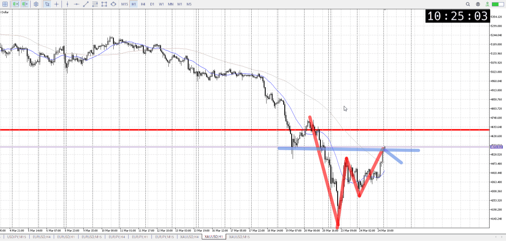
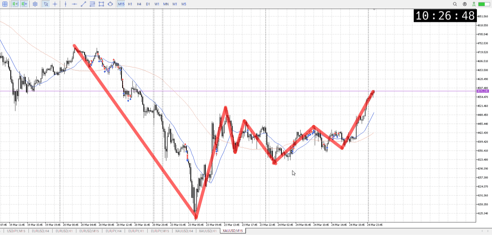
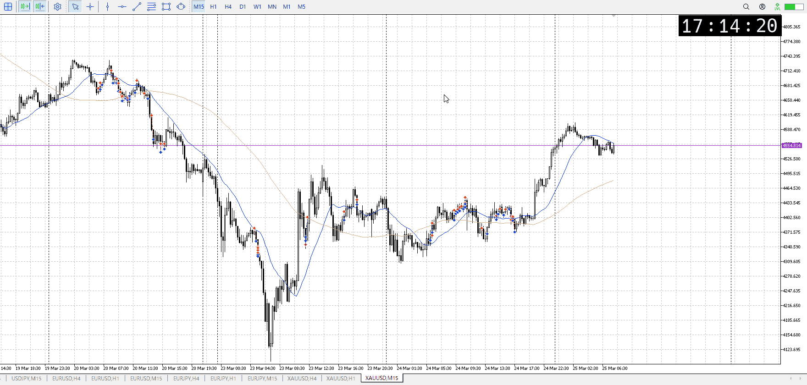
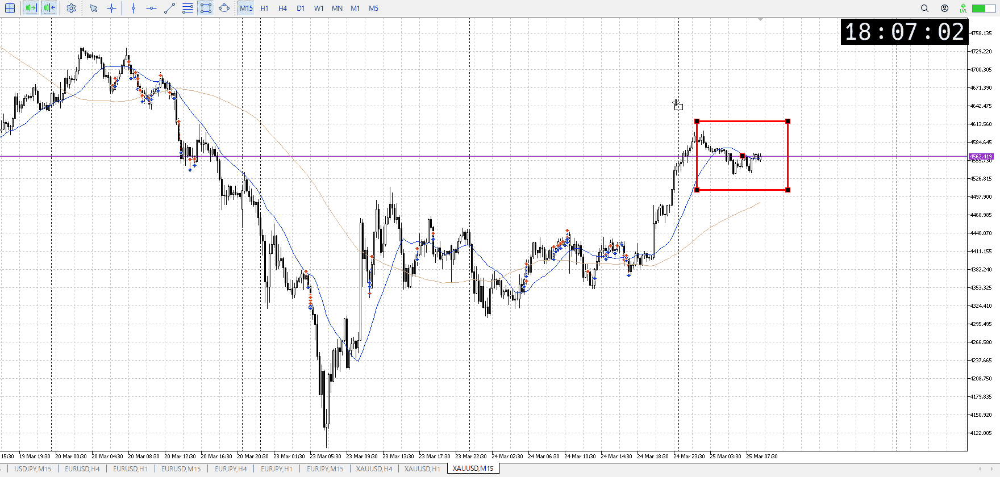
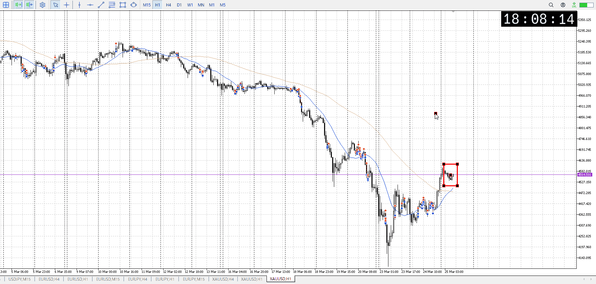
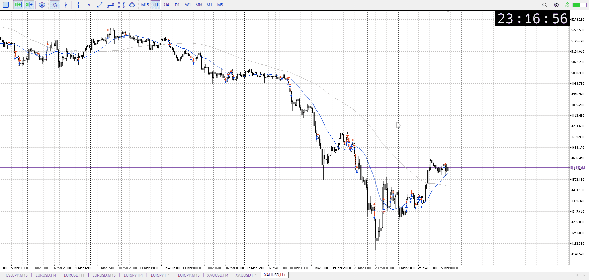

> [!note]
>- +1万 事前認識 **開始5分**

- [ ] [my](my.md)(見ないと増える)
- [ ] 指標
    - 差し込まれる可能性有り、毎日
    - ローソク優先

## 4h

＜ここに目線画像＞

- [x] トレーディングレンジ
    - d

方向：d

## 1h

＜ここに目線画像＞ ^wofsjs

方向：d

## 15m

＜ここに目線画像＞

方向：u

全方向：ddu
^0c1rnu

- [x] 使用足全ての目線確認

## シナリオ

b:1d
s:1h
- [x] 時間足ぶつかり

戻り売り
- [x] 1hシナリオ
    - [x] 明確か ? 続行 : 確定後考え直し

上昇終了
- [x] 日出日入、週出週入

今は買いが強い
- [x] 傾き比率

## 位置

- [ ] 推進
- [x] 調整

## 方針
目線・シナリオ・強弱・調整
横幅・PA後・平均線方向・波
**ひきつけ**・軸時間・傾き比率・流れ

売りたい
上昇してるが、これを根拠に買うにはもう1hの売り場が近すぎる
これがレンジとかして折れたとこを狙う
今は買いが優勢なので静観

それなりに買いも理由があるので、売れたとしても押し目買いを警戒する

- [x] 買いたい勢
    - 1hの売り場で売られて落ちたとこを、短期押し買い
- [x] 売りたい勢
    - 1hの売り場で売る

OK!
Exchage Start.

> [!Info]
>- +1万 簡易テスト **開始5分**

> [!Tip]
>- Minecraftは3hまで
## メモ
前回までは方向感が無い中、方向を早めに切り替えていた
今回は1h売り場なので売りで

t
溜めてた分を抜いて15mは完全に買い
まず押し目買い、それが駄目な時売り

押し目が結構遠い
早めに上がられると入れない

目安として前回の調整の長さに合わせて四角
この間で下まで下がるのも早すぎる、ここのまま上がる方がありそう

1hAが来てるのも確認

![[../After_Entry/Aen20260325T111345.md]]

1hAおいつき
目線下ながら上トレンド

---

再検証