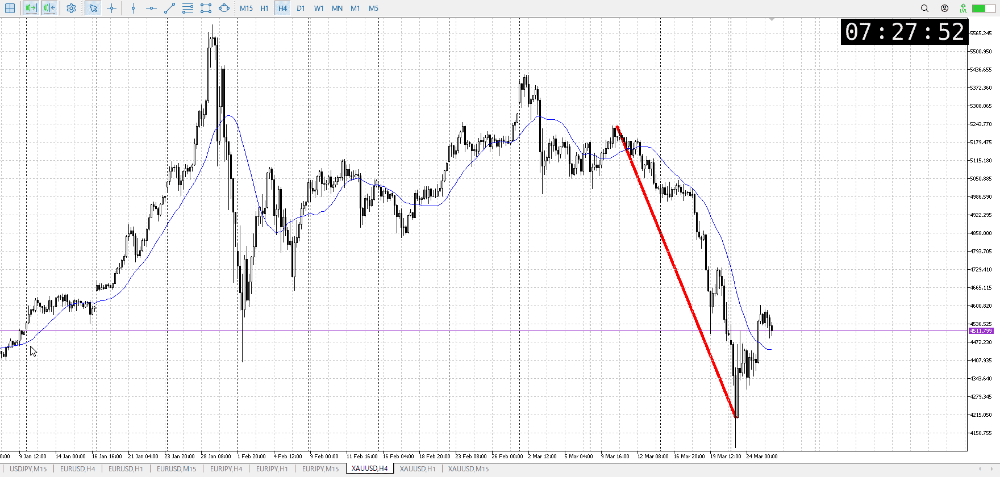
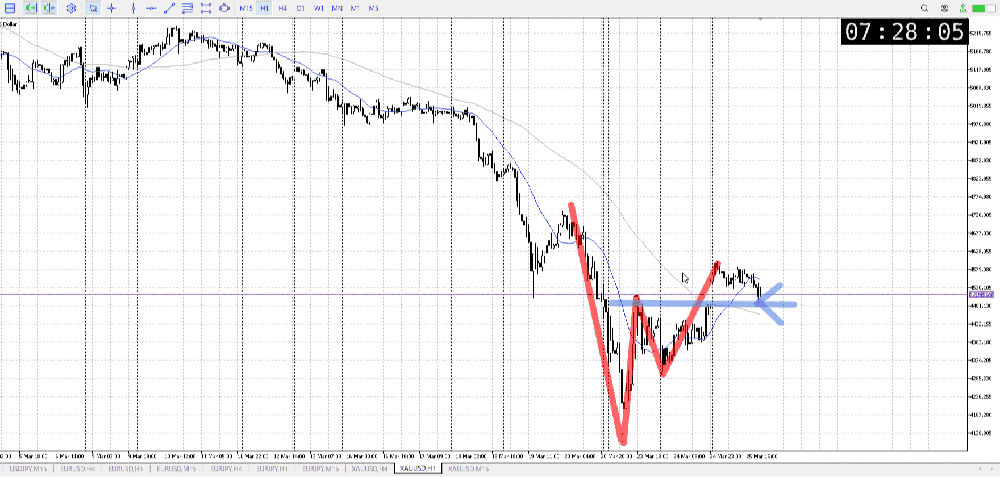
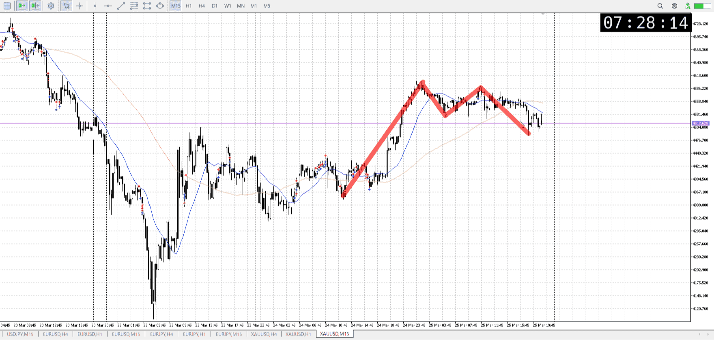
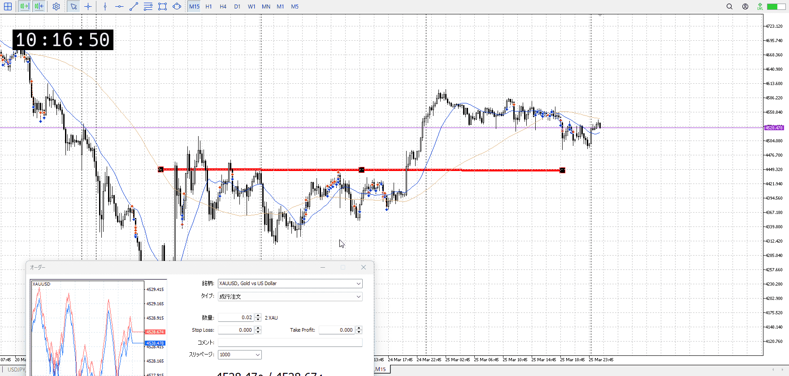
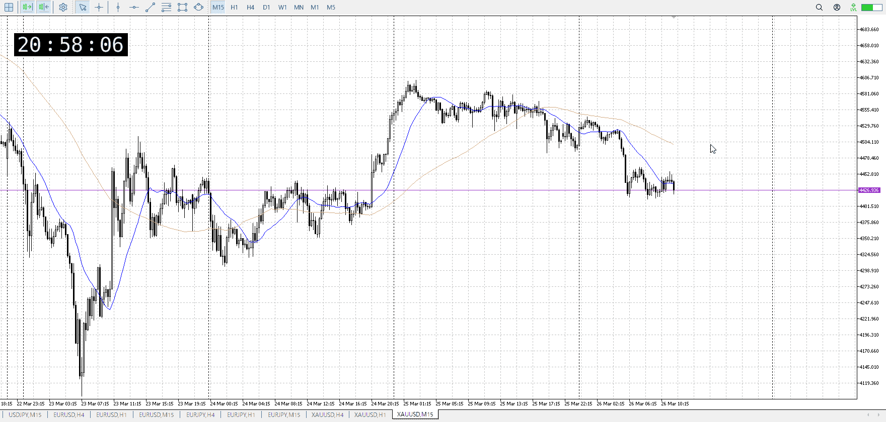
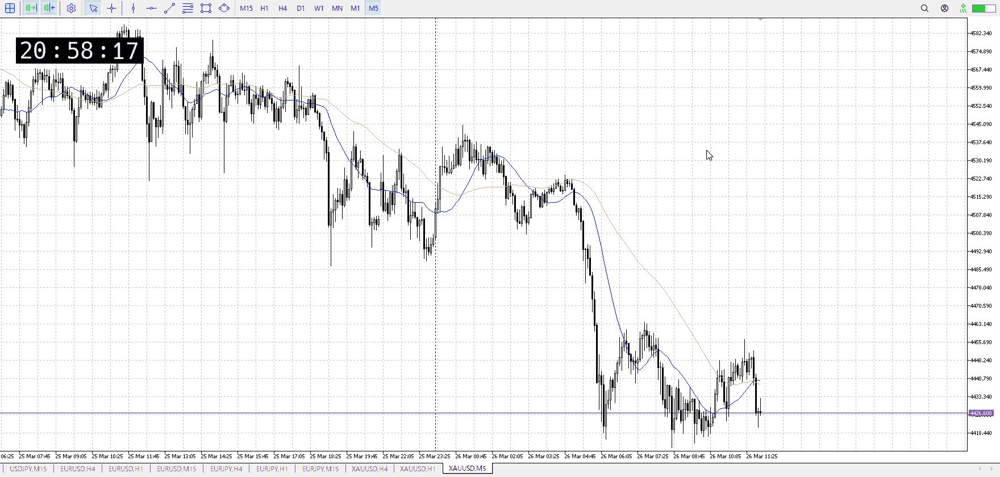
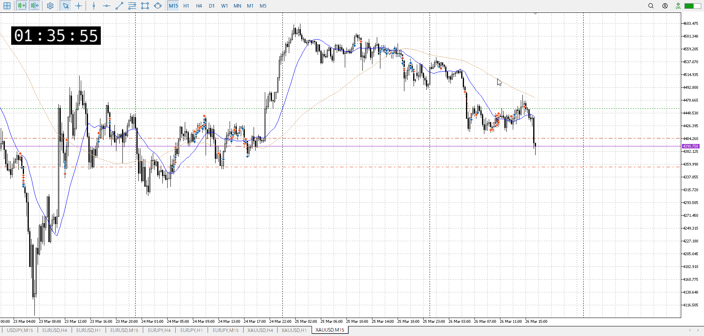
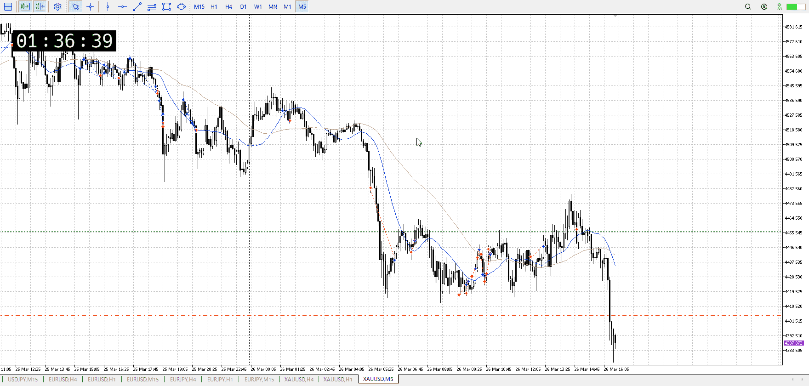

> [!note]
>- +1万 事前認識 **開始5分**

- [x] [my](my.md)
- [x] 指標
    - 差し込まれる可能性有り、毎日
    - ローソク優先

## 4h

＜ここに目線画像＞

- [x] トレーディングレンジ
    - d

方向：d

## 1h

＜ここに目線画像＞ ^hpqmrw

方向：d

## 15m

＜ここに目線画像＞

方向：u

全方向：ddu
^v513oi

- [x] 使用足全ての目線確認

## シナリオ

b:1d背景15m上昇
s:1h売り
- [x] 時間足ぶつかり

15m押し目で上がるかどうか
- [x] 1hシナリオ
    - [x] 明確か ? 続行 : 確定後考え直し

レンジ調整、一昨日230kに対し100k
- [x] 日出日入、週出週入

買い
- [x] 傾き比率

## 位置

- [ ] 推進
- [ ] 調整

## 方針
目線・シナリオ・強弱・調整
横幅・PA後・平均線方向・波
**ひきつけ**・軸時間・傾き比率・流れ

短期買い、長期売り
短期としてはここを押し目、昨日を丸々調整として入りたい
長期としてはこれを否定し、前回安値の売り場で戻り売りしたい
決着を見たい

- [x] 買いたい勢
    - 15m前回高値押し目買い
- [x] 売りたい勢
    - 1h前回安値戻り売り

OK!
Exchage Start.

> [!Info]
>- +1万 簡易テスト **開始5分**

> [!Tip]
>- Minecraftは3hまで
## メモ

押すならこの高さが妥当であることは意識

![[../After_Entry/Aen20260326T105055.md]]

底を抜きでのエントリーが可能

![[../After_Entry/Aen20260326T034608.md]]

![[../After_Entry/Aen20260326T043112.md]]

抜け売りした分、売りのつづきをやる
なので下抜きか、レンジ上から上髭売りか

そろそろ平均線の呪いを解け
横幅と方向を重視

15mで分かりやすいのでてから。買いは。

分かりやすく売ったが、下に行かず。
上で売ってるのはt。

15m上髭に加え、5mだと確かに売れそうではある。
その後の上昇が怖いが。

---

再検証
