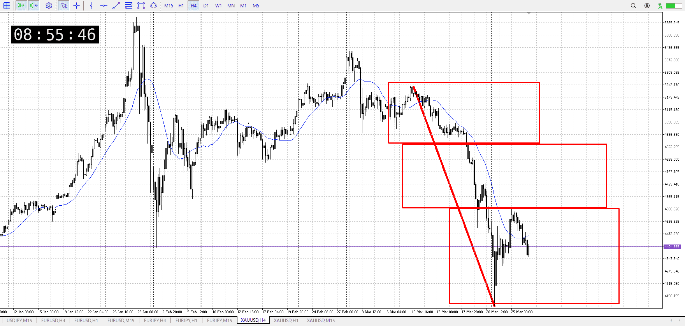
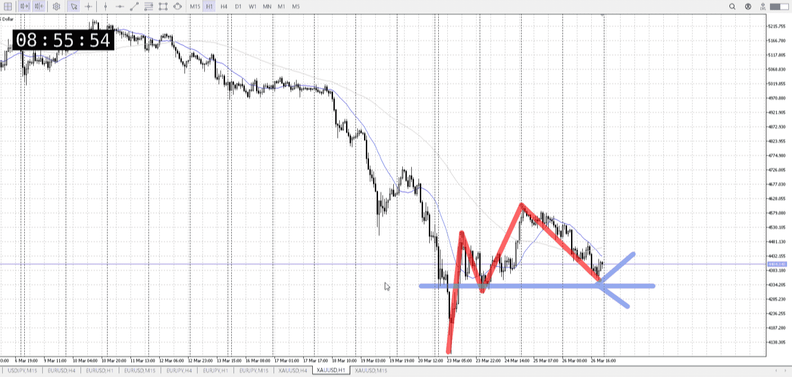
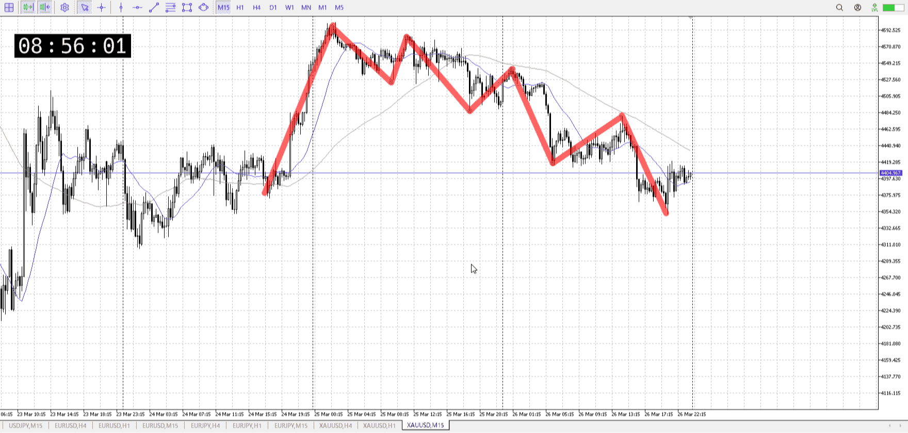
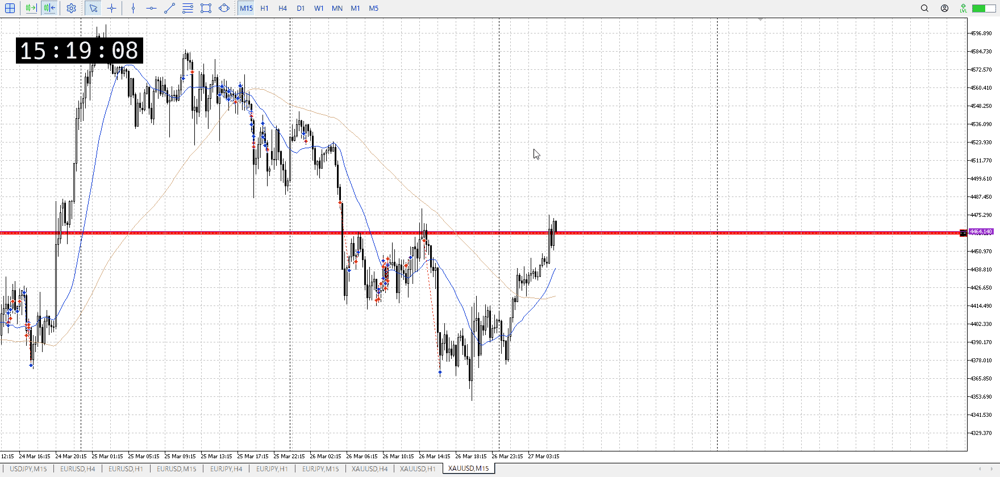

> [!note]
>- +1万 事前認識 **開始5分**

- [x] [my](my.md)
- [x] 指標
    - 差し込まれる可能性有り、毎日
    - ローソク優先

## 4h

＜ここに目線画像＞

- [x] トレーディングレンジ
    - d

方向：d

## 1h

＜ここに目線画像＞ ^gaeqxc

方向：d

## 15m

＜ここに目線画像＞

方向：d

全方向：ddd
^unkf6a

- [x] 使用足全ての目線確認

## シナリオ

b:1d下髭を背景にした短期買い
s:1h戻り売り
- [x] 時間足ぶつかり

いちおうある買い抵抗
- [x] 1hシナリオ
    - [x] 明確か ? 続行 : 確定後考え直し

19万、下降
- [x] 日出日入、週出週入

1h下降緩やか、上昇あり
- [x] 傾き比率

## 位置

- [x] 推進
- [ ] 調整

## 方針
目線・シナリオ・強弱・調整
横幅・PA後・平均線方向・波
**ひきつけ**・軸時間・傾き比率・流れ

売り
目線的には推進なんだけど、1dから買いを考える人による買いがここにもいるはず

つまり一度方向感が無くなるはず、明確に怪しい物が出るまでは売りは継続する

- [x] 買いたい勢
    - 安値まで押し込まれてから押し目買い
- [x] 売りたい勢
    - 押し目買いを否定し下へ

OK!
Exchage Start.

> [!Info]
>- +1万 簡易テスト **開始5分**

> [!Tip]
>- Minecraftは3hまで
## メモ
方向感は無くなるので、朝に入るほどではなさそう

昼でさっきまで長期勝ってて、その中で短期を入れるかと言われると。
普通にここで待って平均追いつき売りの方が強そう。

![[../After_Entry/Aen20260327T100544.md]]

---

再検証

