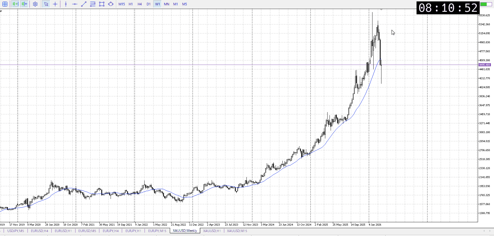
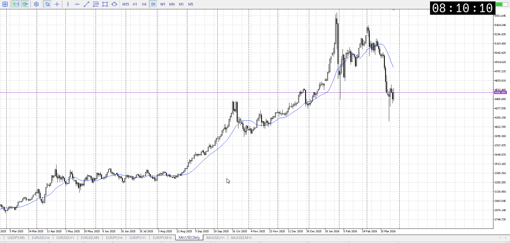
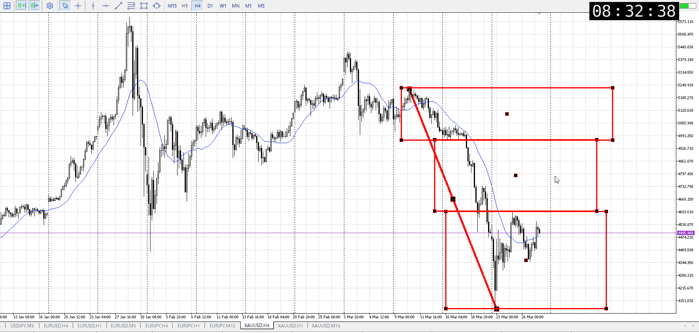
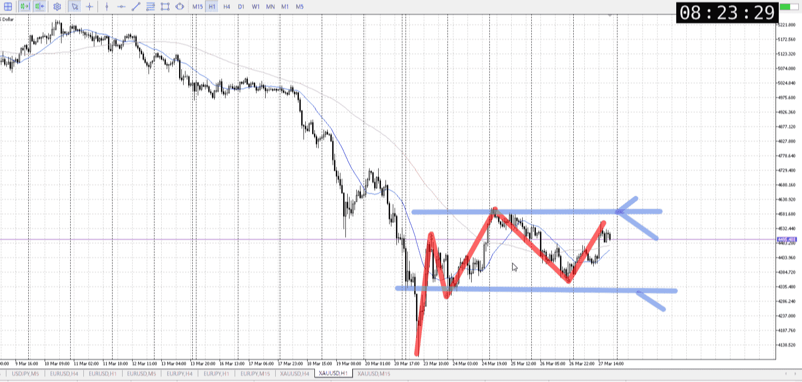
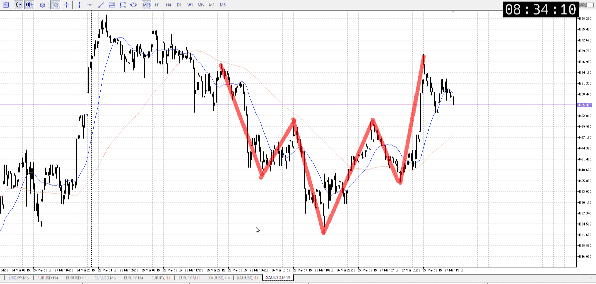

## 1w

下髭

## 1d

＜ここに目線画像＞
下で滞留してるが上がり切れてはない

> [!note]
>- +1万 事前認識 **開始5分**

- [x] [my](my.md)
- [x] 指標
    - 差し込まれる可能性有り、毎日
    - ローソク優先
月23:30パウエル
金21:30雇用統計
## 4h

＜ここに目線画像＞

- [x] トレーディングレンジ
    - d

方向：d

## 1h

＜ここに目線画像＞ ^92hayb

方向：d

## 15m

＜ここに目線画像＞

方向：u

全方向：ddu
^u6ks7c

- [x] 使用足全ての目線確認

## シナリオ

b:1d背景1h安値
s:1h高値
- [x] 時間足ぶつかり

想定より上がってないのでレンジ内で下より
15mはまだ上なのに注意、なので一応上も描いたが上位足的に下
- [x] 1hシナリオ
    - [x] 明確か ? 続行 : 確定後考え直し

上昇、同値下髭
- [x] 日出日入、週出週入

上昇が強い
- [ ] 傾き比率

## 位置

- [ ] 推進
- [ ] 調整

## 方針
目線・シナリオ・強弱・調整
横幅・PA後・平均線方向・波
**ひきつけ**・軸時間・傾き比率・流れ

売りたい
昨日の終わりは15mが目線変わってすぐだったので買えた

月末で動きにくいのはそうだが、深夜で反発しにくいはず
結果は上がらず
流れとしてはまだ平均来てないから全然あり得るレンジ

これより上は1h天井候補が見えてくる
買いにくくはなるか、そこまで来てから
結局はレンジ上からの売り待ち

前の買いがそんな伸びてないのがあるので、売りに偏りがある
が傾きとしては買いがある
でも傾きもこれ以上伸びなければ下になるわけで、というわけで買うなら短期,長期の売り待ちは変わらない

- [x] 買いたい勢
    - 15m押し買い
- [x] 売りたい勢
    - 1h天井

OK!
Exchage Start.

> [!Info]
>- +1万 簡易テスト **開始5分**

> [!Tip]
>- Minecraftは3hまで
## メモ
前の買いがそんな伸びてない

---

再検証