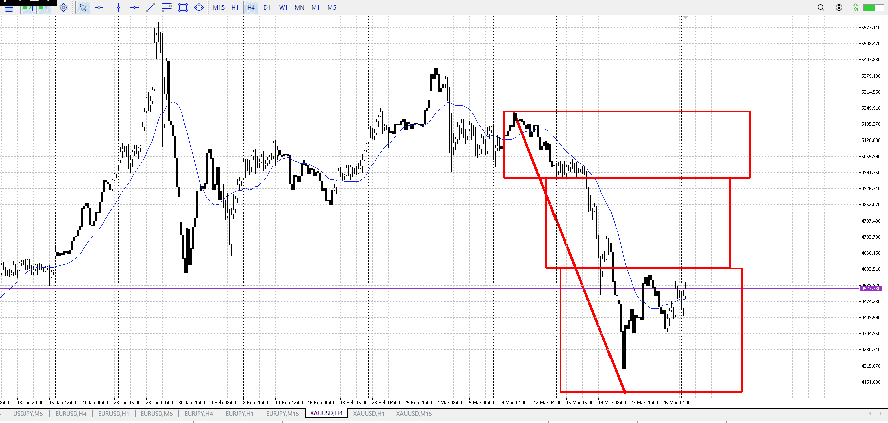
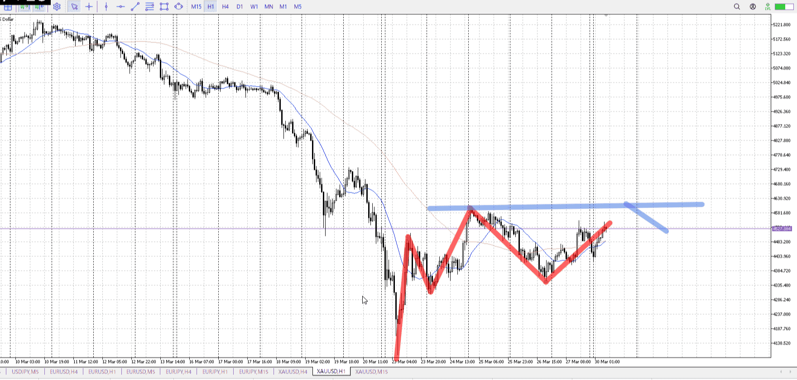
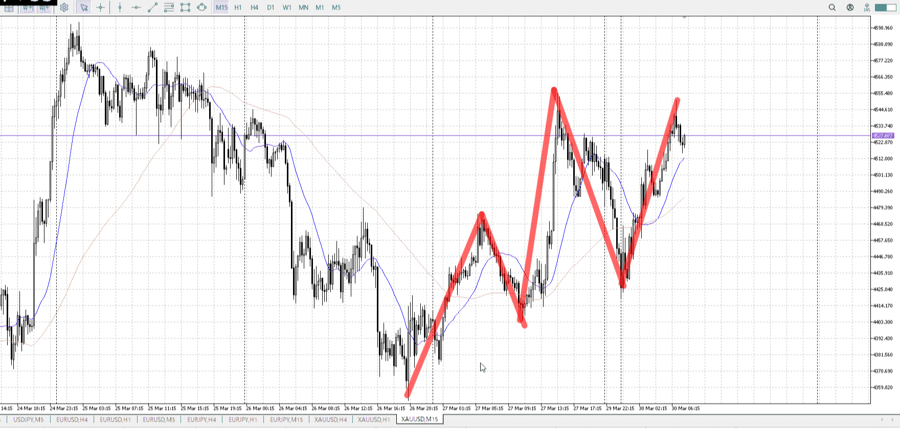

> [!note]
>- +1万 事前認識 **開始5分**

- [x] [my](my.md)
- [ ] 指標
    - 差し込まれる可能性有り、毎日
    - ローソク優先

## 4h

＜ここに目線画像＞

- [x] トレーディングレンジ
    - d

方向：d

## 1h

＜ここに目線画像＞ ^7uz92b

方向：d

## 15m

＜ここに目線画像＞

方向：u

全方向：ddu
^z6873g

- [x] 使用足全ての目線確認

## シナリオ


b:1hレンジ底から買い
s:1hレンジ天井から売り？
- [x] 時間足ぶつかり

売り
調整買いはのびない
- [x] 1hシナリオ
    - [x] 明確か ? 続行 : 確定後考え直し

上昇
- [x] 日出日入、週出週入

同値？
- [x] 傾き比率


## 位置

- [ ] 推進
- [x] 調整

## 方針
目線・シナリオ・強弱・調整
横幅・PA後・平均線方向・波
**ひきつけ**・軸時間・傾き比率・流れ


- [ ] 買いたい勢
    - 
- [ ] 売りたい勢
    - 


```meta-bind-button
style: default
label: Send
actions:
  - type: "replaceSelf"
    replacement: "\n\nOK!\nExchage Start."
```

> [!Info]
>- +1万 簡易テスト **開始5分**

> [!Tip]
>- Minecraftは3hまで
## メモ


---

再検証