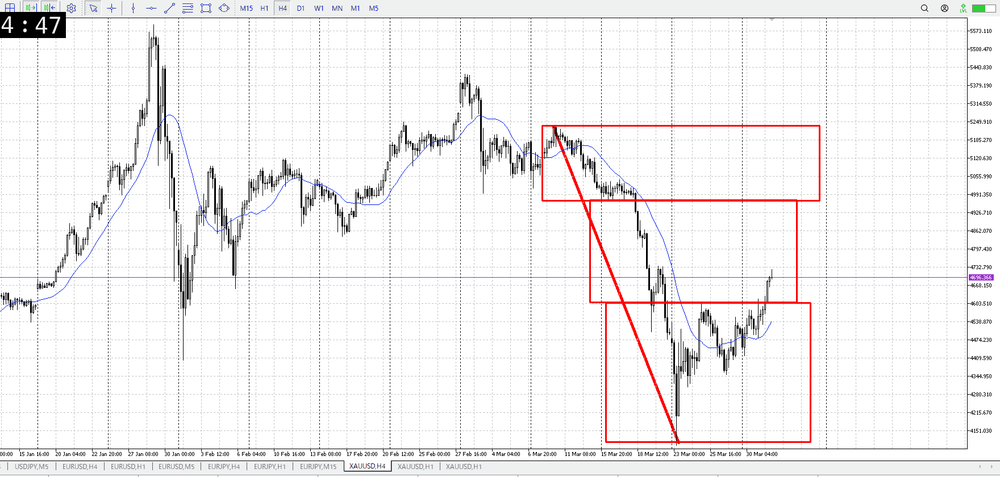
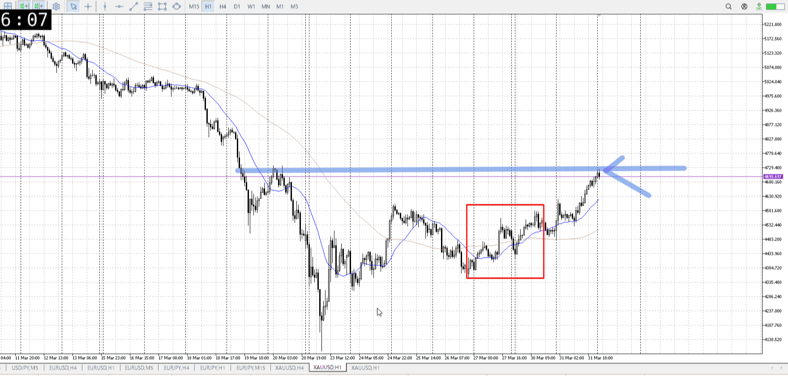
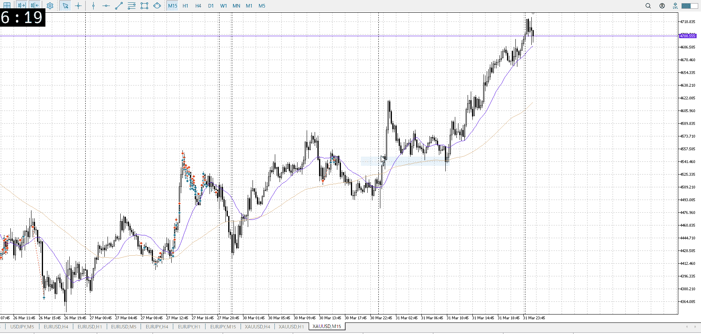

> [!note]
>- +1万 事前認識 **開始5分**

- [x] [my](my.md)
- [x] 指標
    - 差し込まれる可能性有り、毎日
    - ローソク優先

## 4h

＜ここに目線画像＞

- [x] トレーディングレンジ
    - m

方向：d

## 1h

＜ここに目線画像＞ ^le6nbf

方向：d

## 15m

＜ここに目線画像＞

方向：u

全方向：ddu
^rqpzhe

- [x] 使用足全ての目線確認

## シナリオ

b:1d買いを元に1h直近安値から買い
s:1h高値から？
- [x] 時間足ぶつかり

1hに従い反転売り狙い
1d平均も迫ってる
週末雇用統計も
- [x] 1hシナリオ
    - [x] 明確か ? 続行 : 確定後考え直し

上昇
- [x] 日出日入、週出週入

買いだが、傾きはゆるい
- [ ] 傾き比率

## 位置

- [ ] 推進
- [x] 調整

## 方針
目線・シナリオ・強弱・調整
横幅・PA後・平均線方向・波
**ひきつけ**・軸時間・傾き比率・流れ

売りたい
傾きが緩いので、これ折って売れるならあり
ただ週末雇用統計がある

雇用統計後は1万では戦いにくいし
今週は入りにくい

- [x] 買いたい勢
    - 1h売り場抜きたい
- [x] 売りたい勢
    - 1h売り場で売りたい

OK!
Exchage Start.

> [!Info]
>- +1万 簡易テスト **開始5分**

> [!Tip]
>- Minecraftは3hまで
## メモ
[my2026-04-01](../My_Test/my2026-04-01.md)

---

再検証