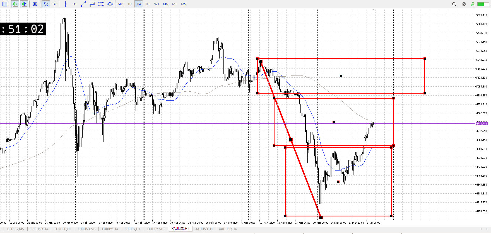
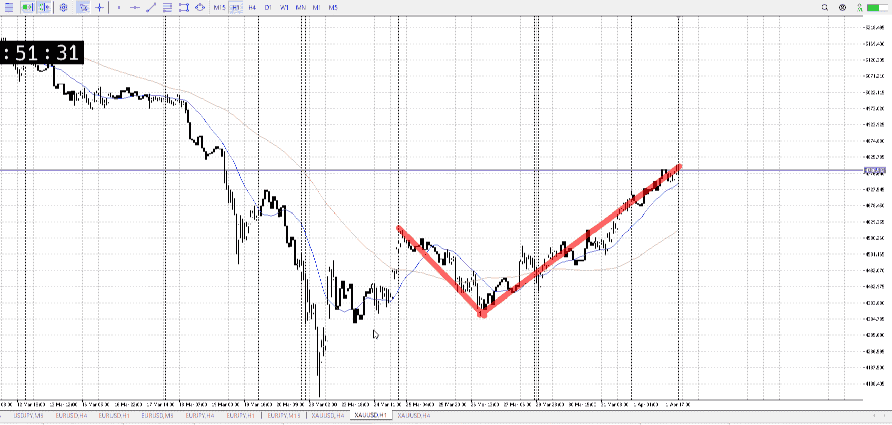
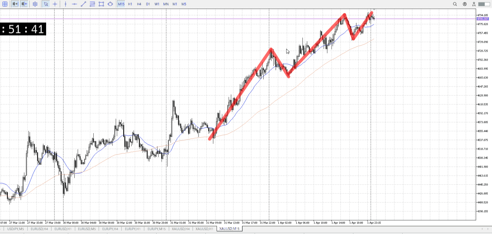

> [!note]
>- +1万 事前認識 **開始5分**

- [x] [my](my.md)
- [x] 指標
    - 差し込まれる可能性有り、毎日
    - ローソク優先

## 4h

＜ここに目線画像＞

- [x] トレーディングレンジ
    - m

方向：d

## 1h

＜ここに目線画像＞ ^5ndlrw

方向：u

## 15m

＜ここに目線画像＞

方向：u

全方向：duu
^yexrug

- [x] 使用足全ての目線確認

## シナリオ

b:1h安値からずっと買い
s:？　1h上のレンジか？
- [x] 時間足ぶつかり

ぐだぐだで買い場分からず、確定待ち
- [x] 1hシナリオ
    - [x] 明確か ? 続行 : 確定後考え直し

上昇
- [x] 日出日入、週出週入

上、ただしゆるやか
- [x] 傾き比率

## 位置

- [x] 推進
- [ ] 調整

## 方針
目線・シナリオ・強弱・調整
横幅・PA後・平均線方向・波
**ひきつけ**・軸時間・傾き比率・流れ

1h上になり、買いたいと言えば買いたい
が売り場も買い場も曖昧になるくらいぐだぐだ、確定まで待ちたい

- [ ] 買いたい勢
    - このまま上昇
- [ ] 売りたい勢
    - 近場は1h前回レンジなので、そこきたら

OK!
Exchage Start.

> [!Info]
>- +1万 簡易テスト **開始5分**

> [!Tip]
>- Minecraftは3hまで
## メモ

---

再検証