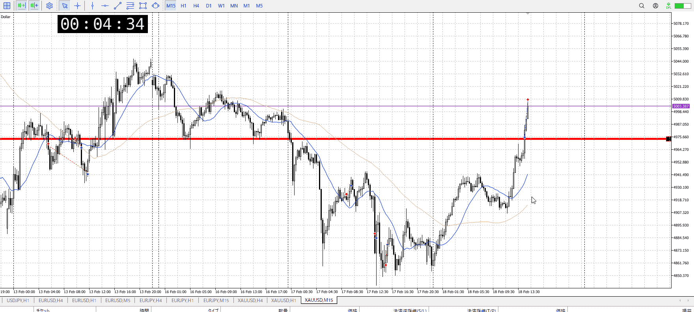

<画像>

TPSL
```meta-bind
INPUT[toggle:TPSL]
```

Height
```meta-bind
INPUT[toggle:Height]
```
Width
```meta-bind
INPUT[toggle:Width]
```

Direction
```meta-bind
INPUT[toggle:Direction]
```
Incline_Ratio
```meta-bind
INPUT[toggle:Incline_Ratio]
```

15m、1h上髭に下振りを見て上がったところを抜け買いしたが
横幅があまりに小さくないか？

前からの買いがあったのは事実で、1h売りとを見たいのも事実
1h上髭に対して15m下髭一つでは上がらないのは分かる、複数出す暇もなく上がっていって1hを裏切っただろうと思ったので買い


根っこから5mで買うのは本当に5mしかなかったはず
次の1h売りとの均衡は横幅を持って見ておきたかったはず
今までと違って抜きに妥当性がある、気はする
でも横幅が無さすぎて、後で良くない利確をした気もする