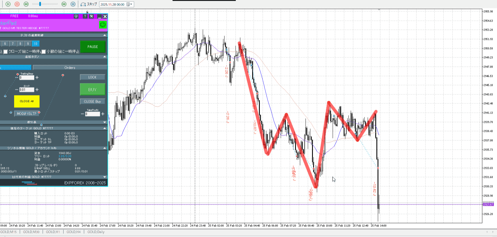
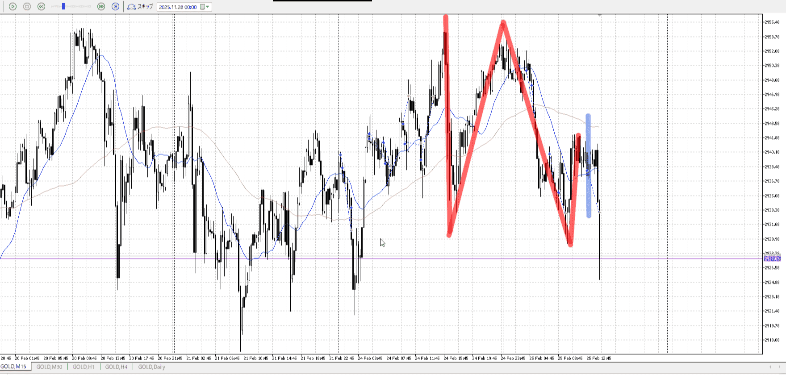

<画像>

`INPUT[inlineSelect(option(Range), option(Trend)):type]`

TPSL
```meta-bind
INPUT[toggle:TPSL]
```

Height
```meta-bind
INPUT[toggle:Height]
```
Width
```meta-bind
INPUT[toggle:Width]
```

Direction
```meta-bind
INPUT[toggle:Direction]
```
Incline_Ratio
```meta-bind
INPUT[toggle:Incline_Ratio]
```

評価は二つ目の買いに対して
一つ目の買いをするにはちょっと買いの根拠が足りなさすぎる

下が固まったっぽいところから一気に上がり
なら下降と同じくらいは待ちたい、その部分が抜けてた
二つ目の買いでも早いが、まだまし