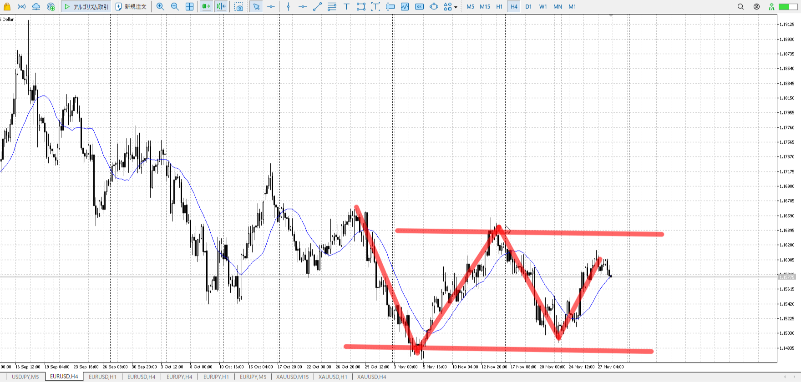
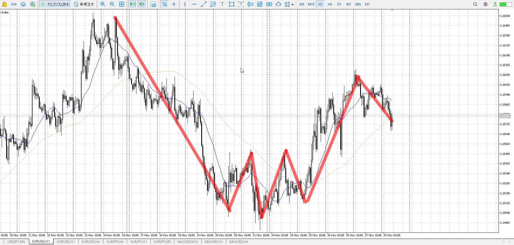
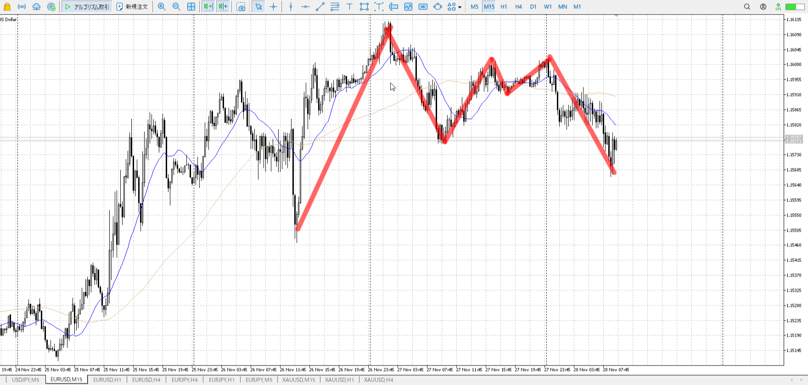
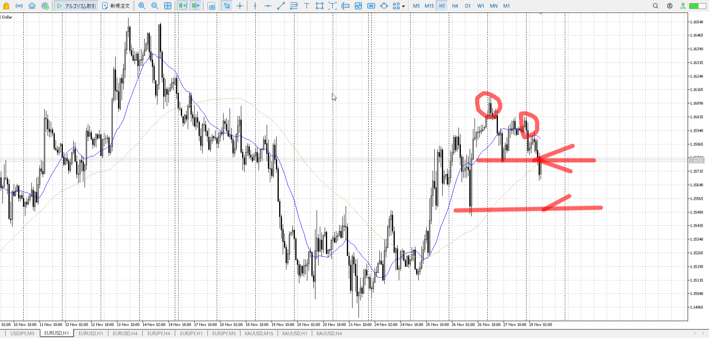

> [!note]
>- +1万 事前認識 **開始5分**

- [ ] [my](obsidian://open?vault=Teino&file=FX/my)(見ないと増える)
- [ ] 指標
    - 差し込まれる可能性有り、毎日

4h

＜ここに目線画像＞

- [x] トレーディングレンジ

方向：dR

1h

＜ここに目線画像＞

方向：dT

15m

＜ここに目線画像＞

方向：uT

全方向：dRdTuT

- [x] 使用足全ての目線確認

＜ここにシナリオ画像＞

b:15m安値
s:1h二番天井

降下も下がり切らず。
ただ今日で下がり切った。

- [x] シナリオ
- [x] ぶつかり
- [x] 日出日入

目線・シナリオ・強弱・横幅・PA・平均線方向・波
dRdTuTでめちゃくちゃだが、直近で一応売れるはず。
5mが上を準備しているので、これが否定されたら。

買いたい場合。
1h半値あたりからか、ここを深押し上昇か。

usdもeurもjpyに対して買い。
euで下に落ちるなら今日はeurjpyが買いだろう。

> [!check]
> - [x] +1万 事前認識 **開始5分**
> - [x] +1万 5枚

OK!
Exchage Start.

---

---

- 1
- 2
- 3