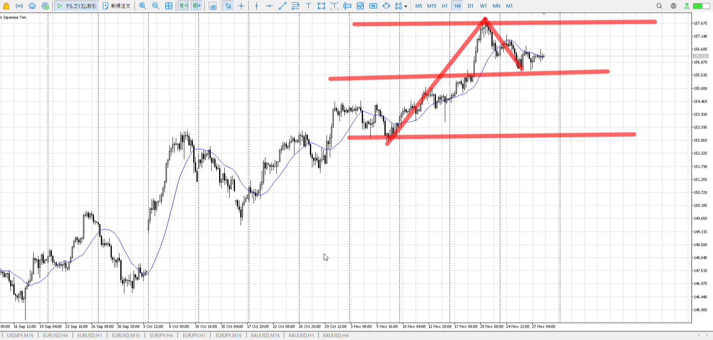
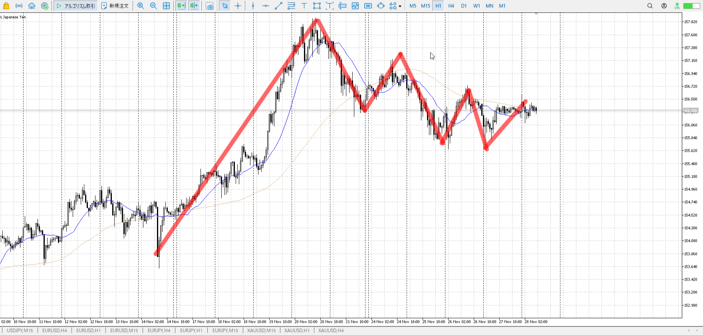
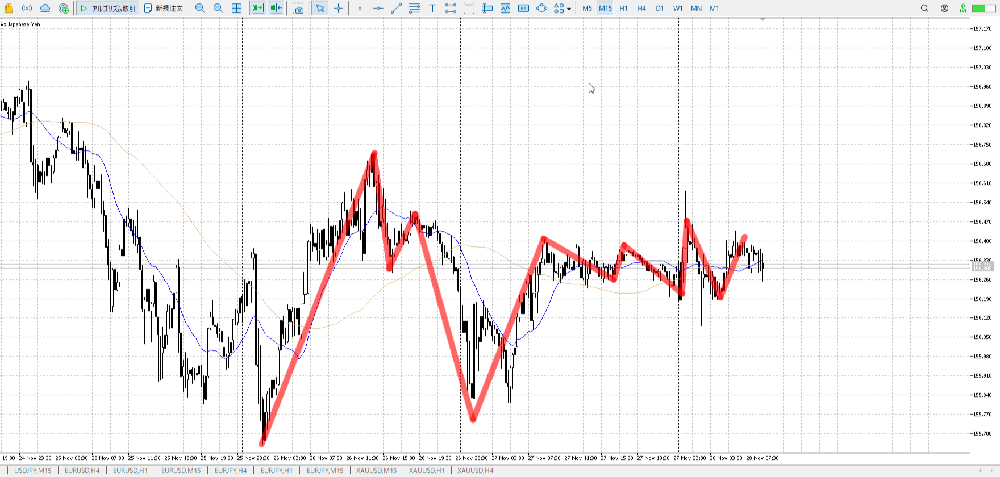
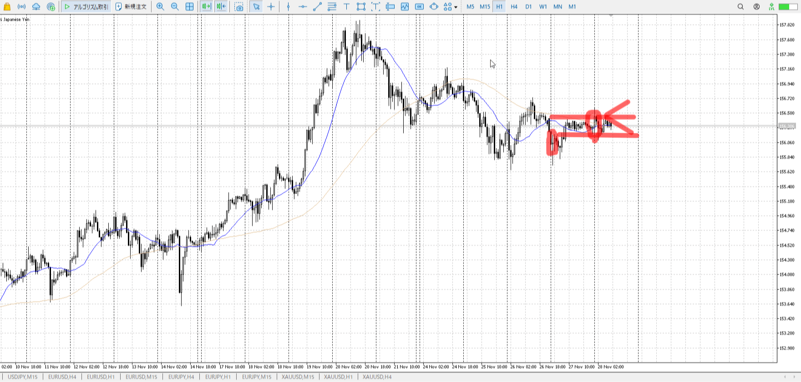

XAUUSDがCME障害で暇。

[2025-11-28-eurusd](<./2025-11-28-eurusd.md>)

> [!note]
>- +1万 事前認識 **開始5分**

- [x] [my](obsidian://open?vault=Teino&file=FX/my)(見ないと増える)
- [x] 指標
    - 差し込まれる可能性有り、毎日

4h

＜ここに目線画像＞

- [x] トレーディングレンジ

方向：u

1h

＜ここに目線画像＞

方向：u

15m

＜ここに目線画像＞

方向：uR

全方向：uuuR

- [x] 使用足全ての目線確認

＜ここにシナリオ画像＞

b:15m底
s:1h二番天井

上がって維持

- [x] シナリオ
- [x] ぶつかり
- [x] 日出日入

目線・シナリオ・強弱・横幅・PA・平均線方向・波
uuuR、15mレンジ
シナリオとしては上抜きか、下から買うか
15m下見て5mで止まり見てが妥当

> [!check]
> - [x] +1万 事前認識 **開始5分**
> - [x] +1万 5枚

OK!
Exchage Start.

---

---

- 1
- 2
- 3

