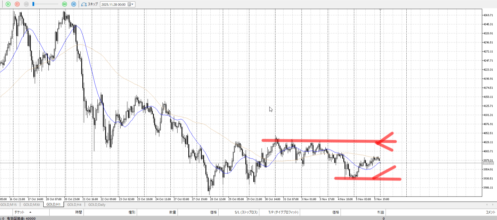
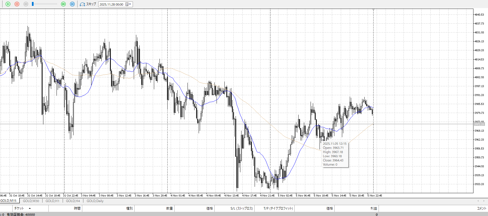
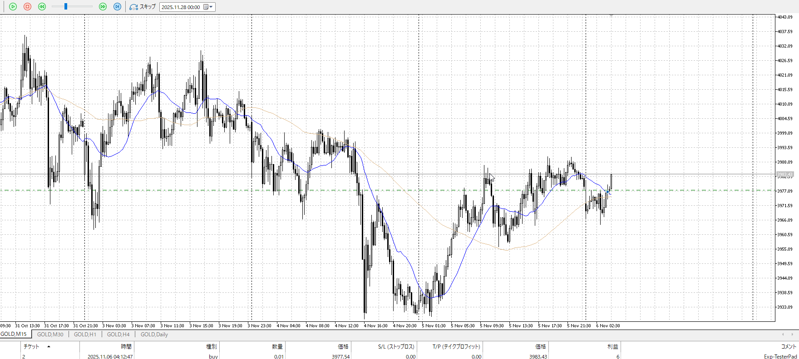
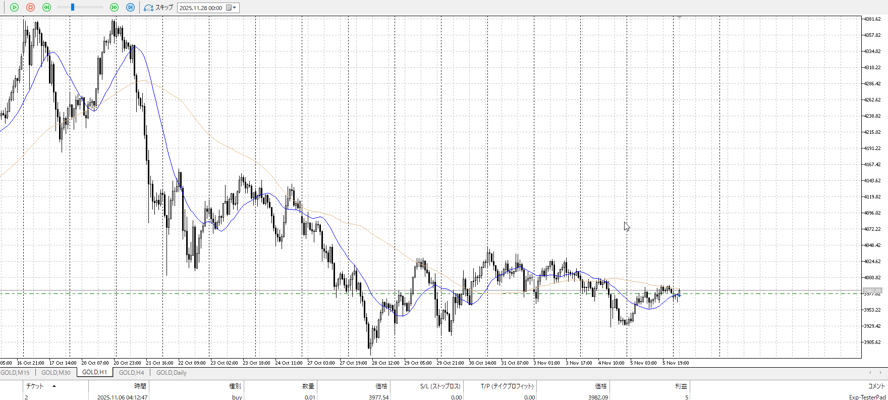
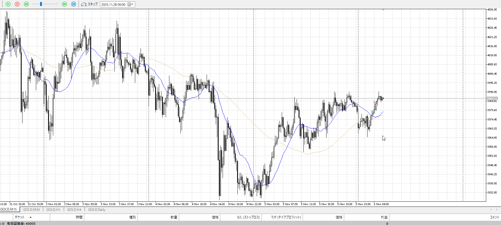
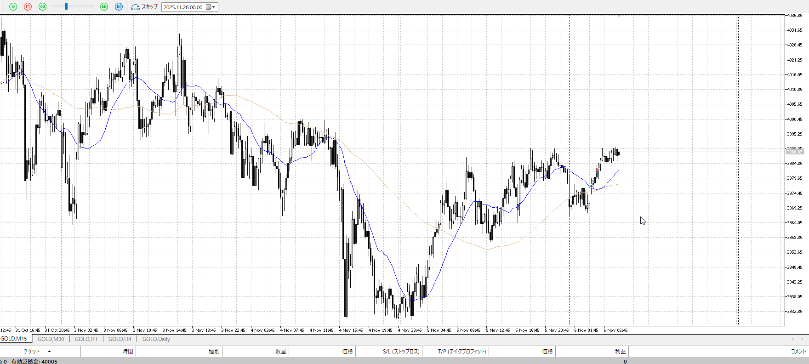
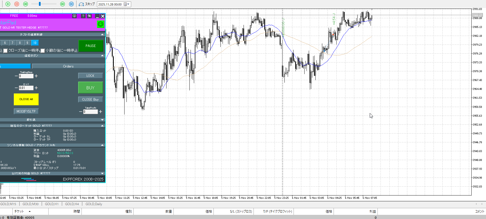
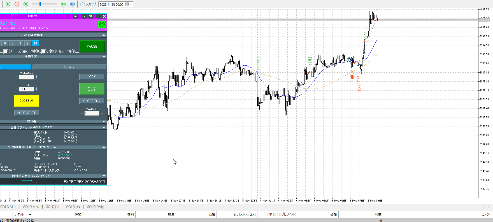
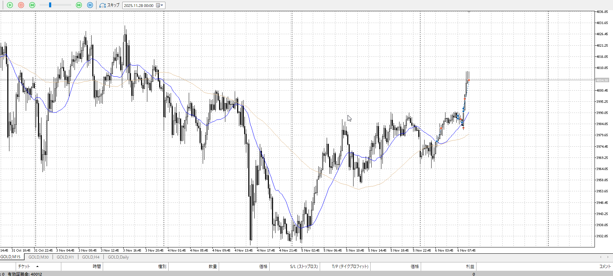
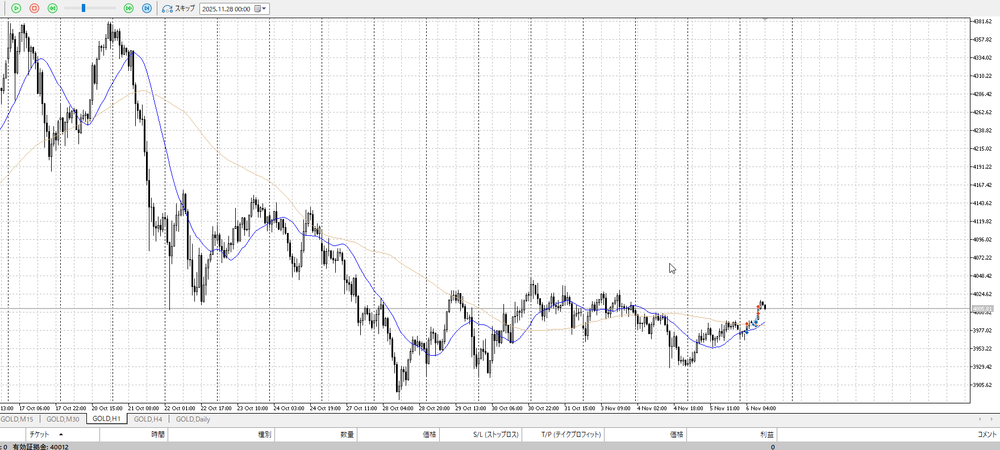

## [ld2025-11-06](<../Link_Daily/ld2025-11-06.md>)
> [!note]
>- +1万 事前認識 **開始5分**

- [x] [my](obsidian://open?vault=Teino&file=FX/my)(見ないと増える)
- [x] 指標
    - 差し込まれる可能性有り、毎日

4h

＜ここに目線画像＞

- [x] トレーディングレンジ

方向：u

1h

＜ここに目線画像＞

方向：d

15m

＜ここに目線画像＞

方向：dT

全方向：uddT

- [x] 使用足全ての目線確認

＜ここにシナリオ画像＞

b:4h底
s:1h天井

4h底から上昇維持

- [x] シナリオ
- [x] ぶつかり
- [x] 日出日入

目線・シナリオ・強弱・横幅・PA・平均線方向・波
uddT、本来売りたいが短期的に買いたい
15mからなので5mで速攻、下向き始めたら5mで横幅取ってが必要

> [!check]
> - [x] +1万 事前認識 **開始5分**
> - [x] +1万 5枚

OK!
Exchage Start.

---

って下向きがヤバそう
一旦どこかでとどめたい

5mで入れた
15mのものなので4日高値が精々か

1hが長すぎてレンジに入りつつある
そう思うとここで買うのは悪手
というか1hの売り場だここ

1h売り場に勝った証明は15m超えないとせめて

15mが上昇方向
5mの決め打ち

決め打ちというか、結局抜け買い。
15mが連続して上髭つけ始めたので止め。

1hが天井までいっているので、そのケアが欲しい
一旦やめ

