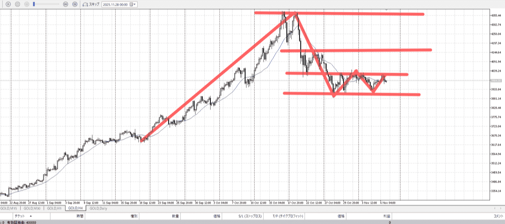
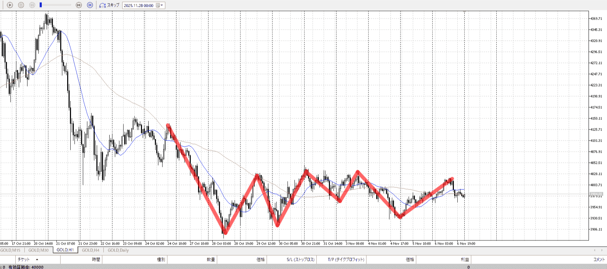
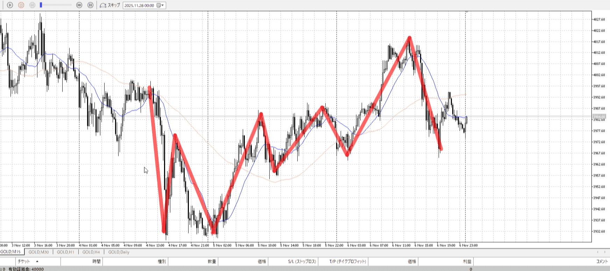
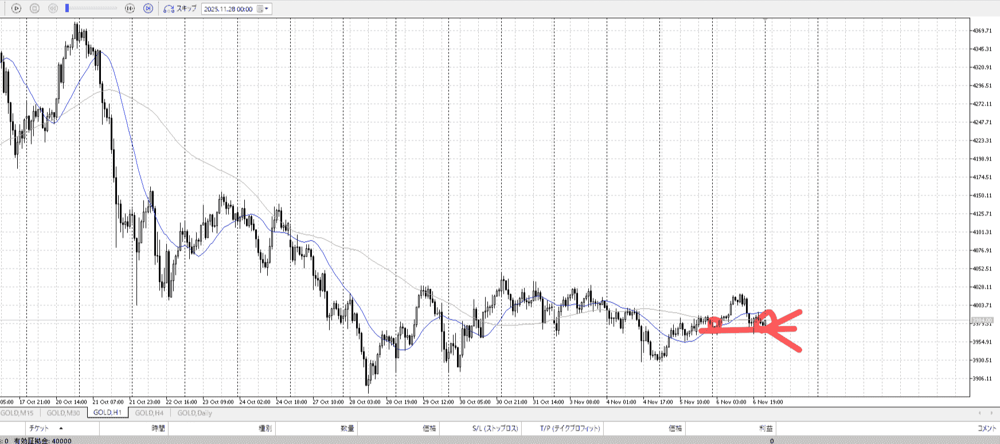
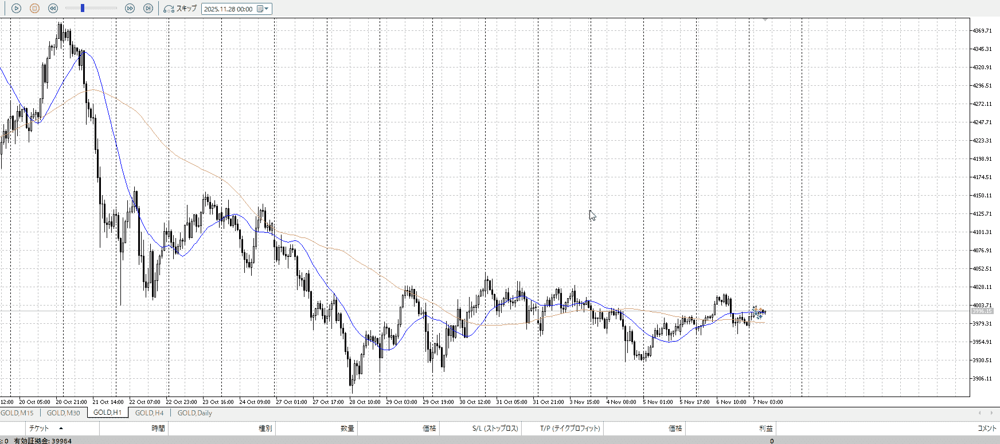
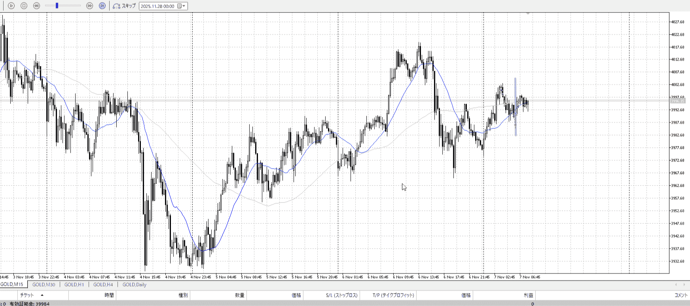
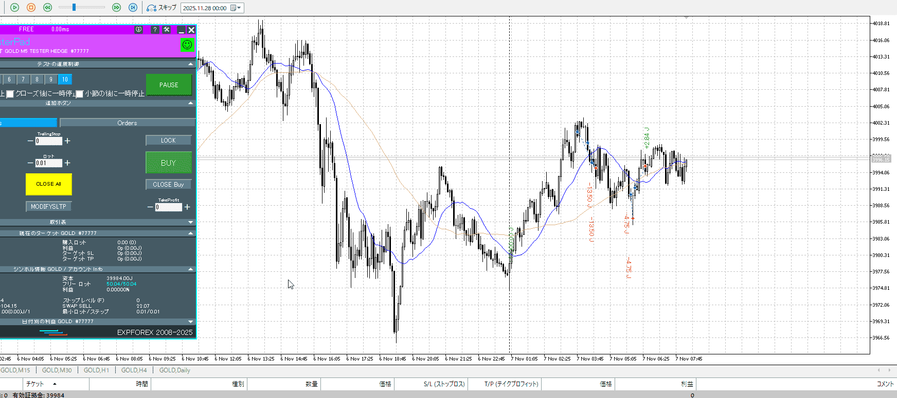
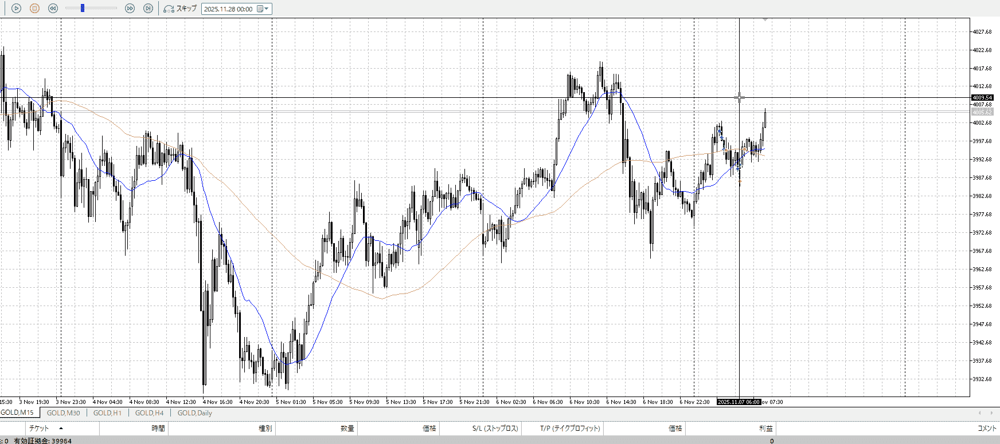
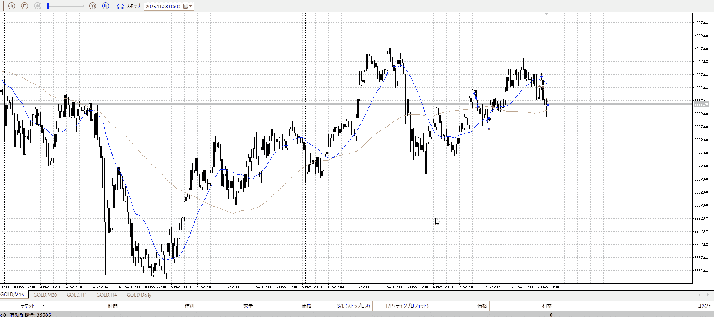
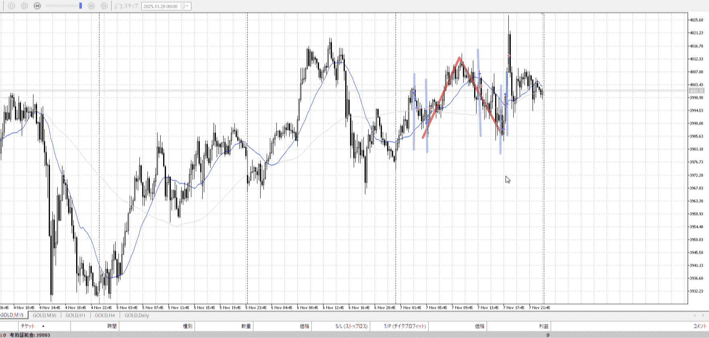

## [ld2025-11-07](<../Link_Daily/ld2025-11-07.md>)
> [!note]
>- +1万 事前認識 **開始5分**

- [x] [my](obsidian://open?vault=Teino&file=FX/my)(見ないと増える)
- [x] 指標
    - 差し込まれる可能性有り、毎日

4h

＜ここに目線画像＞

- [x] トレーディングレンジ

方向：u

1h

＜ここに目線画像＞

方向：dR

15m

＜ここに目線画像＞

方向：u

全方向：udRu

- [x] 使用足全ての目線確認

＜ここにシナリオ画像＞

b:1h底再度
s:1h天井、4h天井

- [x] シナリオ
- [x] ぶつかり
- [x] 日出日入、週出週入

上がって下がってきたが、しっかり底で止まり
下がってから週スタートと同じ高さまで来た

目線・シナリオ・強弱・調整・横幅・PA・平均線方向・波
udRuであり、小さい足に合わせて上昇を買いたい
丁度前回が下まで届かずに戻っていってるのもある

それが折れるということは、1hが買える様な調整が入るということ
下から買えるか

> [!check]
> - [x] +1万 事前認識 **開始5分**
> - [x] +1万 5枚

OK!
Exchage Start.

---

1h上状態だと買えなくないか。
15mで耐えつつ1h下まで持つべきか。

15mが買いで1hが売りなんだから、15mで買いを取りたいなら5mで入るべきで1hまで取るでは

15mで買いたいなら、前回の動きの続きを取りたいところ
だから一個目の買いはあり得ない、降下待て

どこまで下がるかは、5m的にわかったはず
なので3回目に買った場所はそれなりよかった

その後伸びてる
15mで入ったなら15mで持て

T
1hレンジでなら、狙うのは抜け買い天井売り底買い
天井が近いなら入らないでおくは正しい、レンジ内だし下から一気は現実的でない
トレンドじゃないし

ただ持つのは持つこと

流石に二度目の下髭は危なくないかと見送り。
初動に対してこれは大きくないか。

15mで売るなら、15mの買い場まで。
というか、1hでの売りなので15mで直接入れるかというと難しくないか。これだとまだ5m。
5m売りで1hについていっていたとして、ますます15mの買い場は危なくなる。だからあそこで買うのは道理。そして15mで利確。

自分が何で入ってるかが理解できてない。現状把握。

---

- 1
- 2
    - 短期買い。1h売り場まで。
    - 1回目は馬鹿。押しを待て。
    - 2回目は中々だが、どこまで持つか決めて最後まで持て。
- 3
    - 5m売りであることを把握。手放しが浅いが、これはまあまあ。5mは危ない。
- 4
    - 5m売りであることを把握できてない。15mでの買い場なので止めておくべき。
- 5
    - 15m買い場から。上まで。ただちょっと早い。決めて最後まで持て。

dRなのでそもそも入りづらいのはある。
すると小さい足に頼ることも増える。それに留意。