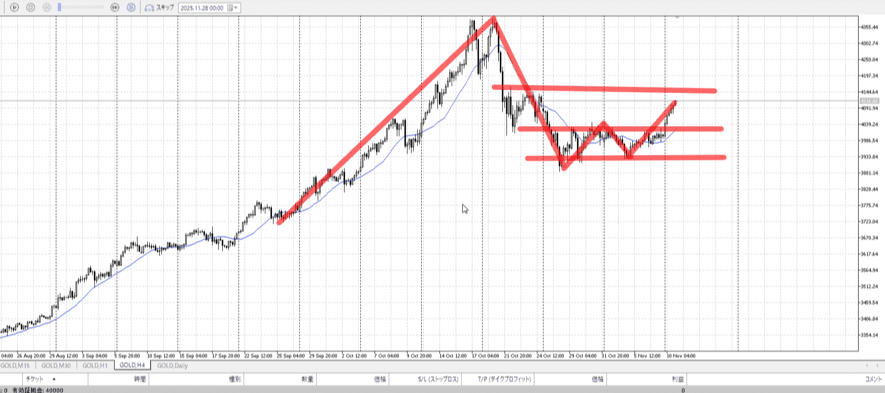
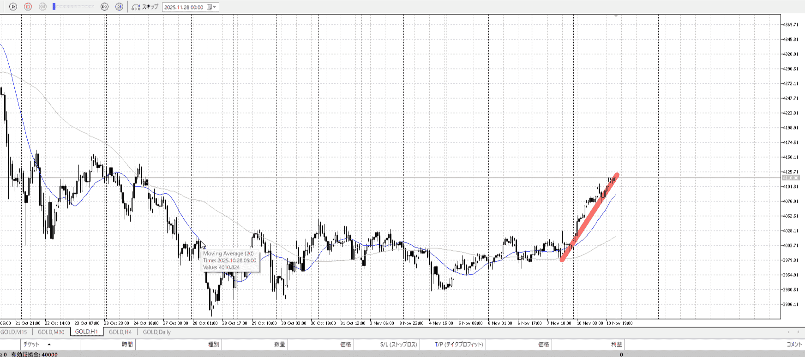
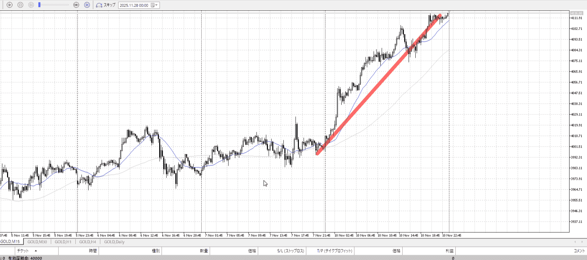
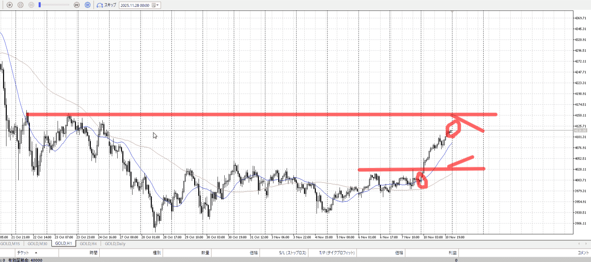
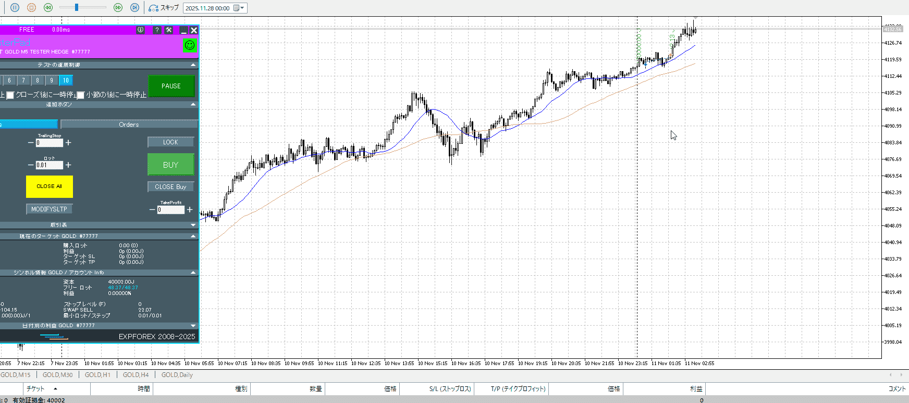
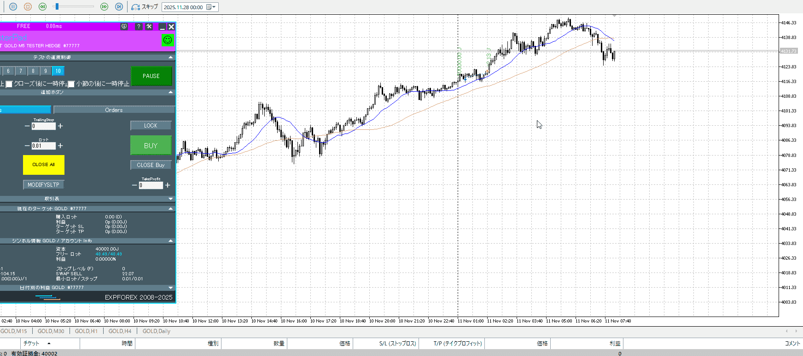
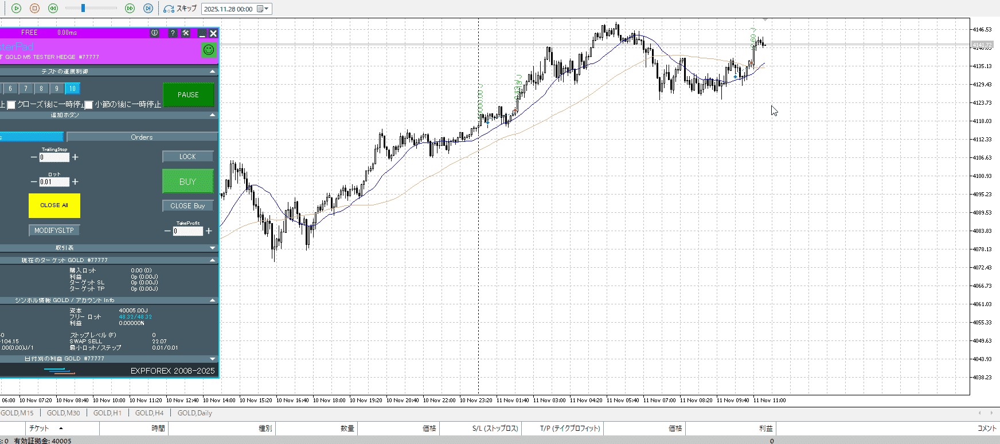
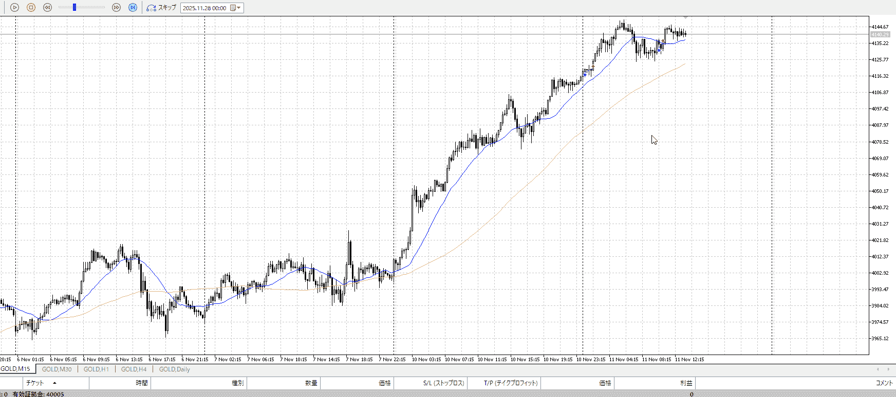

## [ld2025-11-11](<../Link_Daily/ld2025-11-11.md>)
> [!note]
>- +1万 事前認識 **開始5分**

- [x] [my](obsidian://open?vault=Teino&file=FX/my)(見ないと増える)
- [x] 指標
    - 差し込まれる可能性有り、毎日

4h

＜ここに目線画像＞

- [x] トレーディングレンジ

方向：u

1h

＜ここに目線画像＞

方向：u

15m

＜ここに目線画像＞

方向：u

全方向：uuu

- [x] 使用足全ての目線確認

＜ここにシナリオ画像＞

b:1h前回高堰
s:4h二番天井

- [x] 1hシナリオ
- [x] ぶつかり
- [x] 日出日入、週出週入

目線・シナリオ・強弱・調整・横幅・PA後・平均線方向・波・**ひきつけ**
uuu。便宜上前回高値を買い場にしているが、これから1hが作る奴の方が重要。
作られるまでは何もしないか15mで、も見えないから5mになる。やらないほうがいいな。

> [!check]
> - [ ] +1万 事前認識 **開始5分**
> - [ ] +1万 5枚

OK!
Exchage Start.

---

5mそんな長く持つか、と思ったが普通に伸びた。

初期の底っぽいのが見えてきた。まだ5m。

5mレンジとして買いを入れた。
切る場所は悪い。ここは当然抜ける場所。
この上部分は4hなので抜けると思わない。

15mとしても出始め。
1hが追いつき、下に行き始め下で止まって、と実際買うのは結構後。

---

- 1
- 2
- 3