## [ld2025-01-06](<../Link_Daily/ld2025-01-06.md>)
> [!note]
>- +1万 事前認識 **開始5分**

- [x] [my](obsidian://open?vault=Teino&file=FX/my)(見ないと増える)
- [x] 指標
    - 差し込まれる可能性有り、毎日

4h
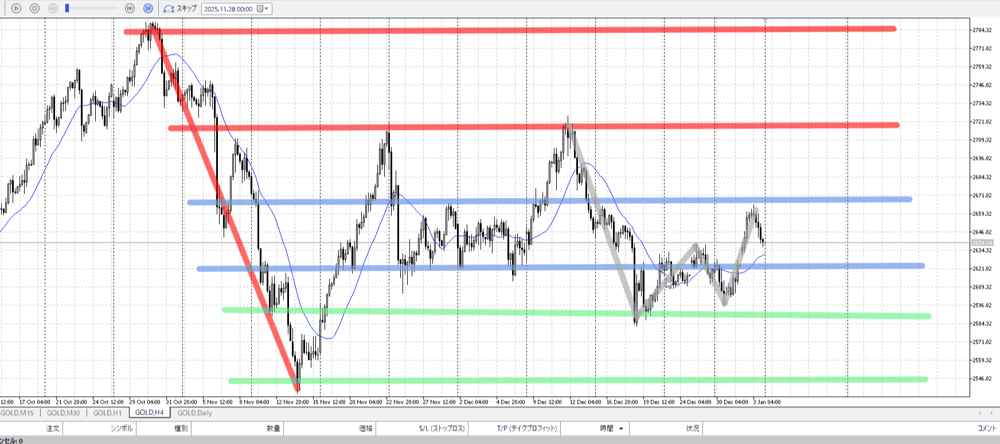
＜ここに目線画像＞

- [x] トレーディングレンジ
    - c

方向：dT

1h
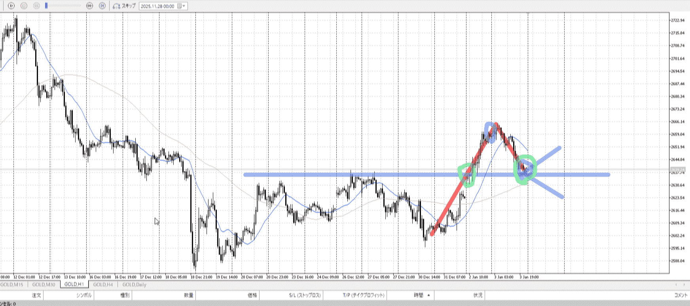
＜ここに目線画像＞

方向：u

15m
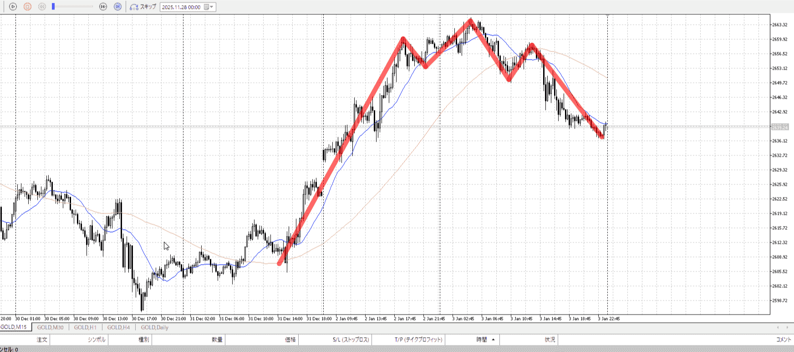
＜ここに目線画像＞

方向：d

全方向：dTud

- [x] 使用足全ての目線確認

＜ここにシナリオ画像＞

b:1hレンジ上、4hネック
s:15m安値

落ち。ただし1hレンジ上は割らず。
週というか年始めに押し。

- [x] 1hシナリオ
- [x] ぶつかり
- [x] 日出日入、週出週入

目線・シナリオ・強弱・調整・横幅・PA後・平均線方向・波・**ひきつけ**
dTud。1hとして買いたいが、15mが上じゃないので今ではない。
同じく15mとして売りたいが、1h買い場の最中。今ではない。

横調整を入れて15m売り場を作り抜き、それに加えて15mA下落ち->反転上抜きで目線も変えてくれれば一応ベスト1h買い。月曜なので今日一日を調整に使えば達成できるはず。

しかし15mの下落ちを1hが買い支えられるかはまだ分からない。調整レンジ内の力の配分に注意。

いずれにせよ一回調整待ち。

> [!check]
> - [x] +1万 事前認識 **開始5分**
> - [x] +1万 5枚

OK!
Exchage Start.

---

調整幅だが、落ちからするとこれぐらい。
……一日かかる。
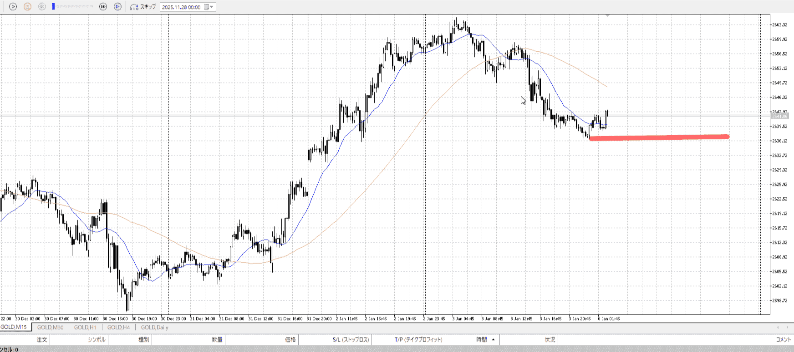

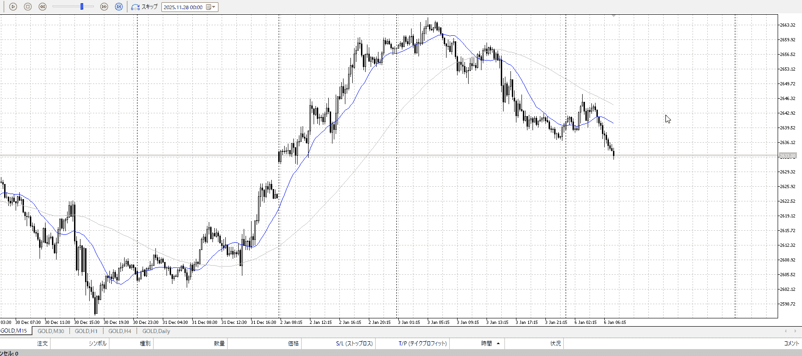

底がどこかを探る前に15m安値を抜いた。これは無理。

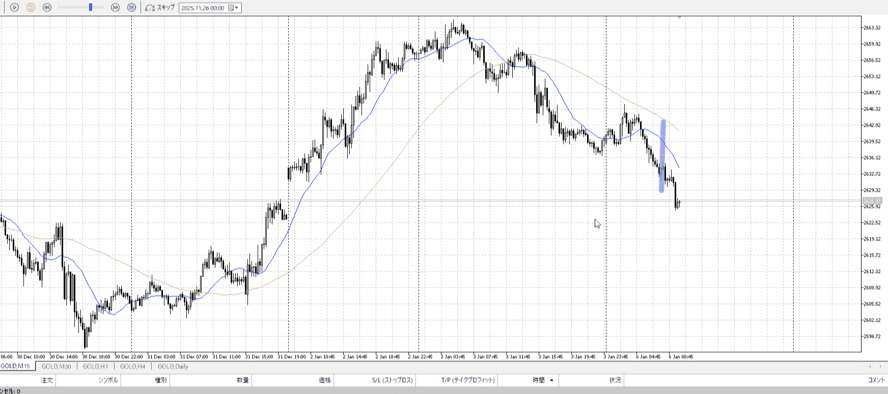

売りトレンドではあるので、戻りを売れたか。

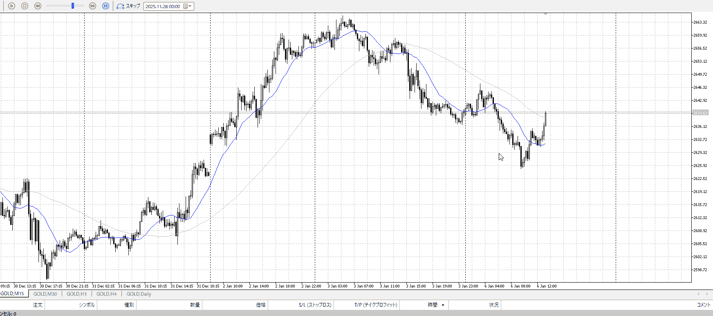

一度目の戻りは無理
二度目の戻りはどうか、売り場である前回レンジ安値を抜いている
この押しなら買えはするはず

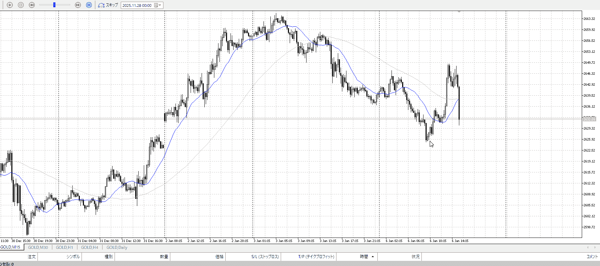
一応15mが上抜いたので買いたい、dTuu。
でもあまりに鋭い。4hが上髭になりそう。

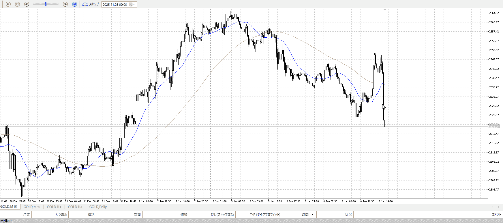

抜いたので再びdTud。
見た目は無茶苦茶だが、1hシナリオの下向きであることは分かる。
これを元に売りたい。1h底まで。

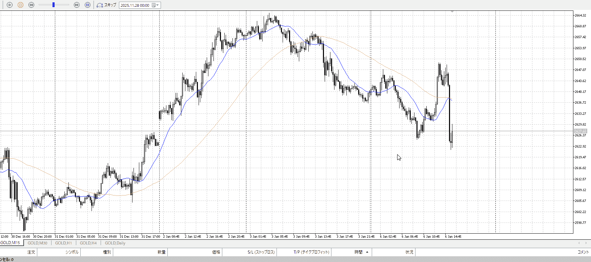

そこで止まるならまだ分からないが。買い。
1hシナリオ上を目指し、ここから買いたいがため5m15mをここから待つ。

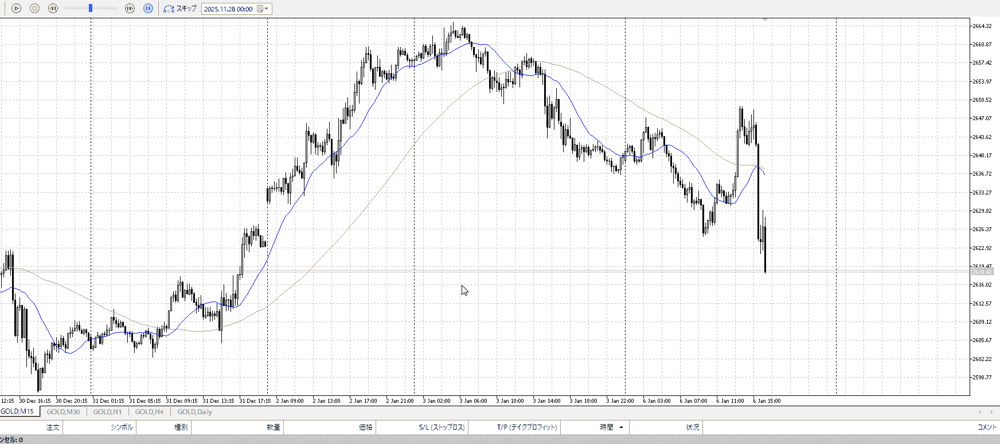

はい
ここまでされたら流石に抜けを売れる。反射ありきだけど。

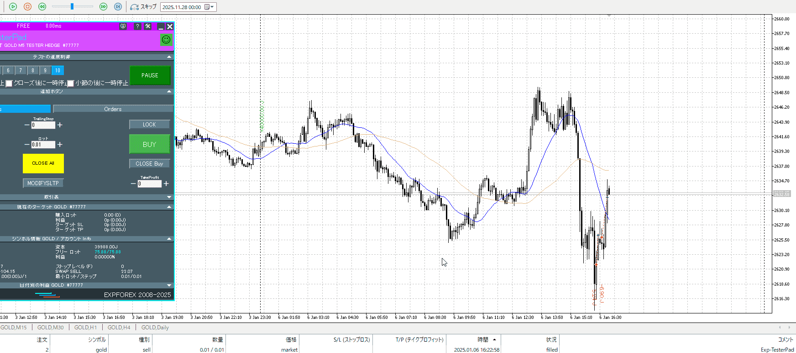

一本戻しの実質抜けを狙ったが、即戻りでそこで留まるなら無理。
判断が遅い。

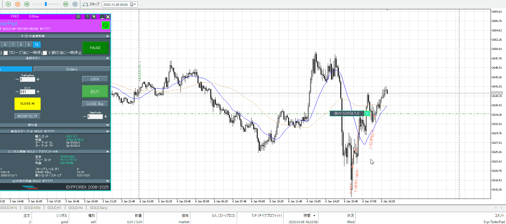

買いを目指す。
ここからの買いの場合、どこまでが正解か？

5m買いに直前の売りがあるので、これの頂点が最高値。
中部から入ったので、現在値が安定ラインか。

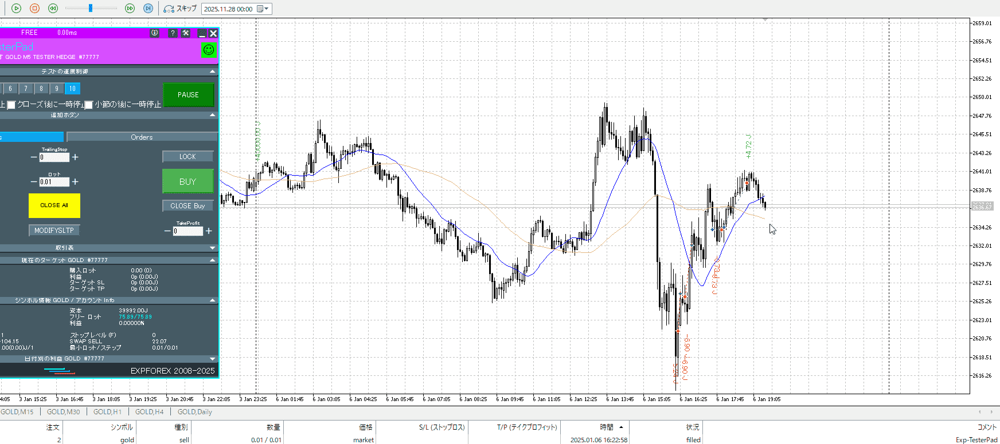

これ以上は止める。よく見れば朝だし。

---

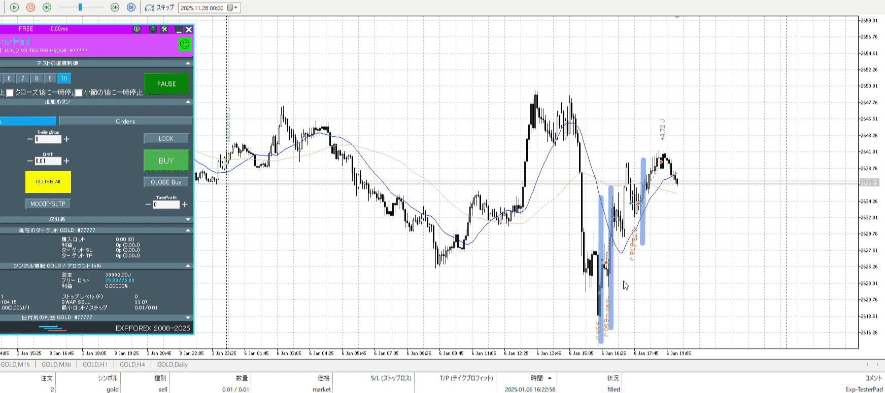

- 1
- 2
    - そもそも上昇後上で確定の時点で15mが下髭である
    - ここで下髭を出すのは下降ならあり得ないので、さっさと売りを止めろ
    - Tも同じ
- 3
    - いいところ
    - 時間帯なので、早めに切るのもできてる
    - その判断を入った時にやれ

危ない場所の自覚を。
入った時の利確損切判断を。

---

## [ld2025-01-07](<../Link_Daily/ld2025-01-07.md>)
> [!note]
>- +1万 事前認識 **開始5分**

- [x] [my](obsidian://open?vault=Teino&file=FX/my)(見ないと増える)
- [x] 指標
    - 差し込まれる可能性有り、毎日

4h
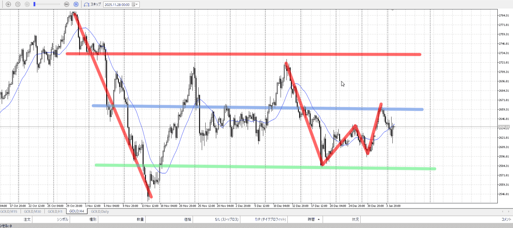
＜ここに目線画像＞

- [x] トレーディングレンジ
    - c

方向：dT

1h
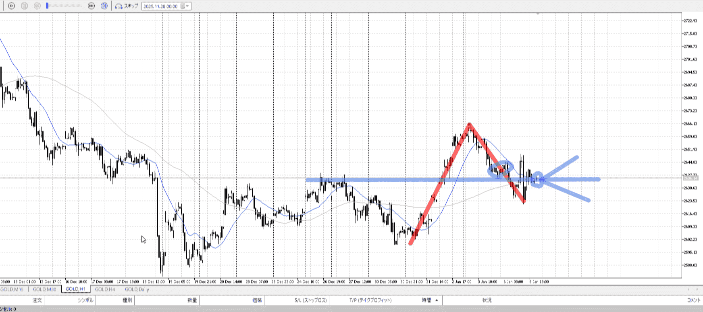
＜ここに目線画像＞

方向：u

15m
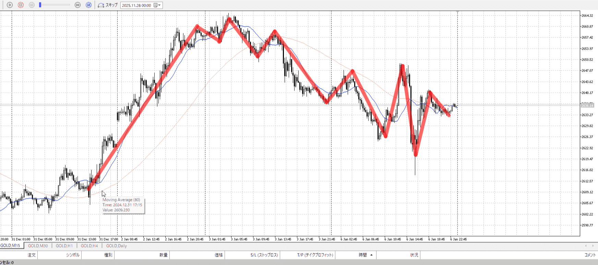
＜ここに目線画像＞

方向：d

全方向：dTud

- [x] 使用足全ての目線確認

＜ここにシナリオ画像＞

b:4hネック
s:15m高値

紆余曲折でちょっと高いとこで

- [x] 1hシナリオ
- [x] ぶつかり
- [x] 日出日入、週出週入

目線・シナリオ・強弱・調整・横幅・PA後・平均線方向・波・**ひきつけ**
dTud
1hと15mの戦いの決着がつかない

15mがdではあるが、かなり高いところでレンジを形成した
切り上げとして買っていけそう

15mAが近く、底を形成した
後は二回目のとこを買ってみるなどできるか

上が切り下がってるので、それを抜かねばならない

> [!check]
> - [x] +1万 事前認識 **開始5分**
> - [x] +1万 5枚

OK!
Exchage Start.

---

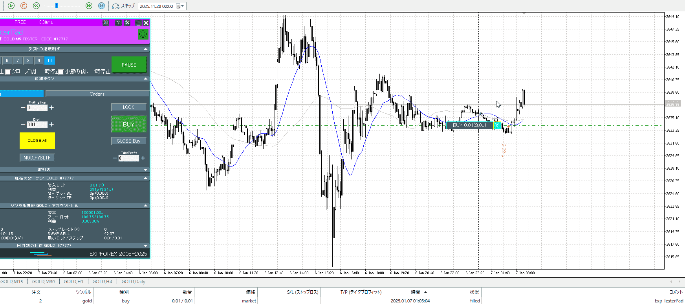
5m一つ目、PAもないのにこの高さから買いはやっぱ駄目。
ちゃんと下まで見る。二つ目のように。

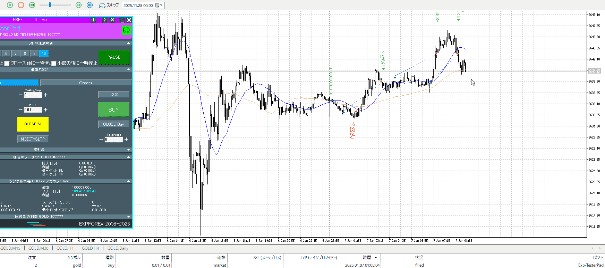

ド昼間からの三つ目。
まあ上髭時点で上がりにくい。

四つ目はベスト点。時間帯としても下髭としても。
ただ前回上昇から15mで数え、その七割というと1300。つまり15mの前回高値までしか取れない。そして抜けから入ってるので必ず一回落ちる意識。
それを理解して持つこと。

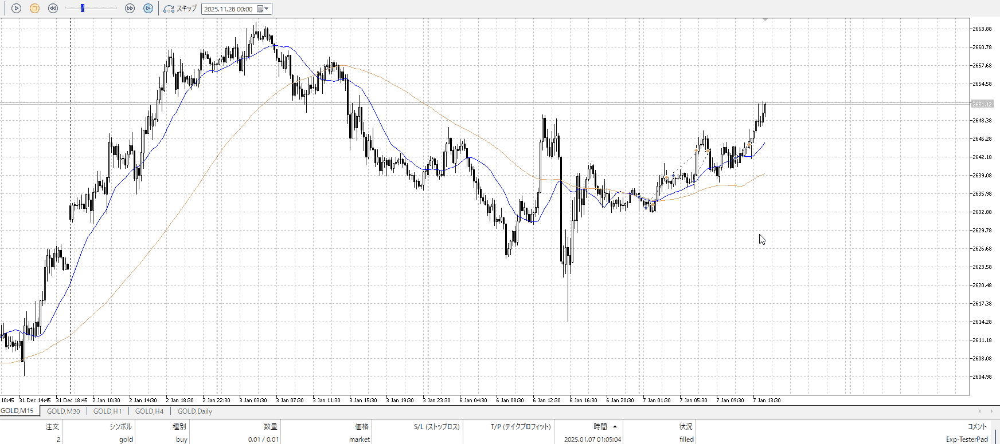

二つ目を持ちっぱなしにしてれば、1800地点まで持つことは可能だった。
それも七割にすると1300、15m前回高値。二つ入ってれば1300と1800で分けられた。

どの道、二つ目を切る場所はおかしい。もっと上。
自分が何で入ったかの意識が無い。ここは危険ではない。

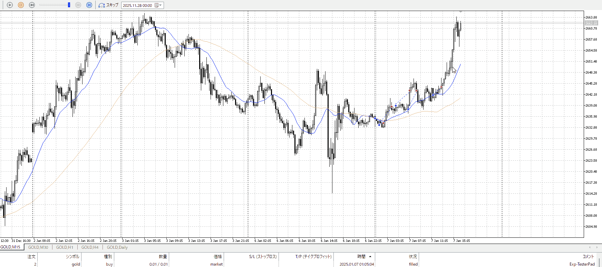

完全に抜けたのは1時ごろ。
ここの抜けを取り1h高値まで取ることも一応できる。今はやらないが。

それよりこの次の日の押し目を取るほうが大事。備える。

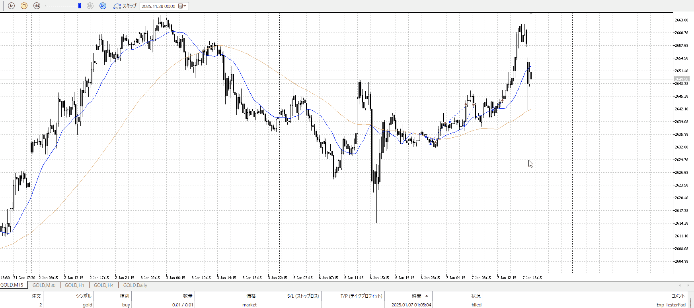

いや無理。

---

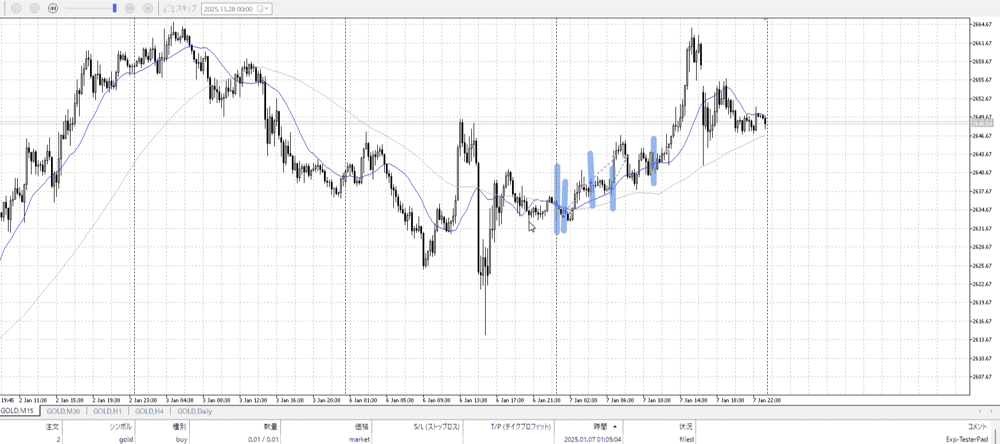

- 1
    - 早すぎ。5mが出る幕ではない。
- 2
    - 良い。
    - ただし利確がクソ。自分が**15m押しで入っていること**、それにより**どこに利確が引かれるか**が分かってない。
- 3
    - 高い。もっと下。
    - 二回目押しなので、もっと下に**引き付け**。
- 4
    - PA
    - ひきつけないよりはマシだが、ひきつけの方が損しない。
    - 利確は一応、まだ持てた。15m抜け入り15m前回上昇7割。
        - 抜け入りなので、一度は押されることを考えろ
        - [抜けで入る](エントリー.md#抜けで入る)
    - 戻ることを容認して、損切を合わせ続ければ行ける
        - 実際損切は抜けなかった
    - データとして損切を取る方法は普通にある。2つ目をまだ持ってれば考えた
- 5
    - 出来なくはない。もちろん15m高値まで。
    - これ以上を望むのは、まあ無理

ひきつけ
何足の何で入ってるか、どこに利確が引かれるか
それまでは持ち続け

