## [ld2025-01-08](<../Link_Daily/ld2025-01-08.md>)
> [!note]
>- +1万 事前認識 **開始5分**

- [x] [my](obsidian://open?vault=Teino&file=FX/my)(見ないと増える)
- [x] 指標
    - 差し込まれる可能性有り、毎日

4h
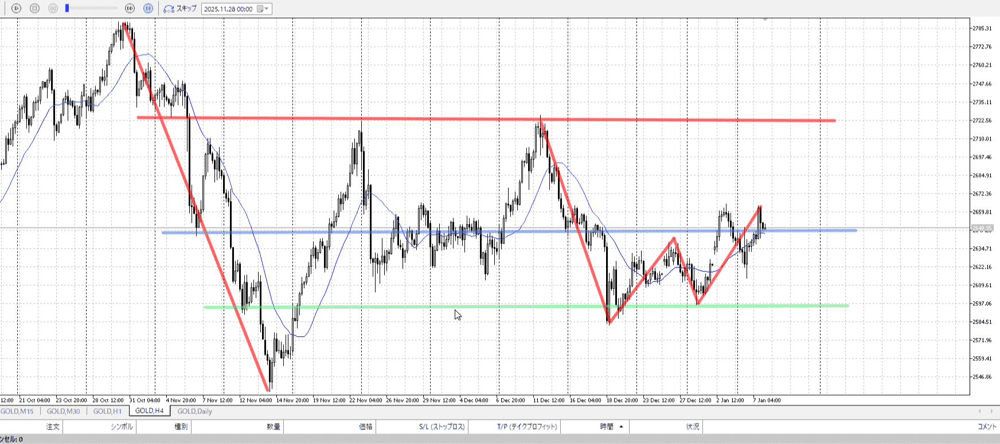
＜ここに目線画像＞

- [x] トレーディングレンジ
    - c

方向：u

1h
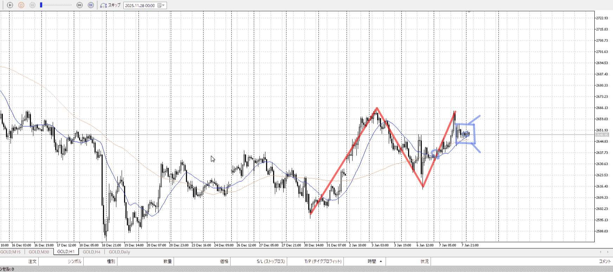
＜ここに目線画像＞

方向：u

15m
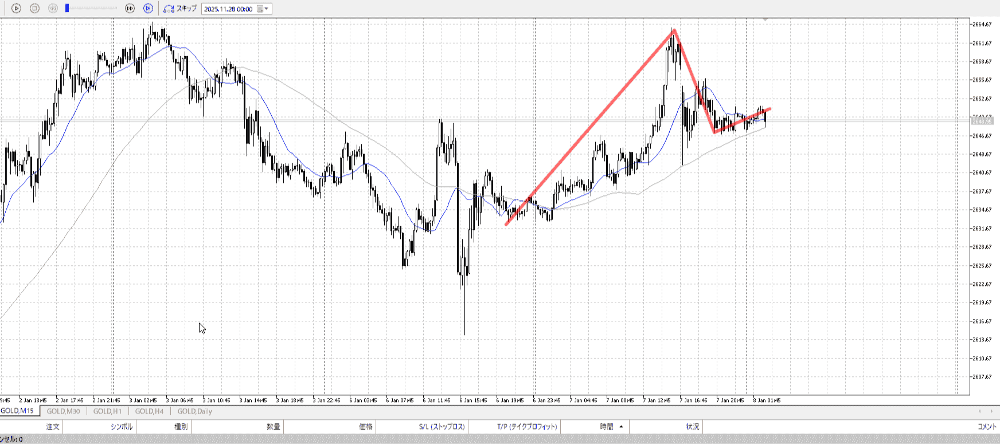
＜ここに目線画像＞

方向：u

全方向：uuu

- [x] 使用足全ての目線確認

＜ここにシナリオ画像＞

b:15m前回高値
s:1h高値

- [x] 1hシナリオ
- [x] ぶつかり
- [x] 日出日入、週出週入

目線・シナリオ・強弱・調整・横幅・PA後・平均線方向・波・**ひきつけ**
大いに買いたい。その中で一旦売りの1h頂上に来て、下がって15mレンジ上で止まった。
かなり買い。横幅も十分。底も確定。

> [!check]
> - [ ] +1万 事前認識 **開始5分**
> - [ ] +1万 5枚

OK!
Exchage Start.

---

- 何足
    - 15m
- どこまで狙う
    - 1h高値

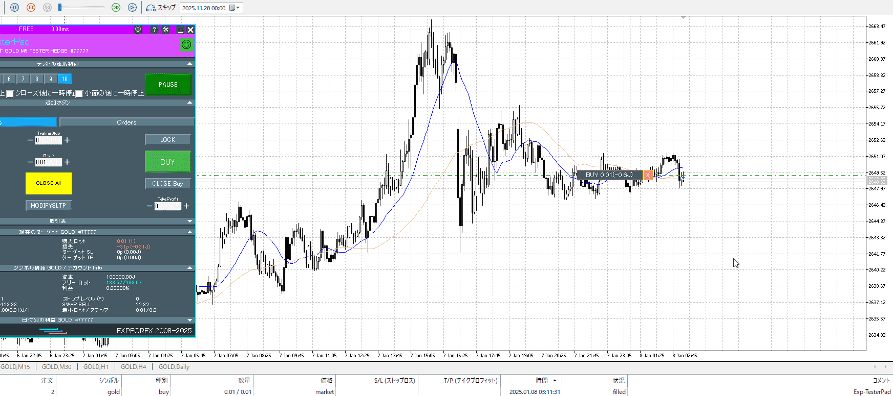

本当に15m底からの場合、前回高値と同じく上がるとすると3082で大きく1h高値を超えるが。

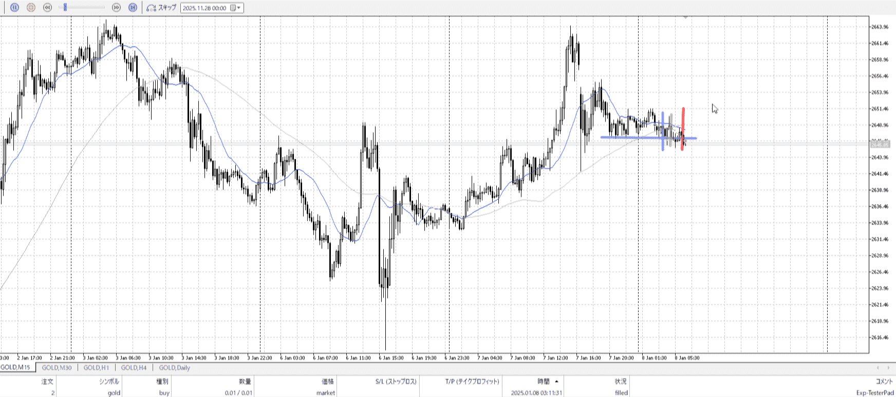

それを狙う場合青横までの落ちを見ないと。
元々二回目押しなので下を狙う。さらに15m買いなら緑縦はまあ持ってていいか。
赤縦ではちゃんと切る？

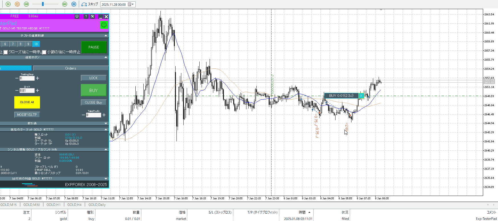

緑切り赤再度持ちがいいか。
いずれにせよ落ちを見る。これは15m抜け、

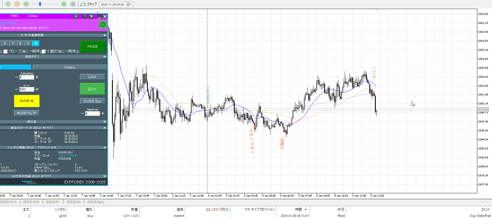

15m抜けなので一度は落ち耐え。二度目は無理なので切り。

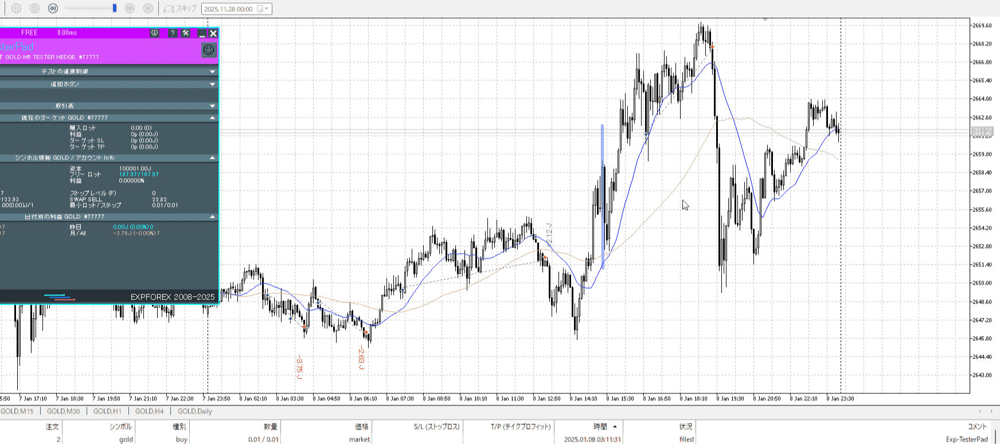

青線、平均にローソクの方から詰めて来たから買える……？
いや、平均が折れてもないしきつい。ただ下髭が長く底が分かるので買う価値はある。
二回目の方は普段なら切ってるので参考にしにくい。

ちょっと流石にレンジからの入りで走るのが癖っぽい。不味い。
やり直し。

---

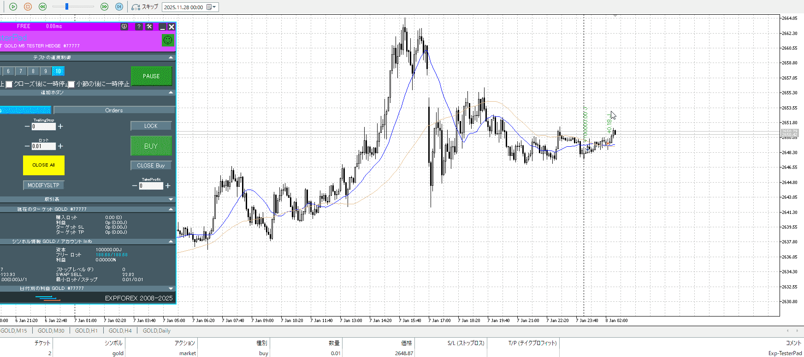

朝はちょっとスプレッドが広くてつらみ。

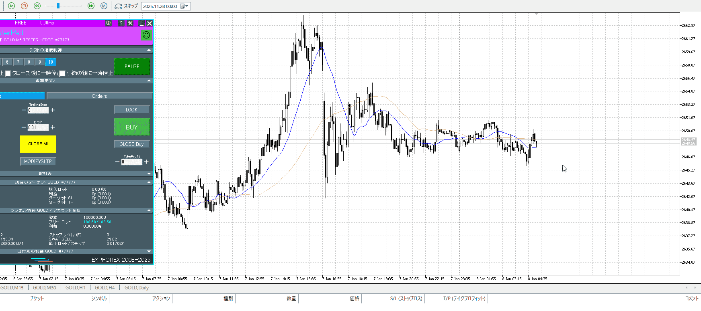

このタイミングは買えるように見えて、15mが上髭。
というかPAとしても小さいし売り場作ってないし抜けてない。
大人しく下から買うが吉。

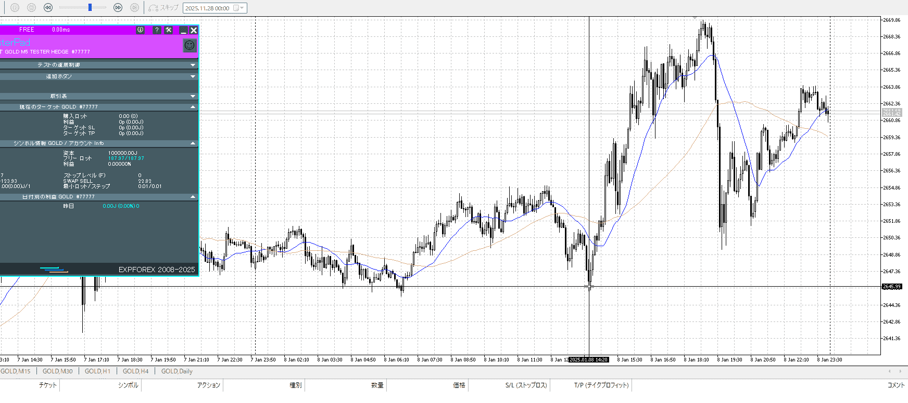

この位置は無理。落ち最中すぎる。
横幅で平均線が逆向きなどの押す理由はない。買ってはいけない。

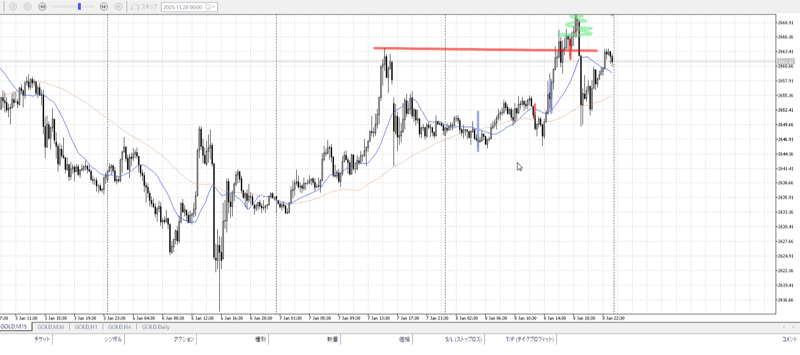
結局この日、この二つの青から赤くらいしかない。
二つ目は危険なので実質一つ目だけ。例としては挙げにくい。
下に引き付け、利確まで持ち。売り場を作ったか抜いたか。

---

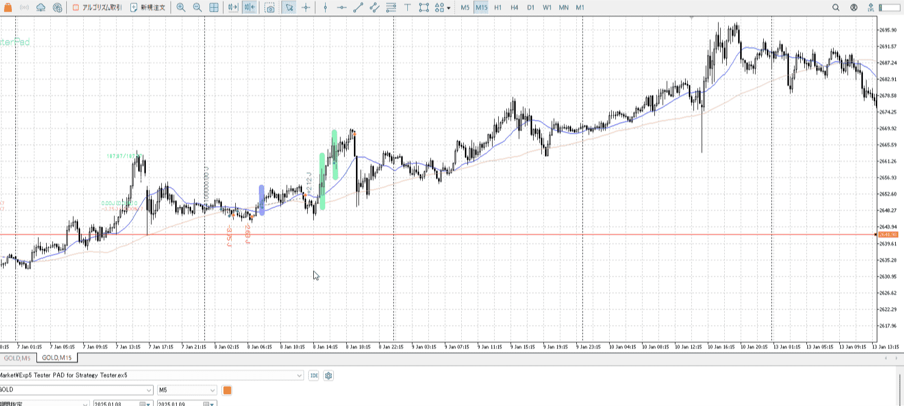

小さく作った15mのレンジ
T
これを抜く前であるなら、損切は直前の下髭高さであるこの横線
その前に切るのは駄目

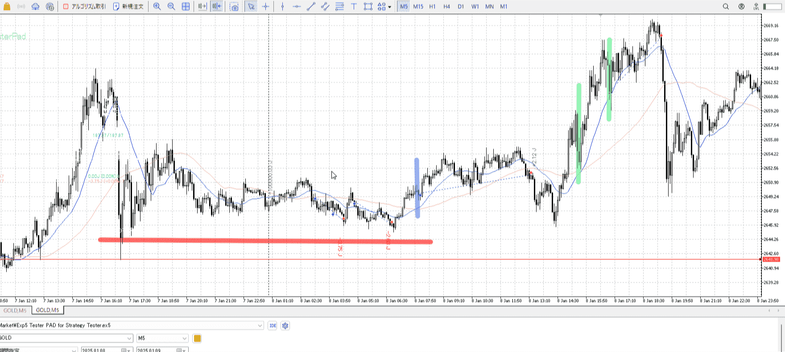

早くてもこの実線高さ

青は悪くない
緑は方向性が分かってれば可能

