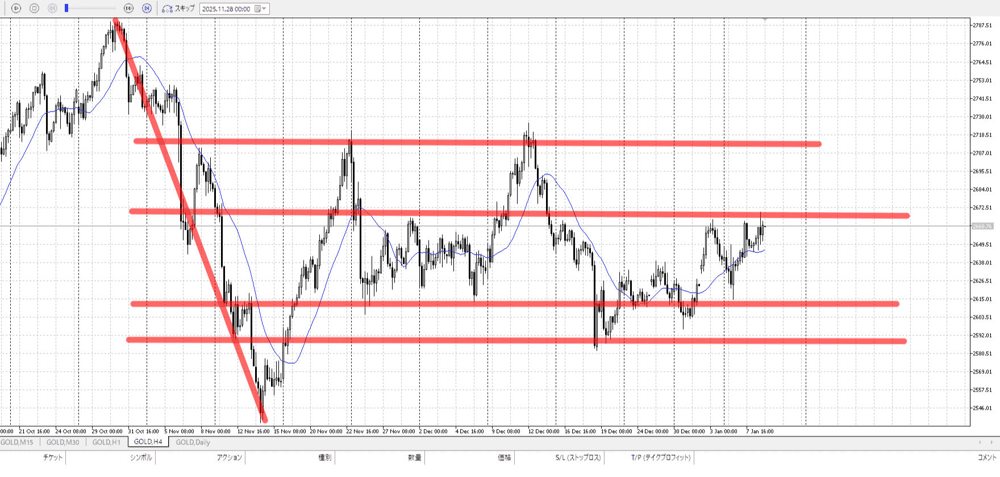
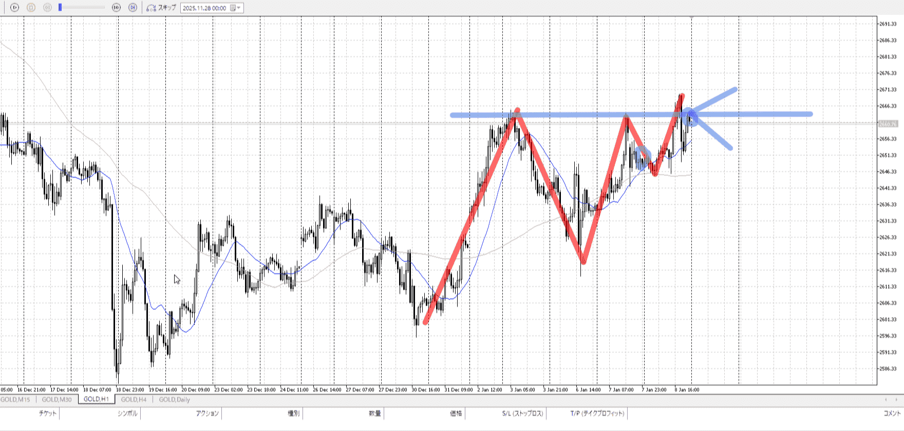
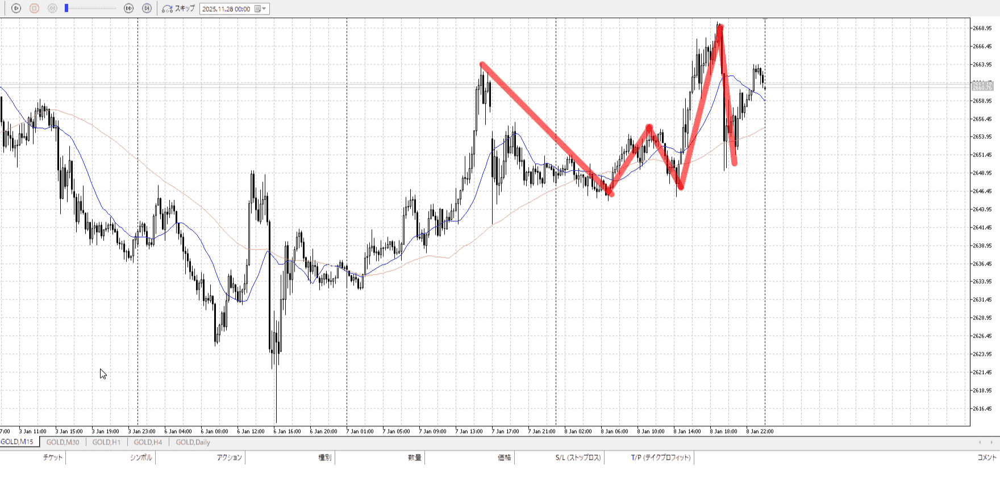
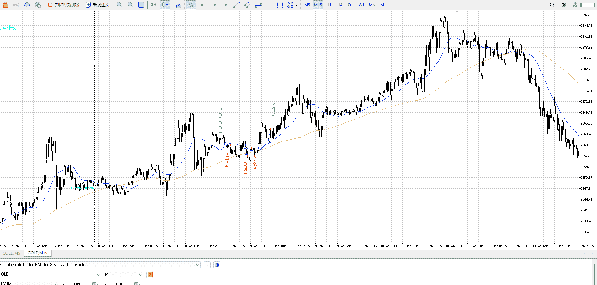
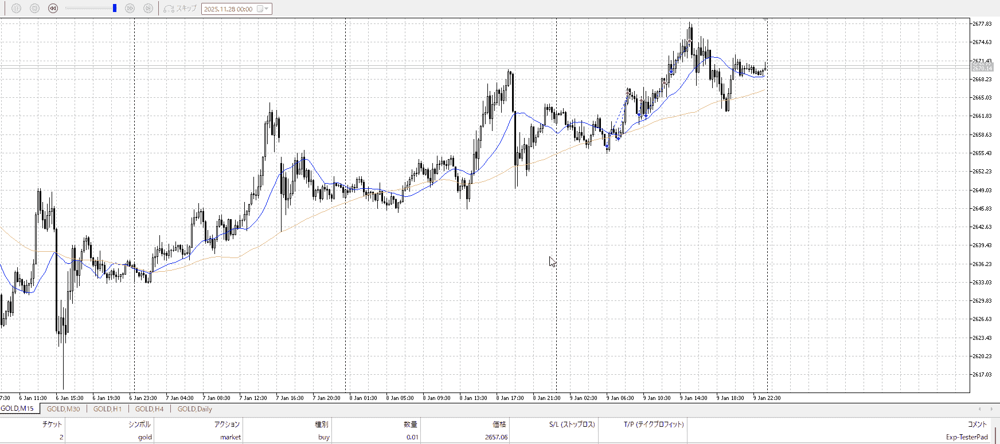
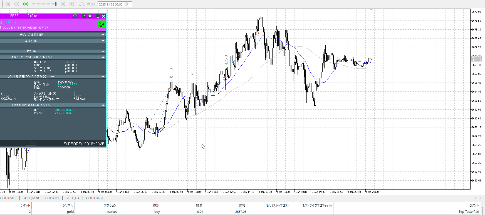

## [ld2025-01-09](<../Link_Daily/ld2025-01-09.md>)
> [!note]
>- +1万 事前認識 **開始5分**

- [x] [my](obsidian://open?vault=Teino&file=FX/my)(見ないと増える)
- [x] 指標
    - 差し込まれる可能性有り、毎日

4h

＜ここに目線画像＞

- [x] トレーディングレンジ
    - c

方向：d

1h

＜ここに目線画像＞

方向：u

15m

＜ここに目線画像＞

方向：u

全方向：duu

- [x] 使用足全ての目線確認

＜ここにシナリオ画像＞

b:1h前回高値
s:1h安値

上昇後、1h前回高値付近で終了

- [x] 1hシナリオ
- [x] ぶつかり
- [x] 日出日入、週出週入

目線・シナリオ・強弱・調整・横幅・PA後・平均線方向・波・**ひきつけ**
duu。上にはみ出てから落ちも止まり。開幕から上がってもおかしくない位の雰囲気。
ただ買えるだけの場所が無い。もっと言うとこれ以上落ちない底も、抜いて買い場代わりになる売り場もない。横幅でそれを作ってからになりそう。でなけりゃ縁なしか、1h前回高値から買うか。

> [!check]
> - [x] +1万 事前認識 **開始5分**
> - [x] +1万 5枚

OK!
Exchage Start.

---

何故損したか

朝はまあいい、二回目

朝が失敗して、底を固めて上昇
完全に抜いたと言えるのは朝のちょっとしたレンジを抜いてから
そうでないので上昇としては弱く、しかも朝で買われなかった->買い場を抜いたということで売り優勢。戻り売りがしたい場面。

とはいえ伸びていく可能性は一応あった。が平均抜いた時点でもうきついか。損のほとんどがここから出てる。

その後。売りが固めたそこから一気に買われた。さらに少し切り上げて止まり。
買われそうな奴。売るならギリギリにひきつけるべきだった。

その後。押しを待って買っている。それはいい。
上に届いてないのでもっと伸びると思える。

もう一度の落ちに際して買うべきでは。
そうすれば少なくともこの日はいいエントリーが出来た。時間見ろ細かいのやれ。

この上昇の頂点は2時確定。
それを待つ必要は一切ない。直近高値まででいい。

総じてひきつけ不足。
もう一回復習。

こんな感じ。
二回目は上昇の半分から。

---

- 1
- 2
- 3