## [ld2025-09-02](<../Link_Daily/ld2025-09-02.md>)
> [!note]
>- +1万 事前認識 **開始5分**

- [x] [my](obsidian://open?vault=Teino&file=FX/my)(見ないと増える)
- [x] 指標
    - 差し込まれる可能性有り、毎日

1d
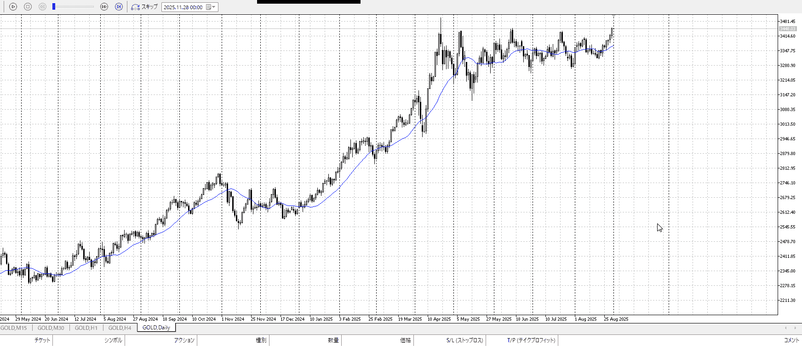

4h
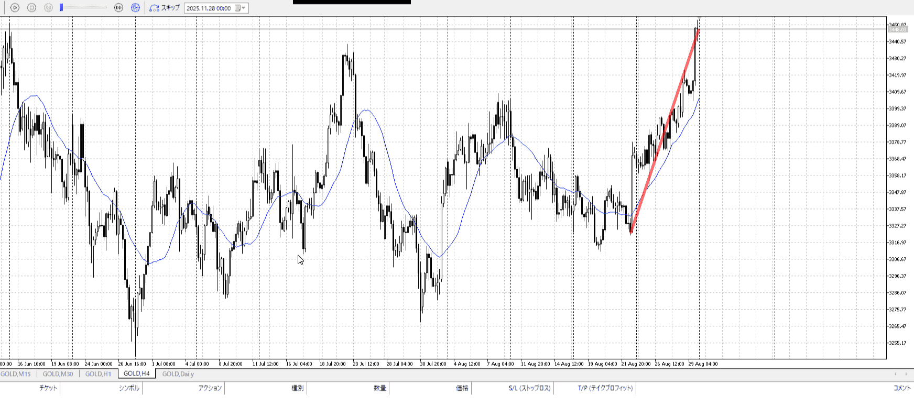
＜ここに目線画像＞

- [x] トレーディングレンジ
    - u

方向：u

1h
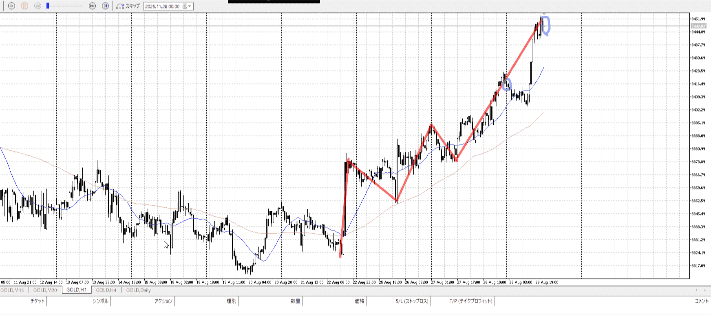
＜ここに目線画像＞

方向：u

15m
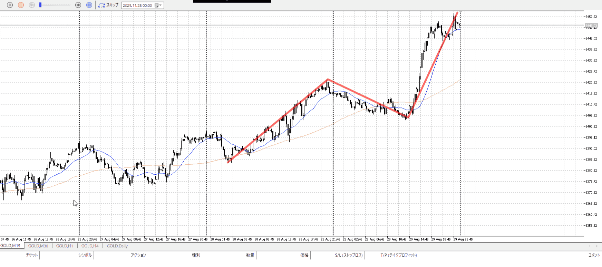
＜ここに目線画像＞

方向：u

全方向：uuu

- [x] 使用足全ての目線確認

＜ここにシナリオ画像＞

b:4h直近高値、3443
s:4h前回高値、3483

上昇

- [x] 1hシナリオ
- [x] ぶつかり
- [x] 日出日入、週出週入

目線・シナリオ・強弱・調整・横幅・PA後・平均線方向・波・**ひきつけ**

8月の高値3400を踏み台に上昇、4月から8月までのレンジの頂点3443を抜く
なので買い支えはここのはず
あとは3483を抜くと一気に上がっていくという場所だが、ちゃんと抜くかは分からない

それはそれとして、3443に降りたら買い

> [!check]
> - [ ] +1万 事前認識 **開始5分**
> - [ ] +1万 5枚

いや違う、3483を抜いた後の未知のエリアをやりたい。
もっと言うと前回上昇すら抜いたエリアだから、10月6日から。

## [ld2025-10-06](<../Link_Daily/ld2025-10-06.md>)
> [!note]
>- +1万 事前認識 **開始5分**

- [x] [my](obsidian://open?vault=Teino&file=FX/my)(見ないと増える)
- [x] 指標
    - 差し込まれる可能性有り、毎日

横幅、引きつけ、もしくは損切買い。

4h
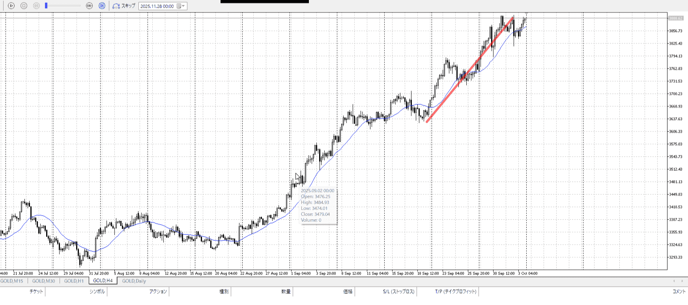
＜ここに目線画像＞

- [x] トレーディングレンジ
    - u

方向：u

1h
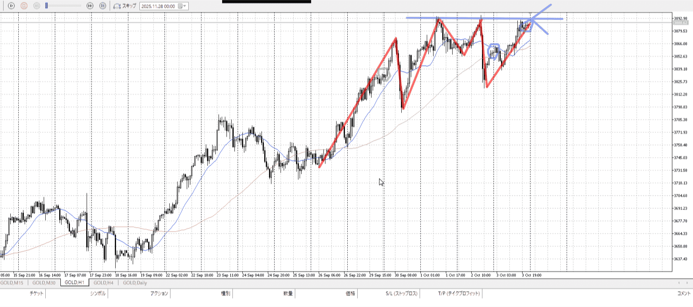
＜ここに目線画像＞

方向：uR

15m
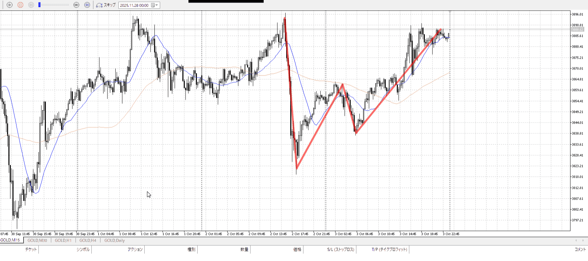
＜ここに目線画像＞

方向：dT

全方向：uuRdT

- [x] 使用足全ての目線確認

＜ここにシナリオ画像＞

b:1h安値
s:1h高値

上昇、ただし天井にぶつかり
ただし下がっても天井に一直線

- [x] 1hシナリオ
- [x] ぶつかり
- [x] 日出日入、週出週入

目線・シナリオ・強弱・調整・横幅・PA後・平均線方向・波・**ひきつけ**
uudT
めちゃくちゃ上、天井にいる
買うなら引きつけ買いになる、底からか売りから損切から

1hがレンジではあるのだが、底が上手く出ず切り上げ
なので買いが強いと仮定して買いたい

> [!check]
> - [x] +1万 事前認識 **開始5分**
> - [x] +1万 5枚

OK!
Exchage Start.

---

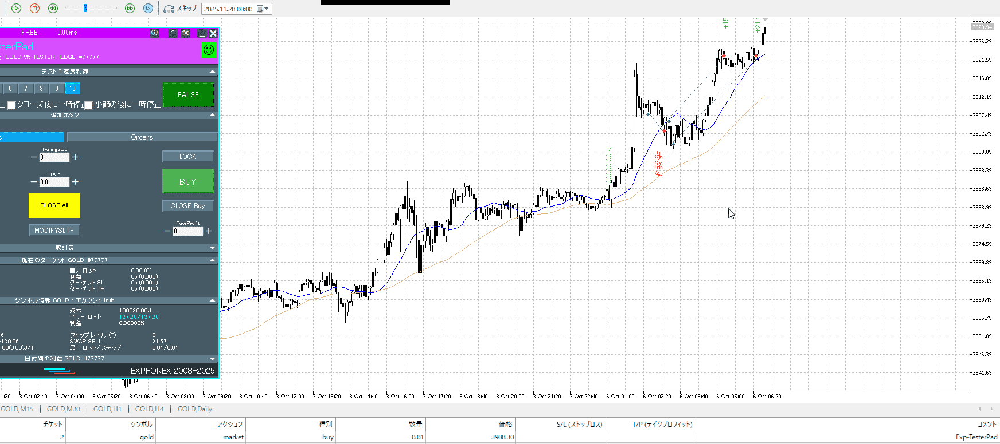
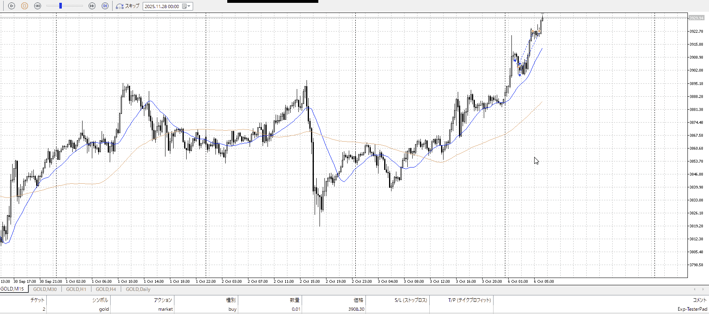
1回目のやつは流石に舐めてる
未知に挑むにあたって、1hのレンジの上は引きつけて借りたい

本当は15mを借りるためにもう少し下に振りたいが、それは無かった
手前なので15mで止まったのを確認して、とかやったほうがいいか

高さ的には三回目で入っているところがベスト
その後の一本上昇から下髭に合わせられたらさらに良かった

二回目は損切許容する奴

切る場所だが、絶対ここじゃない
1h上昇の途中から、前回上昇が14000くらい伸びてるので今回もそれくらい
入ったのが8000くらいだから+6000がベスト、しかし途中を考慮して14000の七割である9800
すなわち+1800くらいはいけたはず
あれつまりここベストじゃね、ならいいか

さらに伸びるとしても、もう一度横幅を待ちましょう

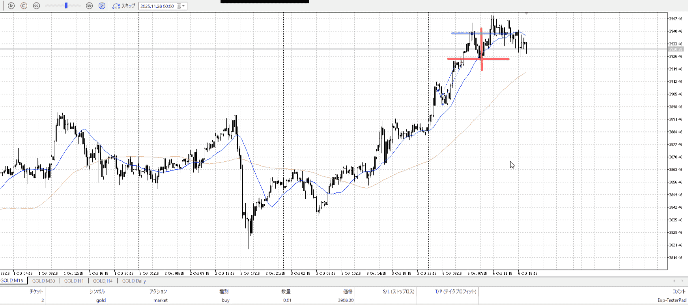

天井で15mAが落ちてきた
5mで赤縦から高値の青線まで買う手はあるが、リスクは高い

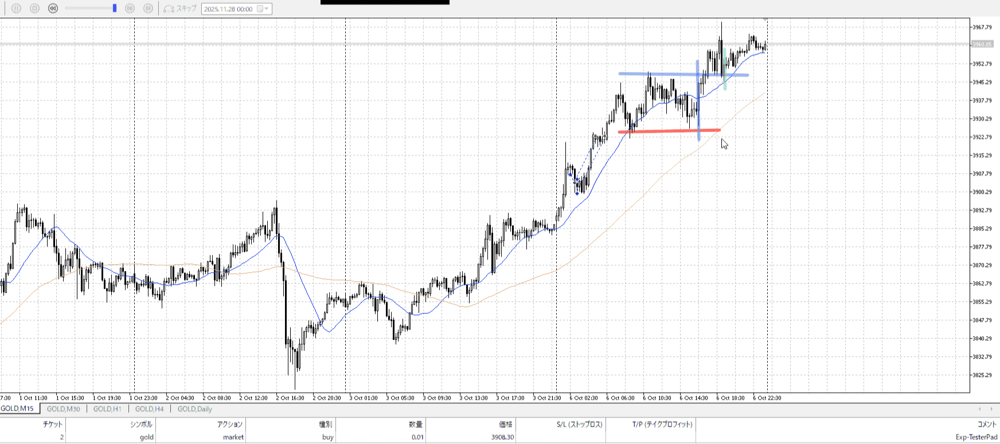

上昇
赤横の高さを底とし、近くの底振れを基準に青縦底買いができる。
あとは抜けた後緑縦。

青縦の意識も、緑縦の意識も薄かった。まだ引きつけが甘い。
1回目のやつも早めに止まってるので、もっと練習する必要がある。
