## [ld2025-10-07](<../Link_Daily/ld2025-10-07.md>)
> [!note]
>- +1万 事前認識 **開始5分**

- [x] [my](obsidian://open?vault=Teino&file=FX/my)(見ないと増える)
- [x] 指標
    - 差し込まれる可能性有り、毎日

4h
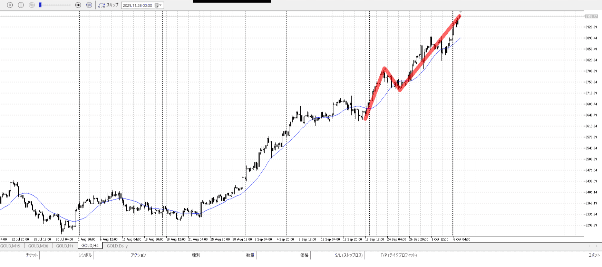
＜ここに目線画像＞

- [x] トレーディングレンジ
    - u

方向：u

1h
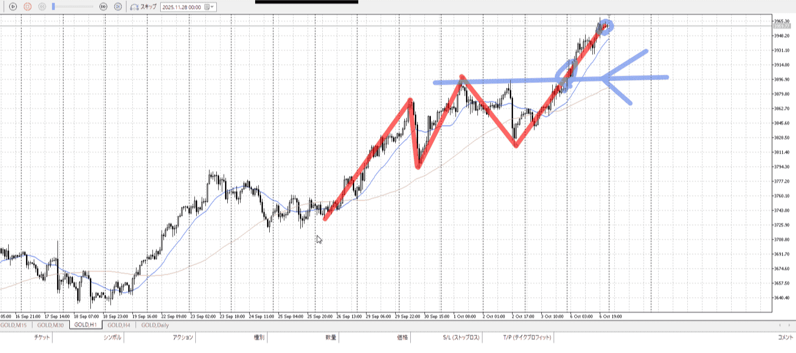
＜ここに目線画像＞

方向：u

15m
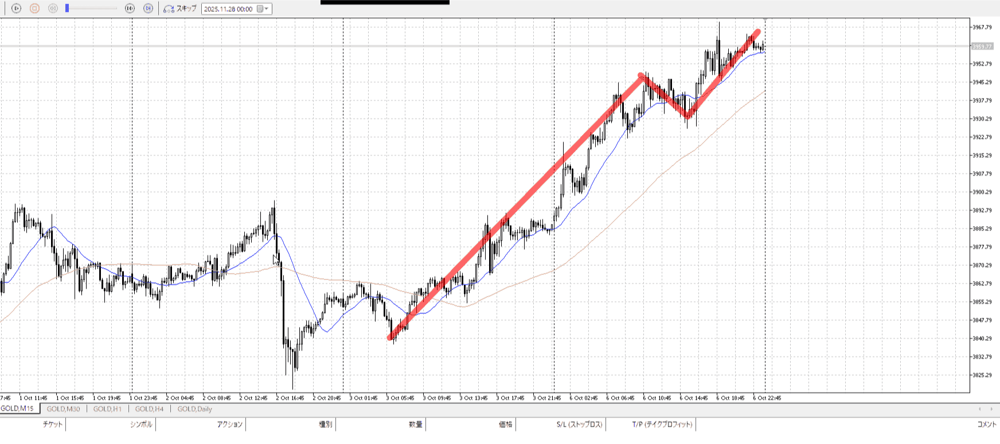
＜ここに目線画像＞

方向：u

全方向：uuu

- [x] 使用足全ての目線確認

＜ここにシナリオ画像＞

b:1h高値
s:？

上昇のみ

- [x] 1hシナリオ
- [x] ぶつかり
- [x] 日出日入、週出週入

目線・シナリオ・強弱・調整・横幅・PA後・平均線方向・波・**ひきつけ**
uuu
4hの前回上昇分も抜いた、1d換算だと60000消費であと20000ほど余裕がある
それはそうと買いたい、15mは追いついてるが1hが来てない
一回目を取ることはできるはず、注視
その後は1hついてきてから底を見て買い入れ、もしくは損切から入り

> [!check]
> - [x] +1万 事前認識 **開始5分**
> - [x] +1万 5枚

OK!
Exchage Start.

---

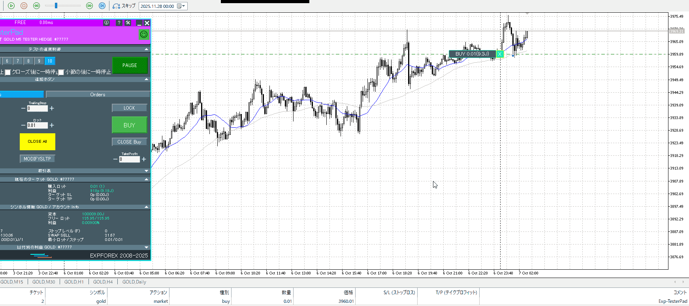

とりあえず損切買い
けどこれどこまで？　15mの一本で入ったとして、前回の直近上昇を基準にすると4000、値としても4000手前で止まる。

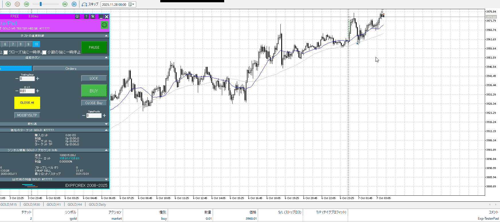

昼に突っ込んだので止め。
15mが折れ始めてから、二回目のチャンスを待つ。

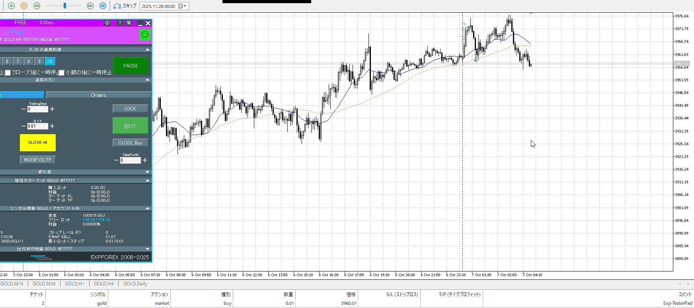

確かに折れ始めだが、これは一回目の降下のはず
これを底として次待ち、ももう来てないか。

いや15mでの買いはもう少し下のはず。それをまとう。

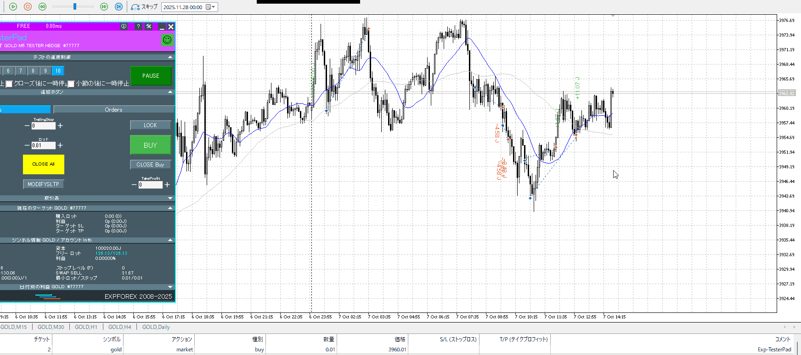

5m再度が失敗、次の損切点も失敗。曲折経て、結局狙い通りの場所で。
最初から5m見すぎ、15mに従う意識。5mでさえレンジじゃないぞ根拠にしようとしてるの。しかもこれを15mで抜いてるので買いにくい。

というか、より失敗なのは5m再度の方。落ち切れてないし、それで買えるのは分析に無い。せめてレンジになってから。それも15mで抜いてるので損切、それなら次の損切点も狙わない。ちゃんと15mまで待ってたはず。
原因は底まで待つ意識。それで上がるようなら縁ないし、15mも見ろ。

やっぱりこんな上の方で入るなら引きつけが必要。
底から入る奴で一回目は損切許容広めであることに留意。

二回目が本命。
その後一回目の反射で止めてしまったが、普通に上まで持てる可能性は十分ある。

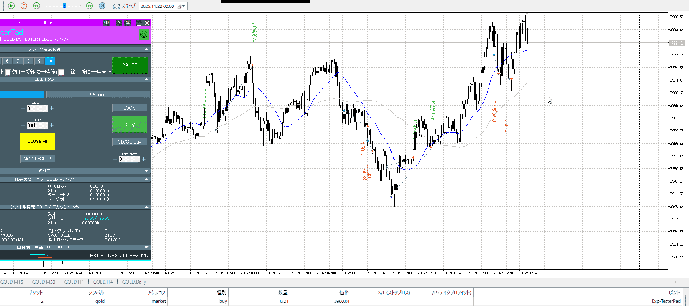

その後。ちゃんと15mのとこまで押してるし、ちゃんとそこで入ってる。
だからそれで抜けて前回上昇4700まで持てばいいだけの話。押しが足りない。夜中の二時だから入れるか問題があるが。

やっぱりいつぞやの1h上から入るの早すぎる。

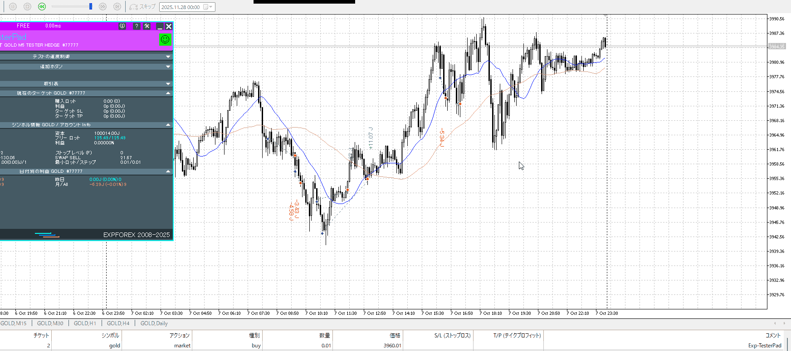

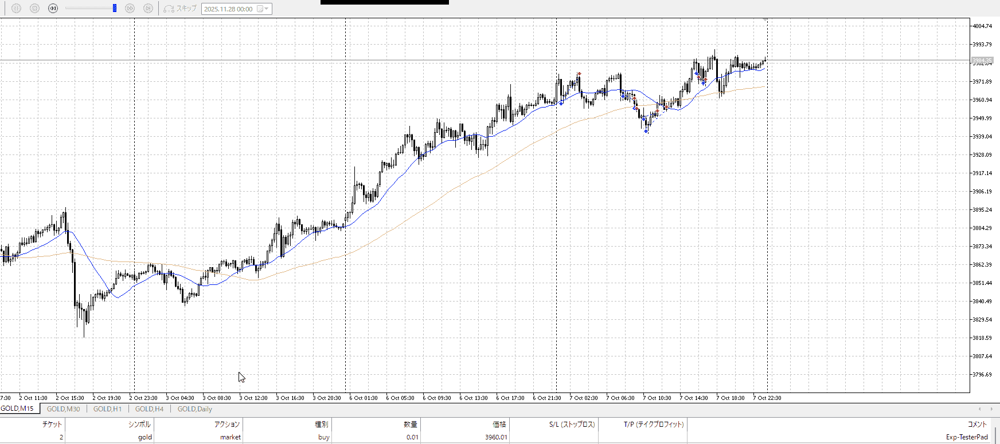

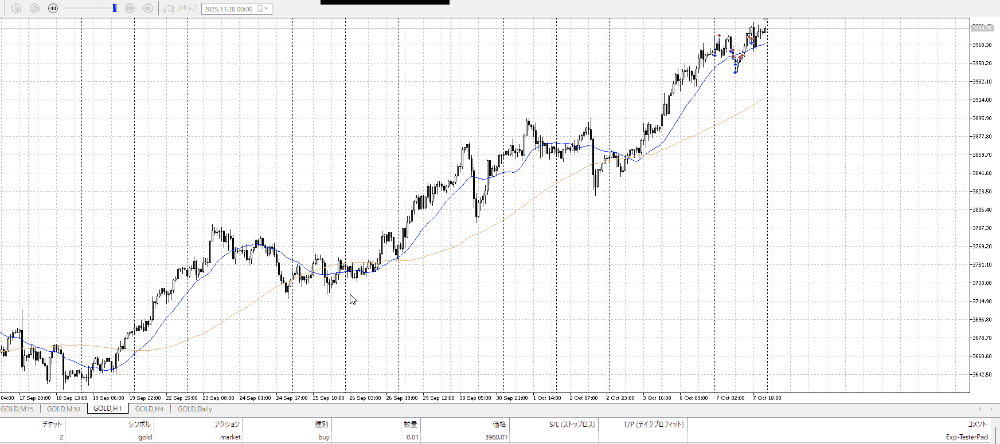

最終。利確が雑、前回上昇を元に上まで。
それと自分が何で入っているか、何を根拠に従っているか。
そもそも上に居るんだからリスクを抑えろ。待とうって言って待ててないのはちょっと。

底まで持つ意識、15mもみつつ

---

- 1
- 2
- 3